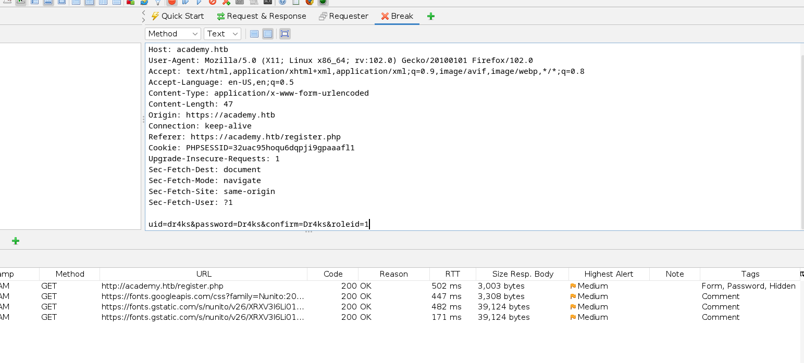

# [Academy](https://app.hackthebox.com/machines/academy)

```bash
nmap -p- --min-rate 10000  10.10.10.215  
```


After we see that (22,80,33060) ports are open, let's do greater nmap scan.

```bash
nmap -A -sC -sV -p22,80,33060 10.10.10.215
```


We see that this IP Address resolves into 'academy.htb' , let's add into `/etc/hosts` file.


Let's do directory brute-forcing.

```bash
gobuster dir -u http://academy.htb -w /usr/share/wordlists/dirbuster/directory-list-2.3-small.txt -x php -t 40
```


Here, I found 'register.php' endpoint to create user account.
While intercepting this request, I see that '**roleid**' into 1 to be admin user.



```bash
uid=dr4ks&password=Dr4ks&confirm=Dr4ks&roleid=1
```


From here, we see that 'dev-staging-01.academy.htb' , let's add this subdomain into `/etc/hosts` file.

This is actually dev state that's why debug mode is runned that's why we can see all stuff.


I found exploit 'CVE-2018-15133'


Let's grab app key from here.

```bash
APP_KEY = base64:dBLUaMuZz7Iq06XtL/Xnz/90Ejq+DEEynggqubHWFj0=
```

Let's use exploit `exploit/unix/http/laravel_token_unserialize_exec`


Make interactive shell.
```bash
python3 -c 'import pty; pty.spawn("/bin/bash")'
export TERM=xterm
export SHELL=bash
```

I enumerate users.


On 'var/www/html/academy' directory, I found '.env' file which contains credentials.


cry0l1t3:mySup3rP4s5w0rd!!

user.txt


I see that my user is `adm` group.


Let's read this to switch into another user by reading [this](https://support.oracle.com/knowledge/Oracle%20Linux%20and%20Virtualization/2239220_1.html)


From here, I see credentials..


I grab credentials.

mrb3n:mrb3n_Ac@d3my!


Let' ssh into machine via above credentials.

I check privileges of my user via `sudo -l` commnad.


Let's read [this](https://gtfobins.github.io/gtfobins/composer/) for `composer` binary.


root.txt


