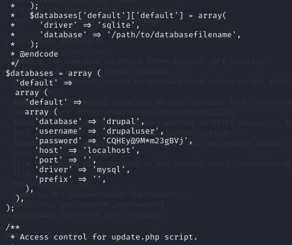
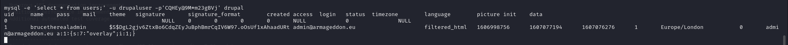

# [Armageddon](https://app.hackthebox.com/machines/Armageddon)

```bash
nmap -p- --min-rate 10000 10.10.10.233 -Pn
```


After we seeing (22,80) ports, let's do greater nmap scan.

```bash
nmap -A -sC -sV -p22,80 10.10.10.233 -Pn
```


After looking at the version of 'Drupal' application, we see that is **Drupal 7.56 version.**


I find one exploit whose CVE name is [CVE-2018-7600](https://www.exploit-db.com/exploits/44449)


Now, I will use `msfconsole` to exploit.
Moduele is considered like this 'exploit/unix/webapp/drupal_drupalgeddon2'


As we gain a shell, let's do enumeration.

I find interesting file called 'settings.php' on '/var/www/html/sites/default' directory.



That's the credentials of Mysql database, let's use this credentials to see what db has.

```bash
mysql -e 'show tables;' -u drupaluser -p'CQHEy@9M*m23gBVj' drupal
```


I see some tables, but sensitive one is 'users' table also. Let's read this content via below command.

```bash
mysql -e 'select * from users;' -u drupaluser -p'CQHEy@9M*m23gBVj' drupal
```




We see password hash of 'brucetherealadmin' user.

```bash
hashcat -m 7900 hash.txt --wordlist /usr/share/wordlists/rockyou.txt 
```


We have below credentials for now.

brucetherealadmin: booboo


Let's ssh into machine and read flag.

user.txt


After enumeration and `sudo -l` command result, I see that I need to use this [exploit](https://github.com/initstring/dirty_sock/blob/master/dirty_sockv2.py)


I did all steps mentioned above exploit.

Hola, I am root user.

root.txt


