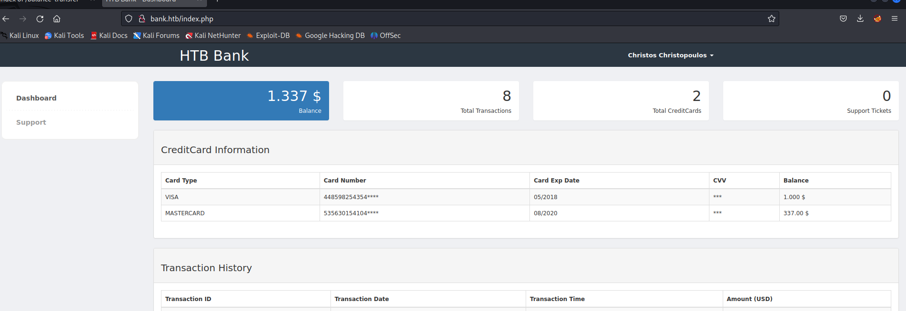

# [Bank](https://app.hackthebox.com/machines/bank)

```bash
nmap -p- --min-rate 10000  10.10.10.29 -Pn 
```


After knowing open ports (22,53,80), let's do greater nmap scan.

```bash
nmap -A -sC -sV -p22,53,80 10.10.10.29 -Pn
```


Now, it's time to enumerate web application.

First, I add this IP Address into '/etc/hosts' file for resolving purposes.


Directory Enumeration.

```bash
gobuster dir -u http://bank.htb/ -w /usr/share/seclists/Discovery/Web-Content/raft-small-words-lowercase.txt -t 40
```


From directory enumeration, I see that 'balance-transfer' page I have.

Let's browse this page.


I guessed that some of them look like each other due to their size, that's why I just sorted them our due to size of file.


There is file whose size is '257', let's browse this file to see some credentials.


I grab credentials from here.

chris@bank.htb : !##HTBB4nkP4ssw0rd!##


Then I access to web application served on port (80) via above credentials.




On Support page, I see that I can attach files, that's why I can attach malicious .php files.

But I tried, it doesn't work.


Let's look at the source code what type of files are allowed.


Hola, I just add my php reverse shell file via 'htb' file extension by intercepting upload request.


I just browse the image as below.


I got reverse shell.


Let's make interactive shell.

```bash
python3 -c 'import pty; pty.spawn("/bin/bash")'
Ctrl+Z
stty raw -echo; fg
export TERM=xterm
export SHELL=bash
```


user.txt


For privilege escalation, I just search files which have 'SUID' privileges via below command.

```bash
find / -type f -user root -perm -4000 2>/dev/null
```


I just run binary file called **'/var/htb/bin/emergency'** to be root user.


root.txt


