# [Blocky](https://app.hackthebox.com/machines/blocky)

```bash
nmap -sT -p- --min-rate 10000 10.10.10.37 -Pn
```

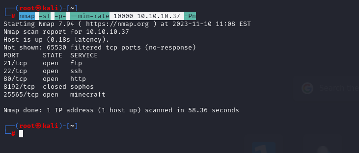


Let's do nmap for open ports.

```bash
nmap -A -sC -sV -p21,22,80,25565 10.10.10.37 -Pn
```

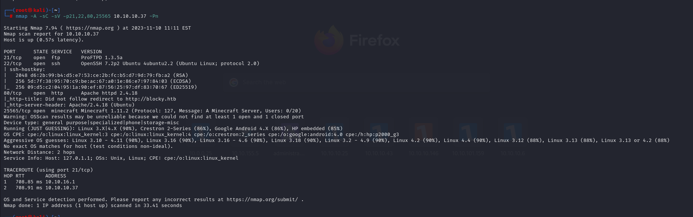

I also add IP address to my '/etc/hosts' file for resolving purposes.

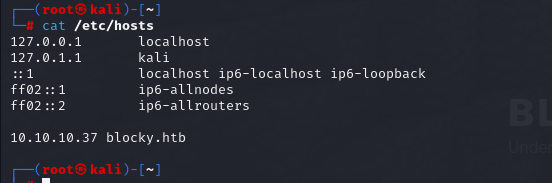


Directory-brute forcing.
```bash
gobuster dir -u http://blocky.htb/ -w /usr/share/wordlists/dirbuster/directory-list-2.3-medium.txt -t 40 -x php
```

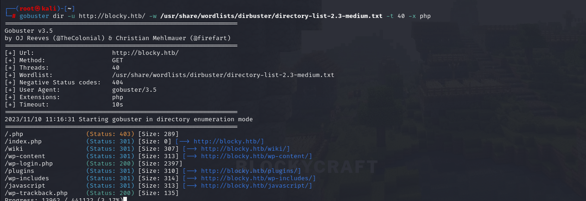

Here we have possible username 'notch' as because there we have post from 'notch' user.

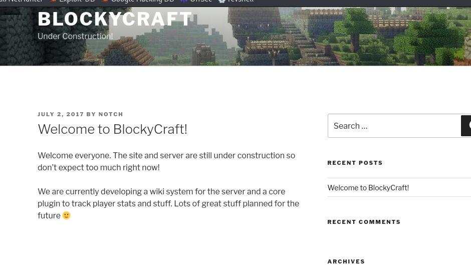


I found '/plugins' directory. Let's check it.

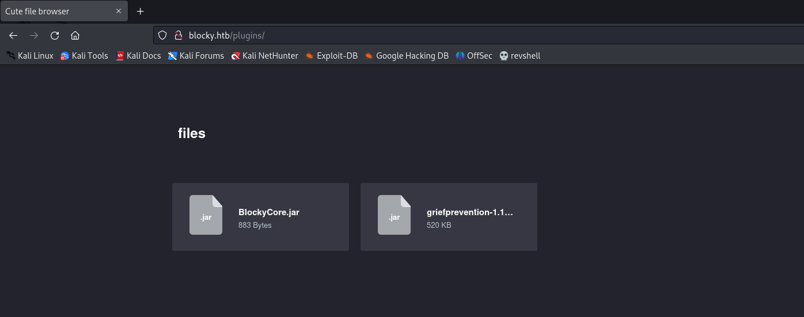


Let's download these files and enumerate this files via `jd-gui` tool.

Hola

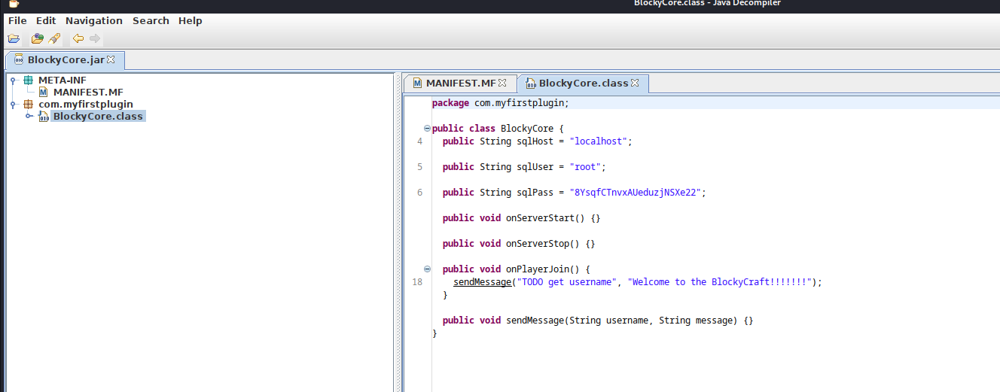


Here, we find **HARD-CODED credentials.** Let's try to login via SSH.

root: 8YsqfCTnvxAUeduzjNSXe22

notch : 8YsqfCTnvxAUeduzjNSXe22


That's it credentials (for notch worked).

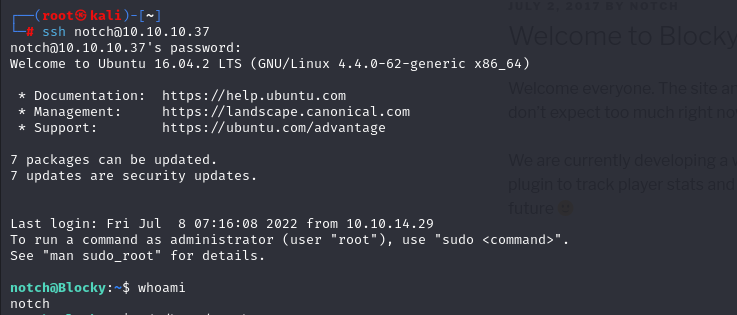


user.txt

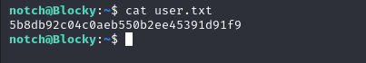


Let's check sudo rights for notch user. `sudo -l` command

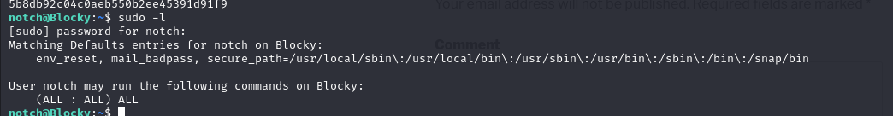


As we see    (ALL : ALL) ALL , let's run `sudo -s` command to be root user.


root.txt

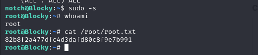