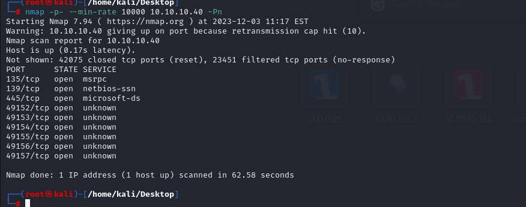
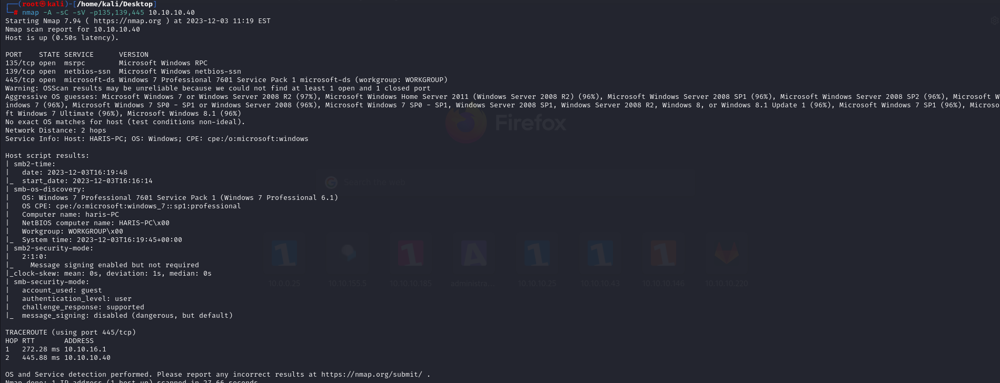
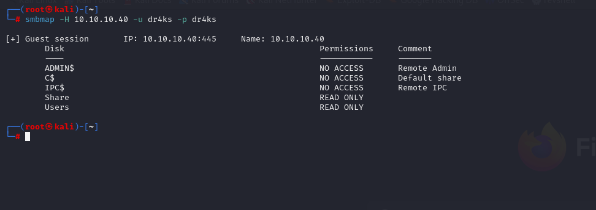
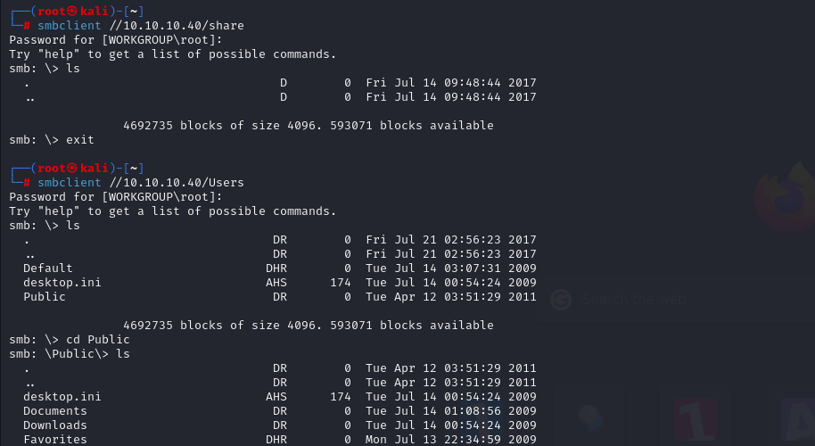
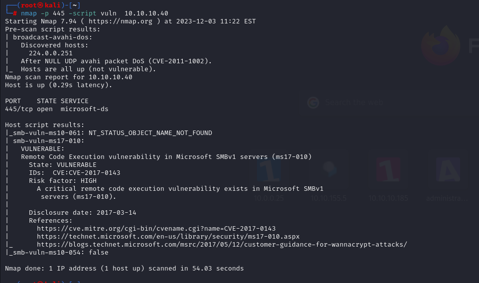
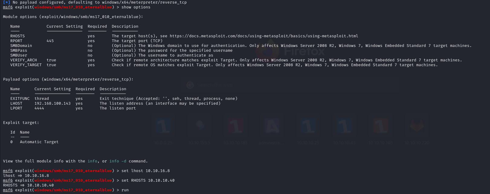
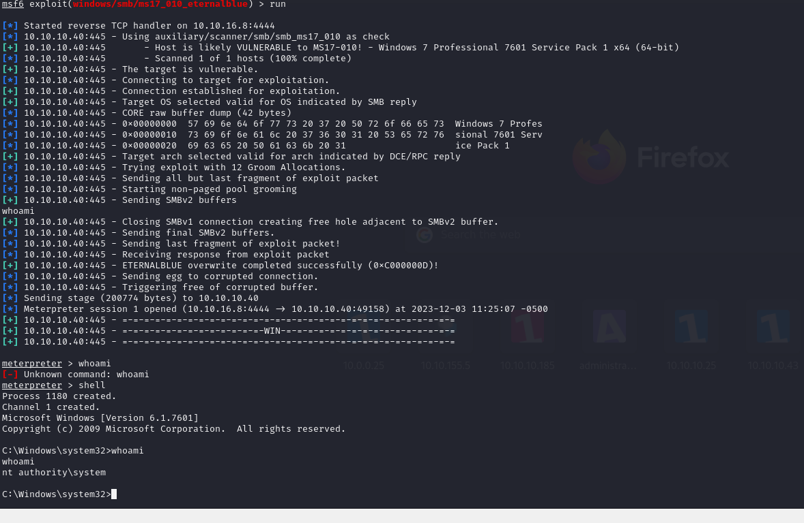
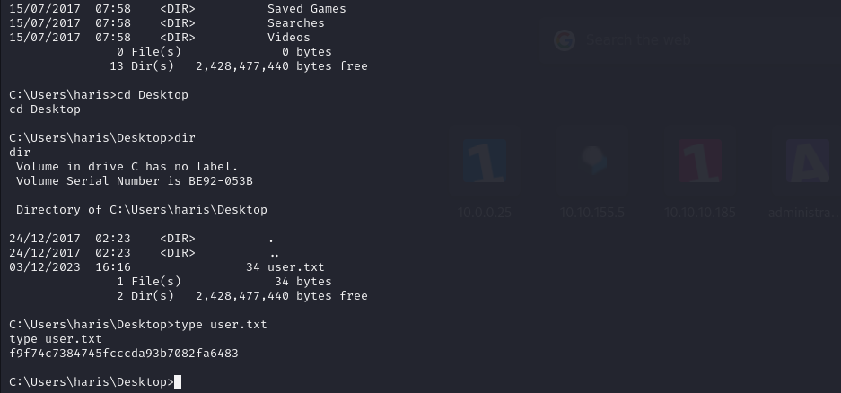
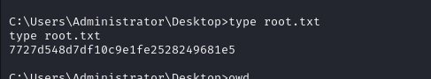

# [Blue](https://app.hackthebox.com/machines/blue)

```bash
nmap -p- --min-rate 10000 10.10.10.40 -Pn
```



After finding many open ports, I grab ports(135,139,445) from here to search vulnerabilities.

```bash
nmap -A -sC -sV -p135,139,445 10.10.10.40
```




From here, I see that 'SMB' is open, let's look at via `smbmap` tool.

```bash
smbmap -H 10.10.10.40 -u dr4ks -p dr4ks
```




Let's access `SHARE` and `USERS` shares of SMB.




I found nothing in here.

Then, again I searched Vulnerability scan for port (445).

```bash
nmap -p 445 -script vuln  10.10.10.40
```



From here, I see that target machine is vulnerable to 'MS-17-010'.

Let's try to access machine via this vulnerability from `msfconsole`.




I gained a shell.




user.txt




root.txt

