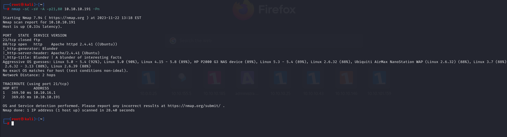
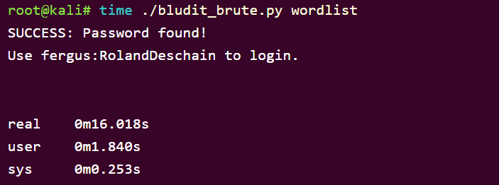

# [Blunder](https://app.hackthebox.com/machines/blunder)


```bash
nmap -p- --min-rate 10000 10.10.10.191
```


```bash
nmap -sC -sV -A -p21,80 10.10.10.191 -Pn 
```




Let's do directory brute-forcing.

```bash
gobuster dir -u http://10.10.10.191/ -w /usr/share/wordlists/dirbuster/directory-list-2.3-medium.txt -t 50 -x php,txt,js
```


We find 'todo.txt' file that reveals some secrets of application. Also 'fergus' is possible username for services.


We find also '/admin' endpoint, let's search used CMS that we can find publicly known exploit or not.

We can see that there is 5.0.8 version is used for 'TinyMCE' application.


We take below exploit to hack web application (CMS).


Let's make a **wordlist** by using '*cewl*' command.

```bash
cewl http://10.10.10.191 > wordlist
```



After we finding credentials.

fergus: RolandDeschain


Let's use another exploit that we got RCE via this vulnerability of CMS. (we do this via metasploit)


Once, we enumerating machine, we find below credentials on this directory. (/var/www/bludit-3.10.0a/bl-content/databases
)


I cracked the hash of Hugo user.


hugo: Password120

Let's switch into 'hugo' user.

user.txt


We enumerate machine that we find version of 'sudo' command.


We search LPE exploit for this version of 'sudo' command and finds 'CVE-2019-14287' that let's use this.

```bash
sudo -u#-1 /bin/bash
```


root.txt


