# [Celestial](https://app.hackthebox.com/machines/celestial)

```bash
nmap -sC -sV  10.10.10.85 
```

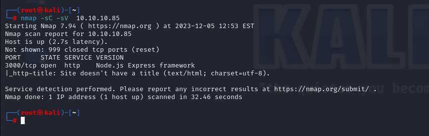

I see that port 3000 is just running on my target.

Let's make a request to this port.

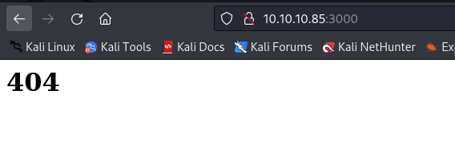


I see just 404 on front of page, let's look at HTTP response headers.

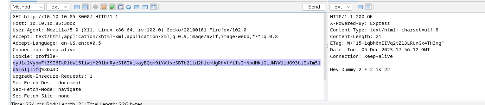


From 'X-Powered-By' response header I see that it is '**Express**.js' framework is used.

While, I try to decode Cookie, it gives me some stuff as below.

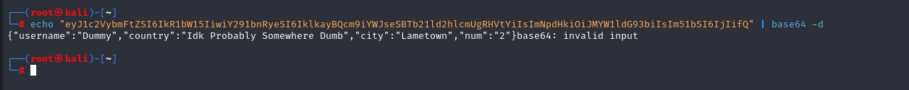


I see that it is stuff which related to Serialization and Deserialization,

I searched some blogs for **'Insecure Deserialization'** attack for 'Express.js' framework.

I find [this](https://opsecx.com/index.php/2017/02/08/exploiting-node-js-deserialization-bug-for-remote-code-execution/)


I did all steps which mentioned on blog.

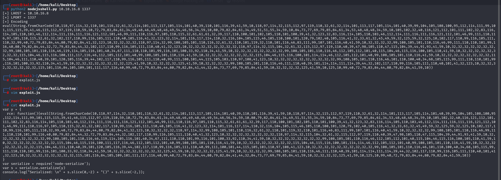

That's worked.

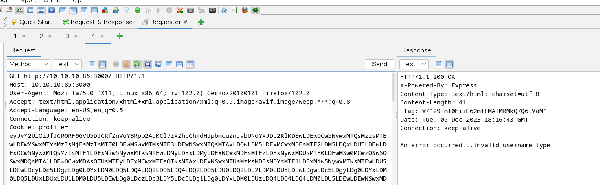

We got reverse shell from port (1337).

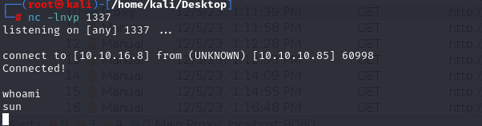


Let's make interactive shell.

```bash
python3 -c 'import pty; pty.spawn("/bin/bash")'
Ctrl+Z
stty raw -echo; fg
export TERM=xterm
export SHELL=bash
```

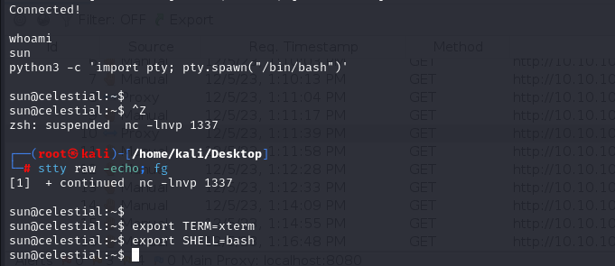


user.txt

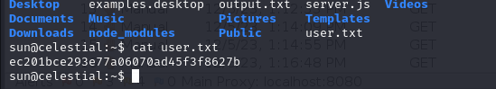


Here, I detect that 'output.txt' file's content is worked via cronjob.

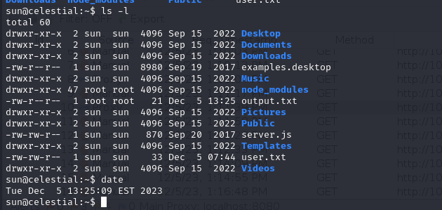

That's why I can add my script into 'script.py' which locating on 'Documents' folder.


I also this hidden cronjob via `pspy` tool.

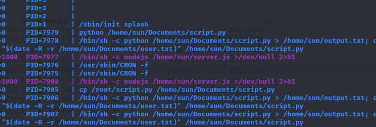


Now, it's time to change this python file via our malicious python file.

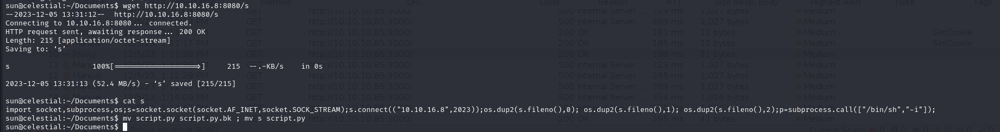

I upload my malicious file into box and change with legitimate one and opens a listener.

After waiting 5 minutes, I got administrative shell.


root.txt

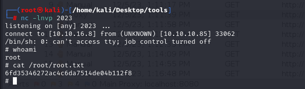
