# [Delivery](https://app.hackthebox.com/machines/delivery)

```bash
nmap -p- --min-rate 10000 10.10.10.222
```

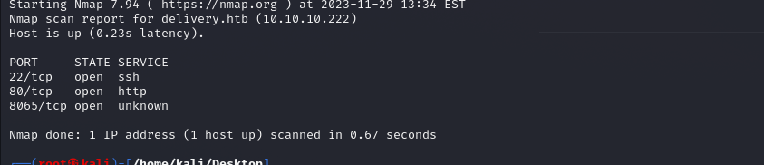


After knowing the open ports (22,80,8065), let's do greater nmap scan.

```bash
nmap -A -sC -sV -p22,80,8065 10.10.10.222 -Pn
```
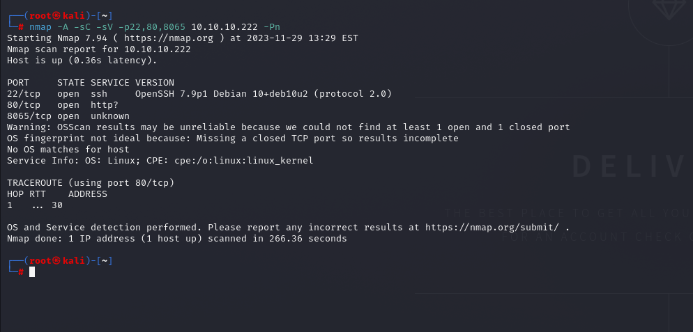

Let's look at the websites.

I see two hostname and add to my '/etc/hosts' file.

```bash
10.10.10.222 delivery.htb helpdesk.delivery.htb
```

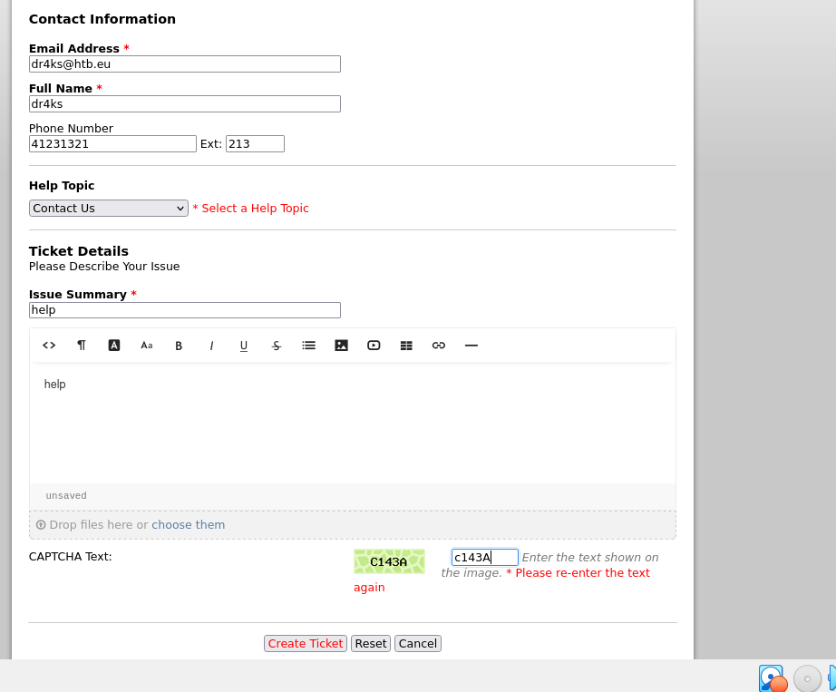


They gave me temporary credentials.

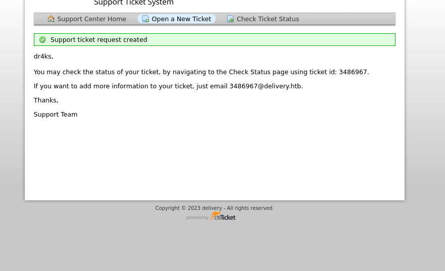


3486967@delivery.htb

Then, I try to login via this email and password field I write id of task.

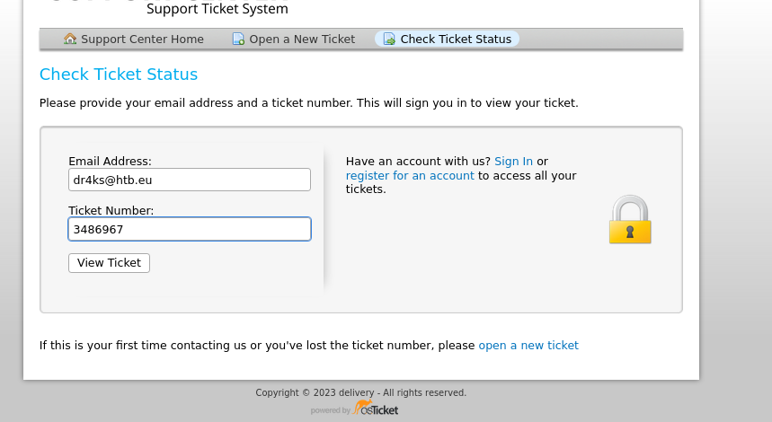

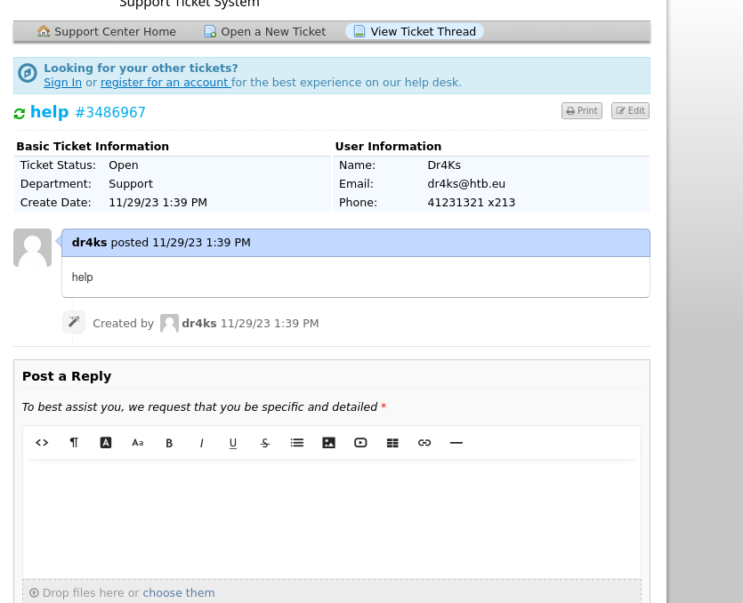


We also discovered web application running on (8065) port. 
For registration from here, I need to use **"@delivery.htb"** email which is valid for their authentication system.


Dr4ks1234$

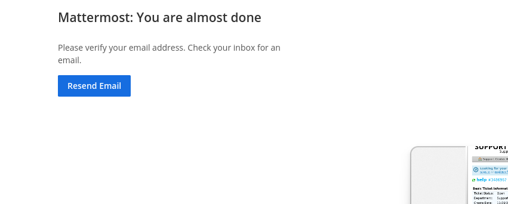

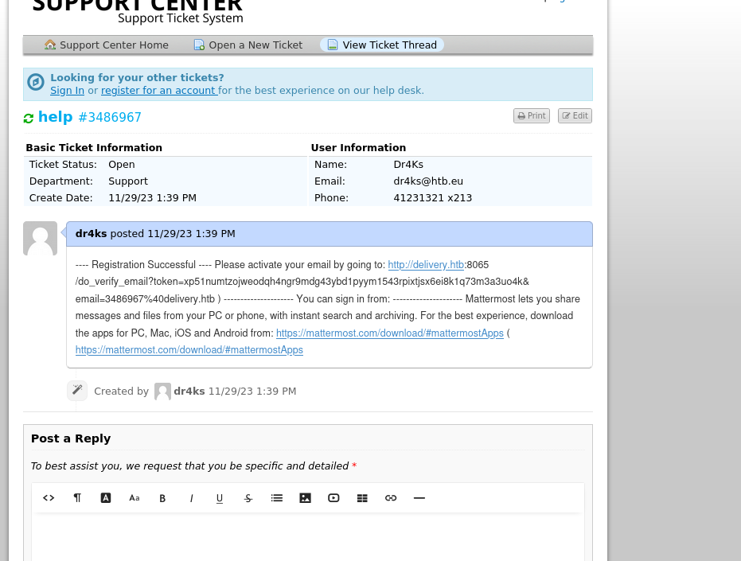


While I login, I find credentials stuff here.

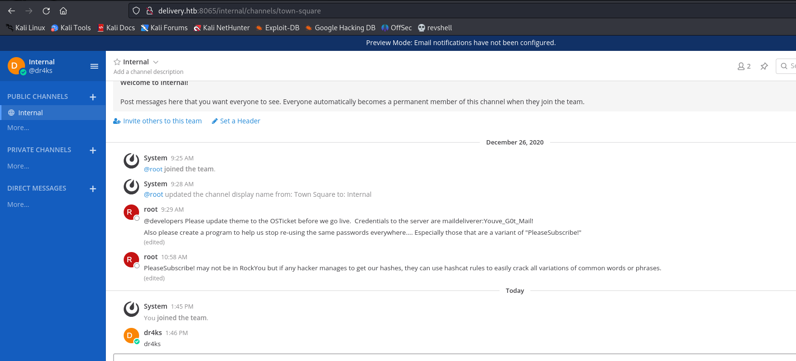

maildeliverer:Youve_G0t_Mail! 

Let's try to use this creds to authenticate machine via SSH.
Hola , it worked.


user.txt

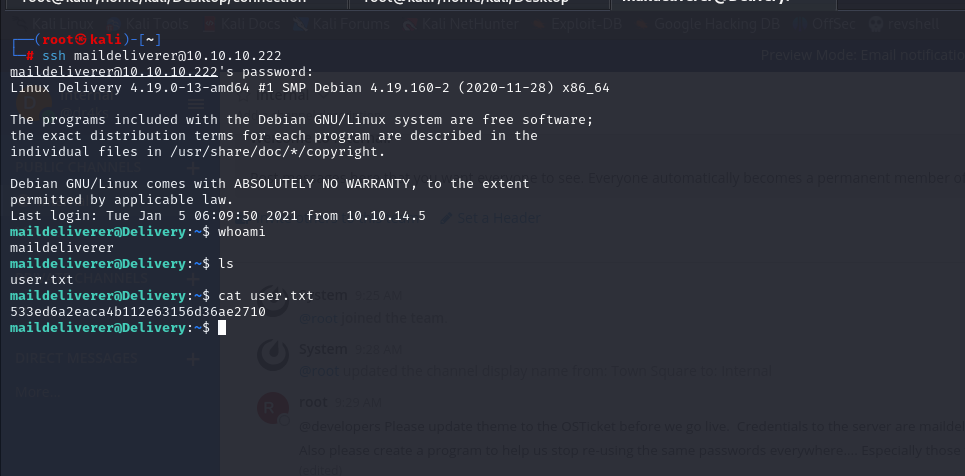


While enumeration on machine , I find `config.json` file on "/opt/mattermost/config" directory which contains Mysql credentials.

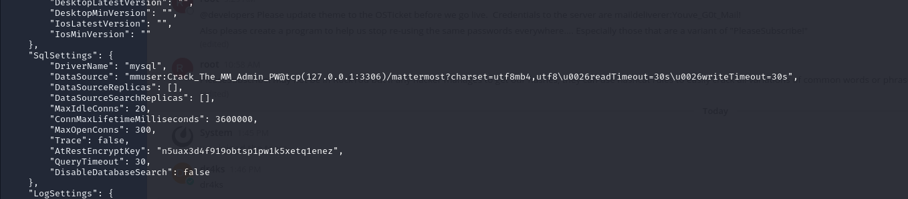


Here's our grabbed credentials.

mmuser:Crack_The_MM_Admin_PW


Let's login into Mysql via this credntials, find what we want.

We find 'mattermost' database and sensitive table which stores information about username and passwords.

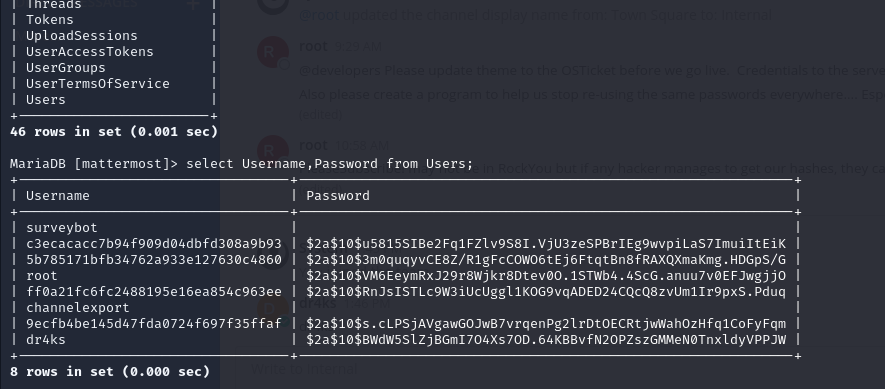

We grab root's user hashed password '$2a$10$VM6EeymRxJ29r8Wjkr8Dtev0O.1STWb4.4ScG.anuu7v0EFJwgjjO'

and try to crack this via `hashcat` tool.


```bash
hashcat -m 3200 hash.txt --wordlist /usr/share/wordlists/rockyou.txt -r /usr/share/hashcat/rules/best64.rule 

```

Credentials for root user is "root: PleaseSubscribe!21"


root.txt

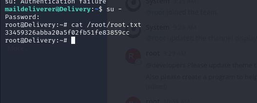